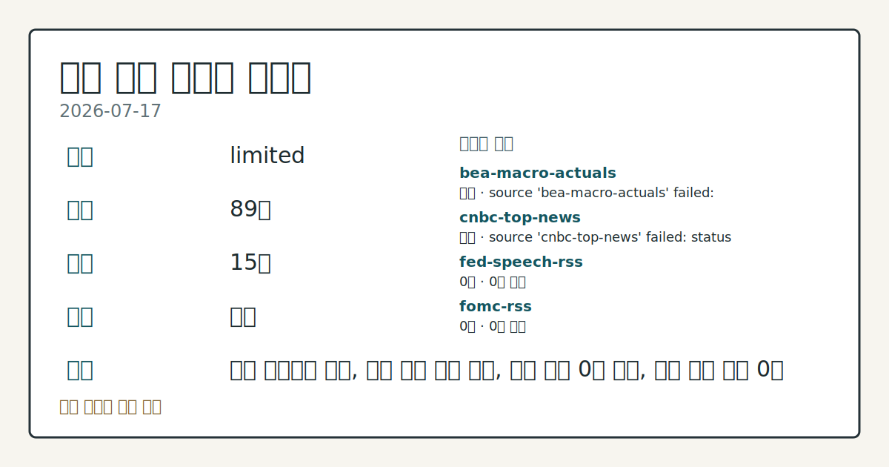
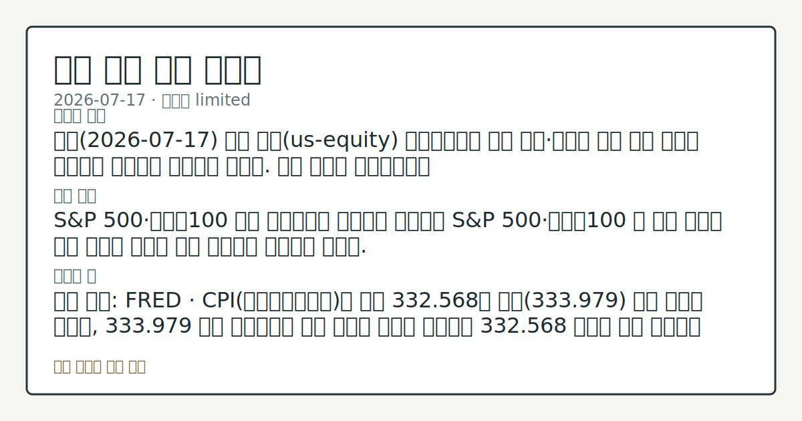
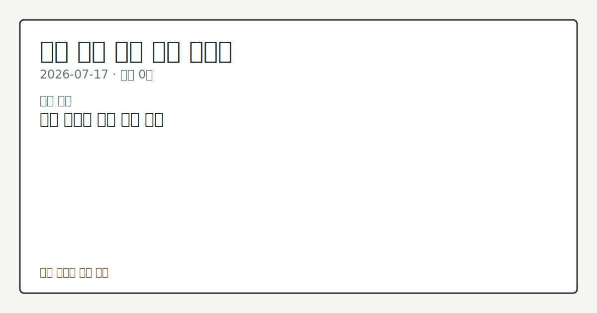

# 2026-07-17 미국 증시 시황
> 정보 제공용 자동 시황이며 매매 권유가 아닙니다.
# 2026-07-17 미국 증시 시황
**기준 시각**: 2026-07-17 NY · 수집창 2026-07-17T04:00Z ~ 2026-07-18T04:00Z (종료 미포함)
| 종목 | 종가 | 변동 | 비고 |
|------|------|------|------|
| ^GSPC | 7,509.20 | +0.89% | -1.32% from 52w high · +9.49% YTD |
| ^IXIC | 25,837.21 | +1.29% | -4.64% from 52w high · +11.20% YTD |
| ^DJI | 52,224.64 | +0.74% | -1.57% from 52w high · +7.94% YTD |
| AAPL | 327.74 | +0.35% | -1.80% from 52w high · +20.93% YTD |
| MSFT | 397.75 | -1.13% | +12.73% from 52w low · -15.90% YTD |
**세그먼트**: [국내 증시](../../../domestic-equity/2026/07/2026-07-17.md) | [미국 증시](2026-07-17.md) | [크립토](../../../crypto/2026/07/2026-07-17.md)
<!-- investo:block visual:us-equity.visual.data-confidence -->

*이미지: 데이터 신뢰도 · 출처: investo 자체 생성 · 생성: investo 0.1.0 · 2026-07-22 UTC*
<!-- /investo:block visual:us-equity.visual.data-confidence -->
> **내 관심 자산 영향**: 데이터 수집 부족으로 매칭 판단 보류 — 추가 수집 후 재평가됩니다.
> **오늘의 결론**: 오늘(2026-07-17) 미국 증시(us-equity) 세그먼트에는 개별 지수·종목의 당일 가격 등락을 나타내는 데이터가 제공되지 않았다. 수집 본문 참고.
> **핵심 동인**: S&P 500·나스닥100 오늘 세그먼트로 라우팅된 입력에는 S&P 500·나스닥100 등 개별 지수의 당일 등락을 다루는 이슈 데이터가 수집되지 않았다.
> **주의할 점**: 확인 소스: FRED · CPI(소비자물가지수)가 최신 332.568로 전월(333.979) 대비 하락한 가운데, 333.979 위로 재상승하면 본문 참고.
## 한눈에 보기
개별 지수의 당일 가격 등락 수치는 입력되지 않았고, 대신 채권·선물 포지셔닝과 매크로 지표가 중심 — 10Y 국채 금리 **4.55%** 본문 참고.
가장 의미 있는 단일 사실은 6월 CPI(소비자물가지수)가 332.568로 전월(333.979) 대비 추가 하락해 디스인플레이션 흐름이 이어졌다는 점이다.
Cboe SKEW(테일리스크 지수)가 **147.28**로 집계돼 옵션시장의 꼬리위험 프리미엄이 관찰 포인트로 남아 있다 — 본문 §④ 참조.
## ⓪ 오늘의 매크로
**미 국채 수익률** — UST curve 2026-07-17: 10Y 4.55%, 2Y10Y +0.37pp
## ⓪-B 채널 기준선
| 기준선 | 값 |
|------|------|
| S&P 500 | 7,509.20 (+0.89%) |
| 나스닥 종합 | 25,837.21 (+1.29%) |
| 다우존스 | 52,224.64 (+0.74%) |
| CFTC 포지셔닝 | E-mini S&P 500 순포지션 -365002계약 (-18.80% OI), 2026-07-14 기준/2026-07-17 공개 · Nasdaq-100 mini 순포지션 -64163계약 (-22.52% OI), 2026-07-14 기준/2026-07-17 공개 · VIX futures 순포지션 10189계약 (2.62% OI), 2026-07-14 기준/2026-07-17 공개 · 주간 지연 |
> **크로스마켓 연결 고리**: 금리 이벤트가 할인율/달러 경로의 공통 변수로 남아 있습니다.
> **오늘의 큰 그림:** 금리와 달러 변수가 공통 변수지만, Nasdaq·Dow 섹터 변동성를 먼저 확인해야 합니다.
## ① 요약

<!-- investo:block visual:us-equity.visual.market-snapshot -->

*이미지: 시장 스냅샷 · 출처: investo 자체 생성 · 생성: investo 0.1.0 · 2026-07-22 UTC*
<!-- /investo:block visual:us-equity.visual.market-snapshot -->

오늘 미국 증시 세그먼트에는 개별 지수·종목의 당일 가격 등락을 나타내는 데이터가 제공되지 않았다. 대신 6월 CPI(소비자물가지수) 332.568(전월 333.979 대비 하락), PPI(생산자물가지수) 157.045(전월 157.346 대비 하락), 실업률 **4.2%**(전월 **4.3%**)가 나란히 둔화 흐름을 보인 반면, CFTC(미국 상품선물거래위원회) COT(선물포지션 보고서)에서는 E-mini S&P 500·나스닥100 선물 모두 레버리지드머니 순매도 포지션이 유지되고 Cboe SKEW·VVIX도 테일리스크·변동성 경계 수준을 나타냈다. 물가·고용 지표는 완화적 신호를, 선물 포지셔닝과 옵션시장 지표는 방어적 신호를 함께 보여 방향이 한쪽으로 정렬되지 않는다 [혼재]

## ② 전일 핵심 이슈

### S&P 500·나스닥100

오늘 세그먼트로 라우팅된 입력에는 S&P 500·나스닥100 등 개별 지수의 당일 등락을 다루는 이슈 데이터가 수집되지 않았다. 지난 거래일(2026-07-14) CPI 둔화 관련 이슈 이후, 오늘은 같은 CPI 시리즈의 후속 수치(332.568)가 §④에서 확인되는 것 외에 새로운 코어 이슈는 없다. 2026-07-13 COT 관련 이슈도 오늘 §③의 최신 COT 수치로 이어지고 있어, 개별 지수 뉴스보다는 포지셔닝·매크로 데이터 중심의 하루로 볼 수 있다.

> **그래서 의미는?** 현재 수집 근거가 부족해 방향보다 확인 필요 항목으로만 봅니다.

## ③ 섹터/수급 동향

### 채권·주가지수 선물 포지셔닝

CFTC의 최신 [COT](https://www.cftc.gov/MarketReports/CommitmentsofTraders/index.htm)에 따르면, 10Y 국채선물은 leveraged_money(레버리지드머니) 순포지션이 -2,079,653계약(**-39.4%** of OI(미결제약정))으로 순매도 우위를 나타냈다. E-mini S&P 500 선물도 leveraged_money 순포지션 -365,002계약(**-18.8%** of OI), 나스닥-100 미니 선물은 -64,163계약(**-22.5%** of OI)으로 동일한 방향의 순매도 포지셔닝이 확인된다.

> **그래서 의미는?** 선물시장 레버리지드머니의 순매도 우위는 헤지 성격의 포지셔닝으로, 실제 지수 하락을 뜻하지는 않습니다.

### 원자재·달러·변동성 선물 포지셔닝

같은 [COT 보고서](https://www.cftc.gov/MarketReports/CommitmentsofTraders/index.htm)에서 금(Gold)은 managed_money 순포지션이 +120,779계약(**+31.5%** of OI)으로 순매수 우위를 보였고, WTI 원유도 managed_money 순매수 +61,974계약(**+3.3%** of OI)을 기록했다. 반면 달러인덱스(U.S. Dollar Index)는 leveraged_money 순매도 -4,866계약(**-9.1%** of OI), VIX 선물은 leveraged_money 순매수 +10,189계약(**+2.6%** of OI)로 소폭이지만 변동성 헤지 수요가 관찰된다.

## ④ 지표·이벤트

### 물가·고용 지표

[FRED](https://fred.stlouisfed.org/series/CPIAUCSL) 및 [BLS(미국 노동통계국)](https://www.bls.gov/data/) 공동 집계 기준 CPI(소비자물가지수, CPIAUCSL)는 최신 332.568로 전월(2026-05) 333.979 대비 하락했다. 같은 계열의 [PPI](https://fred.stlouisfed.org/series/PPIFID)도 157.045로 전월 157.346 대비 하락했고, [실업률(UNRATE)](https://fred.stlouisfed.org/series/UNRATE)은 **4.2%**로 전월 **4.3%** 대비 낮아졌다. 그 외 BLS 데이터에서는 평균시간당임금 37.64달러(전월 37.51달러), 비농업고용 158,984천 명(전월 158,927천 명), 구인건수(Job Openings) 7,594(전월 7,585), 경제활동참가율 **61.5%**(전월 **61.8%**)가 함께 발표됐다.

> **그래서 의미는?** 물가·생산자물가·실업률이 나란히 낮아져, 인플레이션 둔화와 노동시장 냉각이 동시에 확인됩니다.

### 변동성·금리 지표 및 당일 일정

[Cboe SKEW](https://cdn.cboe.com/api/global/us_indices/daily_prices/SKEW_History.csv)는 2026-07-17 기준 147.28, [VVIX(변동성의 변동성 지수)](https://cdn.cboe.com/api/global/us_indices/daily_prices/VVIX_History.csv)는 104.87로 집계됐다. [美 재무부 국채 금리](https://home.treasury.gov/resource-center/data-chart-center/interest-rates)는 3개월물 **3.85%**, 2년물 **4.18%**, 10년물 **4.55%**, 30년물 **5.06%**이며 2년-10년 스프레드는 **+0.37%p**, 3개월-10년 스프레드는 **+0.70%p**다. 오늘은 연준 [G.17 - Industrial Production and Capacity Utilization(산업생산·가동률)](https://www.federalreserve.gov) 지표 발표도 예정돼 있다.

## ⑤ 주요 종목
<!-- investo:block chart:us-equity.chart.market -->

<!-- u50 lightweight-charts-embed: placeholders consumed by site_docs/assets/investo-chart-init.js -->

<noscript><em>인터랙티브 차트는 JavaScript가 활성화된 환경에서 표시됩니다. 위 정적 카드가 동일한 정보를 담고 있습니다.</em></noscript>

<!-- /investo:block chart:us-equity.chart.market -->

### SEC 공시 확인 항목

[SEC(미국 증권거래위원회) 기업 공시](https://data.sec.gov/) 기준으로 AAPL(애플)은 최근 Form 4 제출(2026-06-17)에서 순이익 611.10억 달러·희석 EPS(주당순이익) **$4.05**를 보였고, MSFT(마이크로소프트)는 Form 4(2026-07-15) 기준 순이익 745.99억 달러·EPS **$9.99**를 기록했다. GOOGL(알파벳)은 Form 4(2026-07-21) 기준 매출 902.34억 달러·순이익 345.40억 달러, META(메타 플랫폼스)는 Form 144(2026-07-20) 기준 순이익 166.44억 달러, AMZN(아마존)은 8-K(2026-07-09) 기준 순이익 659.44억 달러, NVDA(엔비디아)는 Schedule 13G(2026-07-20) 기준 매출 440.62억 달러, TSLA(테슬라)는 8-K(2026-07-02) 기준 순이익 4.09억 달러를 보고했다.

> **그래서 의미는?** AAPL(애플)·MSFT 등 대형 기술주의 최신 공시 지표를 확인하는 참고 자료입니다.

### 실적 발표 예정 (확인 항목)

[나스닥 실적 캘린더](https://www.nasdaq.com/market-activity/stocks) 기준으로 금융주 다수의 실적 발표가 예정돼 있다: TFC(트루이스트 파이낸셜, Jun/2026, EPS 전망 **$1.08**), RF(리전스 파이낸셜, EPS 전망 **$0.64**), FITB(피프스 서드 뱅코프, EPS 전망 **$0.98**), SPFI(사우스 플레인스 파이낸셜, EPS 전망 **$0.86**), ALV(오토리브, EPS 전망 **$2.34**), HIFS(힝엄 인스티튜션 포 세이빙스), CSAI(클라우다스트럭처)가 확인 항목으로 남아 있다.

## ⑥ 오늘의 관전 포인트

<!-- investo:block visual:us-equity.visual.watchlist-relevance -->

*이미지: 관심 자산 관련성 · 출처: investo 자체 생성 · 생성: investo 0.1.0 · 2026-07-22 UTC*
<!-- /investo:block visual:us-equity.visual.watchlist-relevance -->

> **관전 포인트**: 오늘은 공개 근거가 충분한 관전 신호만 본문에 남겼습니다.

> **데이터 상태**: 제한

수집/품질 진단

> **데이터 상태**: 제한 — 수집 89건 / 소스 15개 / 누락: 가격 · 제한 — 핵심 가격 소스 0건/실패/stale, 본문 결론 신뢰도 낮음
> **소스 카운트**: 수집 대상 26 / 성공 15 / 수집 상세는 진단 섹션에서 확인할 수 있습니다. / 수집 상세는 진단 섹션에서 확인할 수 있습니다. / 수집 상세는 진단 섹션에서 확인할 수 있습니다.
> **소스 등급 분포**: S=8 / A=7
> **상세 사유**: 가격 카테고리 누락, 일부 소스 수집 실패, 일부 소스 0건 반환, 핵심 가격 소스 0건
> **소스별 상태**: bea-macro-actuals 실패 (설정 미완료(미수집)), cnbc-top-news 실패 (접근 제한), fed-speech-rss 0건, fomc-rss 0건, nasdaq-stocks-news 0건, nyfed-reference-rates 0건, sec-edgar-8k 0건, sec-newsroom-rss 0건, stooq-price 0건, yahoo-finance-news 0건, yfinance-price 0건, 정상 15개

## ⑦ 면책조항
본 시황은 일반 정보 제공을 목적으로 자동 생성된 자료이며,
특정 종목·자산에 대한 매매 권유나 투자 자문이 아닙니다.
투자 결정과 그 결과에 대한 책임은 전적으로 본인에게 있으며,
본 시황의 내용에 따라 발생한 손실에 대해 작성자는 일체의 책임을 지지 않습니다.