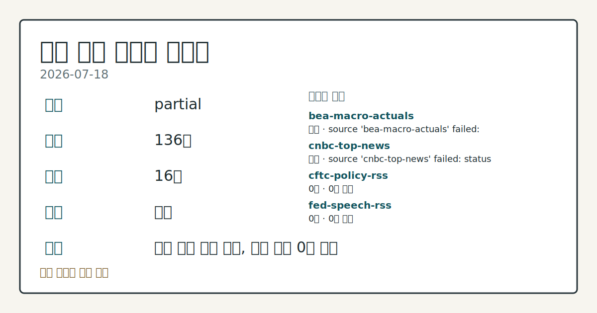
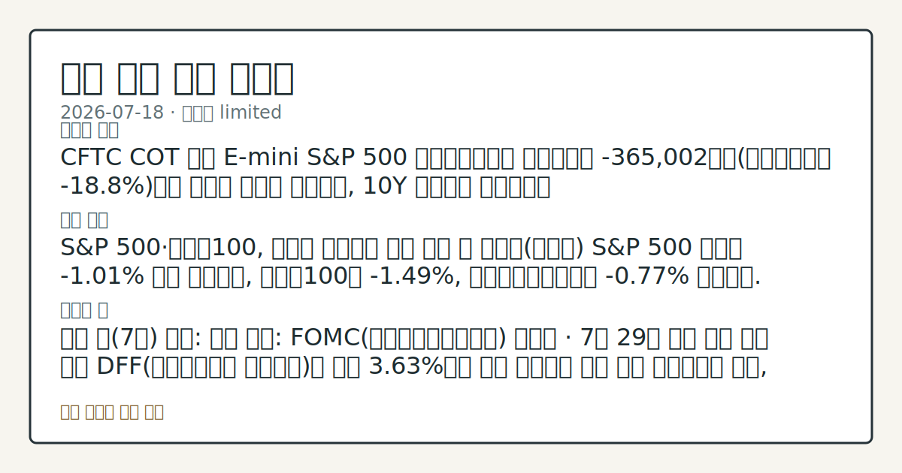

> 정보 제공용 자동 시황이며 매매 권유가 아닙니다.
# 2026-07-18 미국 증시 시황
**기준 시각**: 2026-07-18 NY · 수집창 2026-07-18T04:00Z ~ 2026-07-19T04:00Z (종료 미포함)
| 종목 | 종가 | 변동 | 비고 |
|------|------|------|------|
| ^GSPC | 7,457.69 | -1.01% | -2.00% from 52w high · +8.74% YTD |
| ^IXIC | 25,520.24 | -1.40% | -5.81% from 52w high · +9.83% YTD |
| ^DJI | 52,146.42 | -0.77% | -1.71% from 52w high · +7.78% YTD |
| AAPL | 333.74 | +0.14% | ATH 경신 · +23.15% YTD |
| MSFT | 393.82 | -1.82% | +11.62% from 52w low · -16.73% YTD |
**세그먼트**: [국내 증시](../../../domestic-equity/2026/07/2026-07-18.md) | [미국 증시](2026-07-18.md) | [크립토](../../../crypto/2026/07/2026-07-18.md)

*이미지: 데이터 신뢰도 · 출처: investo 자체 생성 · 생성: investo 0.1.0 · 2026-07-19 UTC*
> **내 관심 자산 영향**: 데이터 수집 부족으로 매칭 판단 보류 — 추가 수집 후 재평가됩니다.
> **오늘의 결론**: CFTC COT 기준 E-mini S&P 500 레버리지드머니 순포지션은 -365,002계약(미결제약정의 **-18.8%**)으로 순매도 우위를 본문 참고.
> **핵심 동인**: S&P 500·나스닥100, 기술주 매도세에 하락 마감 전 거래일(금요일) S&P 500 지수는 **-1.01%** 하락 마감했고, 나스닥100은 본문 참고.
> **주의할 점**: 이번 달(7월) 관전: 확인 소스: FOMC(연방공개시장위원회) 캘린더 · 7월 29일 회의 결과 발표 이후 DFF(연방기금금리 실효금리)가 현재 본문 참고.
## 한눈에 보기
미국 3대 지수 전 거래일 나스닥100 **-1.49%**, S&P 500 **-1.01%**, 다우존스산업평균 **-0.77%** 하락 마감.
CFTC(미국 상품선물거래위원회) COT(선물포지션 보고서) 기준 E-mini S&P 500 레버리지드머니(레버리지 자금) 순포지션 본문 참고.
FOMC 회의가 7월 29일 예정, DFF(연방기금금리 실효금리) **3.63%** 유지 여부가 본문 §④에서 확인 대상.
## ⓪ 오늘의 매크로
**국제 유가** — CFTC WTI crude oil managed_money net +61974 contracts
**미 국채 수익률** — UST curve 2026-07-17: 10Y 4.55%, 2Y10Y +0.37pp
## ⓪-B 채널 기준선
| 기준선 | 값 |
|------|------|
| S&P 500 | 7,457.69 (-1.01%) |
| 나스닥 종합 | 25,520.24 (-1.40%) |
| 다우존스 | 52,146.42 (-0.77%) |
| CFTC 포지셔닝 | E-mini S&P 500 순포지션 -365002계약 (-18.80% OI), 2026-07-14 기준/2026-07-17 공개 · Nasdaq-100 mini 순포지션 -64163계약 (-22.52% OI), 2026-07-14 기준/2026-07-17 공개 · VIX futures 순포지션 10189계약 (2.62% OI), 2026-07-14 기준/2026-07-17 공개 · 주간 지연 |
> **크로스마켓 연결 고리**: 유가/지정학 이슈가 여러 자산군의 변동성 연결 고리로 관찰됩니다. / 금리 이벤트가 할인율/달러 경로의 공통 변수로 남아 있습니다.
> **오늘의 큰 그림:** 유가와 지정학 변수가 공통 변수지만, 섹터·실적 변동성를 먼저 확인해야 합니다.
## ① 요약

*이미지: 시장 스냅샷 · 출처: investo 자체 생성 · 생성: investo 0.1.0 · 2026-07-19 UTC*

CFTC COT 기준 E-mini S&P 500 레버리지드머니 순포지션은 -365,002계약으로 순매도 우위를 이어갔고, 10Y 국채선물 순포지션도 -2,079,653계약으로 숏 우위가 두드러졌다. 같은 시점 FRED(세인트루이스 연방준비은행 경제데이터) 기준 CPIAUCSL(소비자물가지수)은 332.568로 전월(333.979) 대비 낮아졌고 UNRATE(실업률)는 **4.2%**로 전월 **4.3%**에서 하락하며 물가·고용 지표는 완만한 냉각을 시사했다. 반면 전 거래일 뉴욕증시는 기술주 매도세로 S&P 500 **-1.01%**, 나스닥100 **-1.49%**, 다우 **-0.77%** 하락 마감하며 단기 수급은 하방으로 기울었다. [하락 관찰]

## ② 전일 핵심 이슈

### S&P 500·나스닥100, 기술주 매도세에 하락 마감

전 거래일(금요일) [S&P 500 지수는 **-1.01%** 하락 마감](https://www.nasdaq.com/articles/stocks-finish-sharply-lower-tech-stocks-slump)했고, 나스닥100은 **-1.49%**, 다우존스산업평균은 **-0.77%** 하락했다. 지난 7월 14일 CPI 둔화 소식에 3대 지수가 상승 마감했던 흐름에서 이탈해 기술주 중심 매도세로 전환된 모습으로, CFTC COT 기준 E-mini S&P 500 레버리지드머니 순포지션이 -365,002계약으로 순매도 우위를 보이며 수급 이탈을 뒷받침한다.

> **그래서 의미는?** 대형 기술주 중심 매도세로 지수 하락폭이 커지는 흐름을 관찰합니다.

## ③ 섹터/수급 동향

CFTC COT(주간 발표, 장중 실시간 수급 아님) 기준 주요 선물 포지셔닝은 아래와 같다.

> **그래서 의미는?** 선물시장 참가자들의 포지션 방향으로 주식·채권·금 수급 심리를 가늠해 볼 수 있습니다.

- [10Y 국채선물](https://www.cftc.gov/MarketReports/CommitmentsofTraders/index.htm): 레버리지드머니 순포지션 -2,079,653계약 — 순매도(숏) 우위
- [E-mini S&P 500(소형 S&P 500 선물)](https://www.cftc.gov/MarketReports/CommitmentsofTraders/index.htm): 레버리지드머니 순포지션 -365,002계약
- [나스닥100 미니(소형 나스닥100 선물)](https://www.cftc.gov/MarketReports/CommitmentsofTraders/index.htm): 레버리지드머니 순포지션 -64,163계약(**-22.5%**)
- [Gold](https://www.cftc.gov/MarketReports/CommitmentsofTraders/index.htm): 매니지드머니(운용자금) 순포지션 +120,779계약(**+31.5%**) — 순매수 우위
- [DXY(달러지수)](https://www.cftc.gov/MarketReports/CommitmentsofTraders/index.htm): 레버리지드머니 순포지션 -4,866계약(**-9.1%**)
- [VIX(변동성지수) 선물](https://www.cftc.gov/MarketReports/CommitmentsofTraders/index.htm): 레버리지드머니 순포지션 +10,189계약(**+2.6%**)
- [WTI(서부텍사스산원유)](https://www.cftc.gov/MarketReports/CommitmentsofTraders/index.htm): 매니지드머니 순포지션 +61,974계약(**+3.3%**)

## ④ 지표·이벤트

### 6월 CPI·PPI 둔화, 실업률 **4.2%**로 하락

[CPIAUCSL(소비자물가지수)](https://fred.stlouisfed.org/series/CPIAUCSL)는 332.568로 전월(333.979) 대비 하락했고, [PPIFID(생산자물가지수 최종수요)](https://fred.stlouisfed.org/series/PPIFID)는 157.045로 전월(157.346) 대비 하락했다. [UNRATE(실업률)](https://fred.stlouisfed.org/series/UNRATE)는 **4.2%**로 전월 **4.3%**에서 낮아졌고, [DFF](https://fred.stlouisfed.org/series/DFF)는 **3.63%**로 전일과 동일하게 유지됐다.

> **그래서 의미는?** 물가·고용 지표 둔화가 연준의 향후 금리 결정에 어떤 영향을 줄지 확인이 필요합니다.

BLS(미국 노동통계국) 데이터도 같은 방향을 보였다: 6월 평균시간당임금 실제치 **$37.64**(전월 **$37.51**), 핵심 CPI 실제치 336.065(전월 336.121), 5월 구인건수 실제치 7,594천건(전월 7,585천건), 6월 경제활동참가율 실제치 **61.5%**(전월 **61.8%**), 6월 PPI 최종수요 실제치 156.566(전월 157.001), 6월 비농업부문 고용 실제치 158,984천명(전월 158,927천명), 6월 실업률 실제치 **4.2%**(전월 **4.3%**) — 전 항목 [BLS 데이터](https://www.bls.gov/data/) 기준.

### FOMC 회의 7월 29일, SKEW 지수 147.28

[FOMC 회의](https://www.federalreserve.gov/newsevents/calendar.htm)가 2026년 7월 29일 이틀간 개최 예정이며, 같은 날 오후 2시 30분 [기자회견](https://www.federalreserve.gov/live-broadcast.htm)이 예정되어 있다. 현재 연준 의장 관련 사실은 검증되지 않아 본 시황에서는 FOMC 기자회견으로만 표기한다. [Cboe SKEW(테일리스크지수)](https://cdn.cboe.com/api/global/us_indices/daily_prices/SKEW_History.csv)는 7월 17일 기준 **147.28**을 기록했다.

## ⑤ 주요 종목

<!-- u50 lightweight-charts-embed: placeholders consumed by site_docs/assets/investo-chart-init.js -->

<noscript><em>인터랙티브 차트는 JavaScript가 활성화된 환경에서 표시됩니다. 위 정적 카드가 동일한 정보를 담고 있습니다.</em></noscript>

### 실적·재무 공시 확인 (SEC 최신 공시 기준)

- **AAPL**(애플): 순이익 **$61,110,000,000**, [SEC(미국 증권거래위원회) 공시](https://data.sec.gov/submissions/CIK0000320193.json) 기준 EPS(주당순이익, 희석 기준) **$4.05**, 자산총계 **$359,241,000,000** (2025-03-29 기준)
- **AMZN**(아마존): 순이익 **$65,944,000,000**, EPS **$1.59**, 영업활동현금흐름 **$113,903,000,000** — [SEC 공시](https://data.sec.gov/submissions/CIK0001018724.json)
- **GOOGL**(알파벳): 매출 **$90,234,000,000**, 순이익 **$34,540,000,000**, EPS **$2.81** — [SEC 공시](https://data.sec.gov/submissions/CIK0001652044.json)
- **META**(메타): 순이익 **$16,644,000,000**, EPS **$6.43** — [SEC 공시](https://data.sec.gov/submissions/CIK0001326801.json)
- **MSFT**(마이크로소프트): 순이익 **$74,599,000,000**, EPS **$9.99** — [SEC 공시](https://data.sec.gov/submissions/CIK0000789019.json)
- **NVDA**(엔비디아): 매출 **$44,062,000,000**, 순이익 **$18,775,000,000**, EPS **$0.76** — [SEC 공시](https://data.sec.gov/submissions/CIK0001045810.json)
- **TSLA**(테슬라): 매출 **$19,335,000,000**, 순이익 **$409,000,000**, EPS **$0.12** — [SEC 공시](https://data.sec.gov/submissions/CIK0001318605.json)

> **그래서 의미는?** AAPL(애플)·MSFT(마이크로소프트) 등 대형 기술주의 최근 공시 실적 지표를 한눈에 비교해 볼 수 있는 항목입니다.

### 확인 항목 (업계 뉴스)

- Take-Two Interactive: [GTA VI 출시 관련 현금흐름 전망 기사](https://finance.yahoo.com/markets/stocks/articles/gta-vi-release-date-confirmed-083155039.html)가 보도됨
- SpaceX·마이크론(Micron): [두 종목 비교 분석 기사](https://finance.yahoo.com/markets/stocks/articles/spacex-stock-vs-micron-stock-083200966.html), SpaceX 주가가 고점 대비 **-45%** 하락했다는 [별도 기사](https://finance.yahoo.com/markets/stocks/articles/spacex-stock-down-45-peak-083100026.html)도 확인됨
- **NVDA**(엔비디아): [밸류에이션 재평가 관련 기사](https://finance.yahoo.com/markets/stocks/articles/nvidia-become-value-stock-083000548.html)
- **META**(메타): Iris AI 칩 9월 양산 돌입, 컴퓨팅 용량 14기가와트 확대 계획 관련 [기사](https://finance.yahoo.com/technology/ai/articles/mark-zuckerbergs-meta-putting-house-070200269.html)
- 버크셔 해서웨이(Berkshire Hathaway): 워런 버핏의 지분 처분 관련 [기사](https://finance.yahoo.com/markets/stocks/articles/warren-buffett-disposing-berkshire-shares-065000690.html)
- 반도체 관련: Sandisk 급등 이후 대안 칩주 관련 [기사](https://finance.yahoo.com/markets/stocks/articles/missed-sandisks-580-rally-3-053000590.html)

## ⑥ 오늘의 관전 포인트

> **관전 포인트**: 구조화 가능한 관찰 신호가 부족합니다 — 본문 §②·§④ 참조

> **데이터 상태**: 제한

수집/품질 진단

> **데이터 상태**: 제한 — 수집 113건 / 소스 15개 / 누락: 가격 · 제한 — 핵심 가격 소스 0건/실패/stale, 본문 결론 신뢰도 낮음
> **소스 카운트**: 수집 대상 25 / 성공 15 / 수집 상세는 진단 섹션에서 확인할 수 있습니다. / 수집 상세는 진단 섹션에서 확인할 수 있습니다. / 수집 상세는 진단 섹션에서 확인할 수 있습니다.
> **소스 등급 분포**: S=8 / A=7
> **상세 사유**: 가격 카테고리 누락, 일부 소스 수집 실패, 일부 소스 0건 반환, 핵심 가격 소스 0건
> **소스별 상태**: bea-macro-actuals 실패 (설정 미완료(미수집)), cnbc-top-news 실패 (접근 제한), cftc-policy-rss 0건, fed-speech-rss 0건, fomc-rss 0건, nasdaq-earnings-calendar 0건, sec-edgar-8k 0건, sec-newsroom-rss 0건, stooq-price 0건, yfinance-price 0건, 정상 15개

## ⑦ 면책조항
본 시황은 일반 정보 제공을 목적으로 자동 생성된 자료이며,
특정 종목·자산에 대한 매매 권유나 투자 자문이 아닙니다.
투자 결정과 그 결과에 대한 책임은 전적으로 본인에게 있으며,
본 시황의 내용에 따라 발생한 손실에 대해 작성자는 일체의 책임을 지지 않습니다.