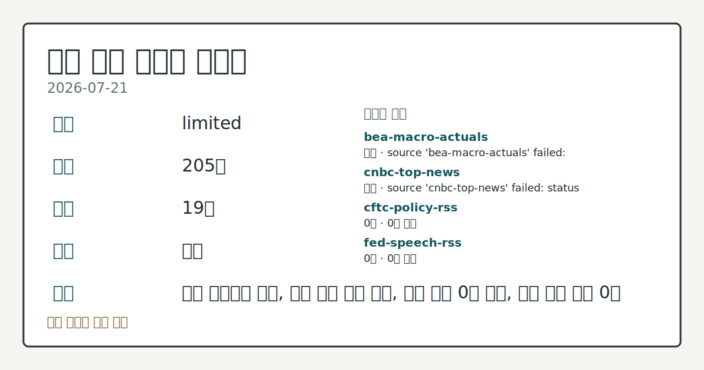
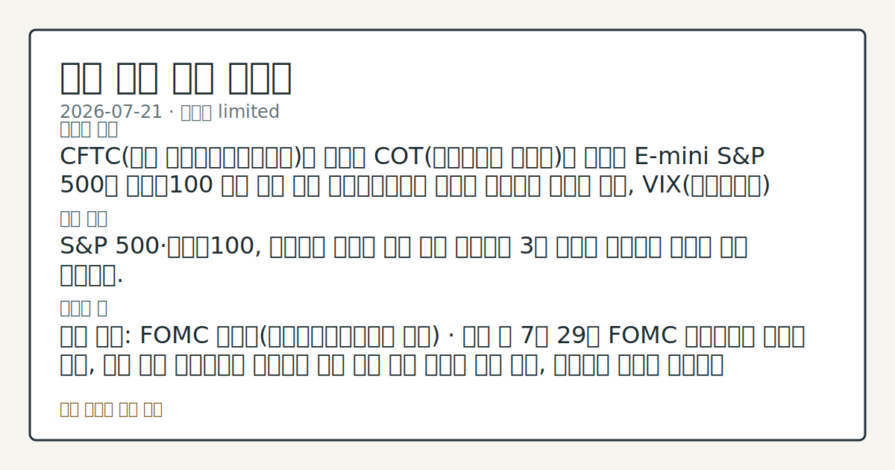
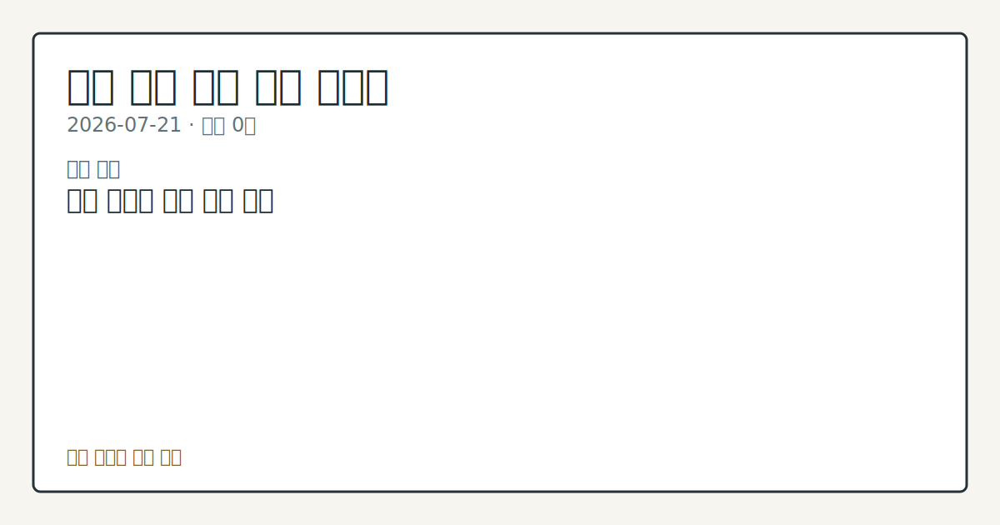

# 2026-07-21 미국 증시 시황
> 정보 제공용 자동 시황이며 매매 권유가 아닙니다.
# 2026-07-21 미국 증시 시황
**기준 시각**: 2026-07-21 NY · 수집창 2026-07-21T04:00Z ~ 2026-07-22T04:00Z (종료 미포함)
| 종목 | 종가 | 변동 | 비고 |
|------|------|------|------|
| ^GSPC | 7,509.20 | +0.89% | -1.32% from 52w high · +9.49% YTD |
| ^IXIC | 25,837.21 | +1.29% | -4.64% from 52w high · +11.20% YTD |
| ^DJI | 52,224.64 | +0.74% | -1.57% from 52w high · +7.94% YTD |
| AAPL | 327.74 | +0.35% | -1.80% from 52w high · +20.93% YTD |
| MSFT | 397.75 | -1.13% | +12.73% from 52w low · -15.90% YTD |
**세그먼트**: [국내 증시](../../../domestic-equity/2026/07/2026-07-21.md) | [미국 증시](2026-07-21.md) | [크립토](../../../crypto/2026/07/2026-07-21.md)
<!-- investo:block visual:us-equity.visual.data-confidence -->

*이미지: 데이터 신뢰도 · 출처: investo 자체 생성 · 생성: investo 0.1.0 · 2026-07-22 UTC*
<!-- /investo:block visual:us-equity.visual.data-confidence -->
> **내 관심 자산 영향**: 데이터 수집 부족으로 매칭 판단 보류 — 추가 수집 후 재평가됩니다.
> **용어 가이드**: 이번 시황에서 처음 등장한 용어 — VIX(변동성지수)
> **오늘의 결론**: CFTC(미국 상품선물거래위원회)가 발표한 COT(선물포지션 보고서)에 따르면 E-mini S&P 500과 나스닥100 미니 선물 모두 본문 참고.
> **핵심 동인**: S&P 500·나스닥100, 반도체주 강세에 상승 마감 뉴욕증시 3대 지수는 반도체주 강세에 상승 마감했다.
> **주의할 점**: 확인 소스: FOMC 캘린더(연방공개시장위원회 일정) · 이번 달 7월 29일 FOMC 기자회견이 예정돼 있어, 발언 톤이 매파적으로 확인되면 금리 본문 참고.
## 한눈에 보기
미국 3대 지수 **+0.74%**~**+1.93%** 범위로 상승 마감, 나스닥100이 반도체주 강세에 최대 상승폭 기록
CFTC COT 기준 E-mini S&P 500 레버리지머니 순매도가 **-18.8%**(미결제약정 대비)로 확대, VIX 선물은 순매수로 전환
6월 CPI 332.568(전월 333.979)·실업률 **4.2%**로 물가·고용 지표 발표 — 본문 §④ 참조
## ⓪ 오늘의 매크로
**미 국채 수익률** — UST curve 2026-07-21: 10Y 4.63%, 2Y10Y +0.37pp
## ⓪-B 채널 기준선
| 기준선 | 값 |
|------|------|
| S&P 500 | 7,509.20 (+0.89%) |
| 나스닥 종합 | 25,837.21 (+1.29%) |
| 다우존스 | 52,224.64 (+0.74%) |
| CFTC 포지셔닝 | E-mini S&P 500 순포지션 -365002계약 (-18.80% OI), 2026-07-14 기준/2026-07-17 공개 · Nasdaq-100 mini 순포지션 -64163계약 (-22.52% OI), 2026-07-14 기준/2026-07-17 공개 · VIX futures 순포지션 10189계약 (2.62% OI), 2026-07-14 기준/2026-07-17 공개 · 주간 지연 |
> **크로스마켓 연결 고리**: 금리 이벤트가 할인율/달러 경로의 공통 변수로 남아 있습니다.
> **오늘의 큰 그림:** 금리와 달러 변수가 공통 변수지만, Nasdaq·Dow 섹터 변동성를 먼저 확인해야 합니다.
## ① 요약

<!-- investo:block visual:us-equity.visual.market-snapshot -->

*이미지: 시장 스냅샷 · 출처: investo 자체 생성 · 생성: investo 0.1.0 · 2026-07-22 UTC*
<!-- /investo:block visual:us-equity.visual.market-snapshot -->

CFTC가 발표한 COT에 따르면 E-mini S&P 500과 나스닥100 미니 선물 모두 레버리지머니가 순매도 포지션을 확대한 반면, VIX 선물은 레버리지머니 순매수로 전환되며 변동성 헤지 수요가 감지됐다. 같은 시기 6월 CPI(소비자물가지수)는 전월(333.979) 대비 하락한 332.568을 기록했고 실업률은 전월(**4.3%**) 대비 낮아진 **4.2%**로 나타났으며, 연방기금금리(DFF)는 **3.63%**로 유지됐다. 이런 매크로·포지셔닝 배경 속에서도 S&P 500은 **+0.89%**, 다우존스 산업평균은 **+0.74%**, 나스닥100은 **+1.93%** 상승 마감하며 반도체주 강세가 지수 상승을 이끌었다. [혼재]

## ② 전일 핵심 이슈

### S&P 500·나스닥100, 반도체주 강세에 상승 마감

뉴욕증시 3대 지수는 [반도체주 강세에 상승 마감했다](https://www.nasdaq.com/articles/stock-indexes-settle-higher-chipmakers-soar). S&P 500(스탠더드앤드푸어스 500 지수)은 **+0.89%**, 다우존스 산업평균은 **+0.74%**, 나스닥100은 **+1.93%** 상승했고, 9월물 ESU26(미니 S&P 500 선물)도 **+0.81%** 올랐다. 지난주(7/13·7/7) 반도체 약세가 지수 하락을 이끌었던 것과 대조적으로, 이번엔 반도체주 강세가 상승을 견인하며 흐름이 전환됐다.

> **그래서 의미는?** 반도체 업종이 하락 요인에서 상승 요인으로 바뀌며 시장 분위기가 개선됐음을 보여줍니다.

### 달러 강세·유가 상승, 인플레이션 경로 재부각

[DXY(달러지수)가 유가·금리 상승 속에 강세를 보였다](https://www.nasdaq.com/articles/dollar-edges-higher-crude-oil-prices-and-bond-yields-climb). DXY는 **+0.23%** 올랐으며, 미국과 이란 간 긴장 고조가 원유 가격을 밀어올려 인플레이션 기대를 자극하고 있다는 점이 언급됐다. 유가발 물가 우려가 재부각될 경우 미국 증시 내 금리 민감 섹터(기술·성장주)의 밸류에이션 부담으로 이어질 수 있어 확인이 필요하다.

## ③ 섹터/수급 동향

### 파생상품 포지셔닝(CFTC COT)

[CFTC COT(선물포지션 보고서)](https://www.cftc.gov/MarketReports/CommitmentsofTraders/index.htm)에 따르면 E-mini S&P 500 레버리지머니는 순매도 -365,002계약(OI(미결제약정) 대비 **-18.8%**)을 기록했고, 나스닥100 미니 선물도 순매도 -64,163계약(OI 대비 **-22.5%**)으로 나타났다. 반면 VIX 선물은 레버리지머니 순매수 +10,189계약(OI 대비 **+2.6%**)으로 변동성 헤지 수요가 관찰됐다. 해당 수치는 주간 CFTC 보고서 기준으로, 일중 흐름과는 다르다.

> **그래서 의미는?** 대형 지수 선물에서 레버리지 자금의 순매도가 늘어 단기 경계심이 커졌음을 시사합니다.

## ④ 지표·이벤트

### 6월 물가·고용 지표

[CPI(소비자물가지수)](https://fred.stlouisfed.org/series/CPIAUCSL)는 전월 대비 하락한 332.568을 기록했으며, [BLS(미국 노동통계국)](https://www.bls.gov/data/) 발표 기준으로도 동일하게 332.568(전월 333.979)로 집계됐다. 근원 CPI는 336.065(전월 336.121)로 소폭 낮아졌다. [PPIFID(생산자물가지수 최종수요, FRED 기준)](https://fred.stlouisfed.org/series/PPIFID)는 157.045(전월 157.346)를 기록했고, BLS 기준 생산자물가지수 최종수요는 156.566(전월 157.001)으로 집계됐다. 실업률은 [FRED](https://fred.stlouisfed.org/series/UNRATE) 기준 전월(**4.3%**) 대비 낮아진 **4.2%**로 나타났으며, 연방기금금리는 [FRED](https://fred.stlouisfed.org/series/DFF) 기준 **3.63%**로 유지됐다. 이 외에 평균 시간당임금은 **$37.64**(전월 **$37.51**), 구인건수는 7,594(전월 7,585), 경제활동참가율은 **61.5%**(전월 **61.8%**), 비농업 고용은 158,984천 명(전월 158,927천 명)으로 집계됐다.

> **그래서 의미는?** 물가 상승세는 둔화되고 고용은 소폭 냉각돼 금리 인하 기대와 경기 둔화 우려가 함께 나타납니다.

### 변동성 지표

[Cboe SKEW(꼬리위험지수)](https://cdn.cboe.com/api/global/us_indices/daily_prices/SKEW_History.csv)는 151.66을 기록했고, [VVIX(변동성의 변동성지수)](https://cdn.cboe.com/api/global/us_indices/daily_prices/VVIX_History.csv)는 96.34로 집계됐다. 두 지표 모두 일중 스냅샷이 아닌 공식 종가 기준이다.

## ⑤ 주요 종목
<!-- investo:block chart:us-equity.chart.market -->

<!-- u50 lightweight-charts-embed: placeholders consumed by site_docs/assets/investo-chart-init.js -->

<noscript><em>인터랙티브 차트는 JavaScript가 활성화된 환경에서 표시됩니다. 위 정적 카드가 동일한 정보를 담고 있습니다.</em></noscript>

<!-- /investo:block chart:us-equity.chart.market -->

### 재무 공시 확인

[AAPL(애플)](https://data.sec.gov/submissions/CIK0000320193.json) SEC(미국 증권거래위원회) 공시 기준 최근 분기 매출은 215,639,000,000달러, 순이익은 61,110,000,000달러, 희석 EPS(주당순이익)는 **$4.05**로 나타났다. [MSFT(마이크로소프트)](https://data.sec.gov/submissions/CIK0000789019.json) 공시 기준 매출은 31,942,000,000달러, 순이익은 74,599,000,000달러, 희석 EPS는 **$9.99**로 집계됐다.

> **그래서 의미는?** 애플·마이크로소프트의 최근 공시 실적 규모를 확인하는 참고 지표입니다.

### 실적 발표(완료)

[VLRS(Controladora Vuela)](https://www.nasdaq.com/articles/controladora-vuela-vlrs-reports-q2-loss-beats-revenue-estimates)는 2026년 6월 마감 분기 실적·매출 서프라이즈가 각각 **-2.78%**, **+1.10%**로 집계됐다. [BFC(Bank First Corporation)](https://www.nasdaq.com/articles/bank-first-corporation-bfc-tops-q2-earnings-and-revenue-estimates)는 실적·매출 서프라이즈가 각각 **+7.46%**, **+2.35%**로 나타났다. [TFIN(Triumph Financial)](https://www.nasdaq.com/articles/triumph-financial-tfin-meets-q2-earnings-estimates)은 실적 서프라이즈 **0.00%**, 매출 서프라이즈 **+3.44%**를 기록했다.

### 실적 발표 예정(확인 항목)

[ALLY(Ally Financial)](https://www.nasdaq.com/market-activity/stocks/ally/earnings) 장 시작 전 EPS 예상치 **$1.25**, [CB(Chubb)](https://www.nasdaq.com/market-activity/stocks/cb/earnings) 장 마감 후 **$6.63**, [COF(Capital One)](https://www.nasdaq.com/market-activity/stocks/cof/earnings) 장 마감 후 **$4.85**, [DHI(D.R. Horton)](https://www.nasdaq.com/market-activity/stocks/dhi/earnings) 장 시작 전 **$2.99**, [DHR(Danaher)](https://www.nasdaq.com/market-activity/stocks/dhr/earnings) 장 시작 전 **$1.84**, [EFX(Equifax)](https://www.nasdaq.com/market-activity/stocks/efx/earnings) 장 시작 전 **$2.21**, [EQT(EQT Corporation)](https://www.nasdaq.com/market-activity/stocks/eqt/earnings) 장 마감 후 **$0.41**, [EWBC(East West Bancorp)](https://www.nasdaq.com/market-activity/stocks/ewbc/earnings) 장 마감 후 **$2.61**, [GM(General Motors)](https://www.nasdaq.com/market-activity/stocks/gm/earnings) 장 시작 전 **$3.13**의 EPS 예상치가 각각 제시됐다.

## ⑥ 오늘의 관전 포인트

<!-- investo:block visual:us-equity.visual.watchlist-relevance -->

*이미지: 관심 자산 관련성 · 출처: investo 자체 생성 · 생성: investo 0.1.0 · 2026-07-22 UTC*
<!-- /investo:block visual:us-equity.visual.watchlist-relevance -->

#### 관찰 신호: Nasdaq 실적 캘린더 · GM 실적

- 출처: Nasdaq 실적 캘린더
- 현재: Nasdaq 실적 캘린더
- 확인 조건: 상방 GM 실적이 시장 예상 EPS **$3.13**을 상회하면 산업재 실적 모멘텀 확대 관찰; 하방 하회하면 소비 둔화 신호로 해석
- 신뢰도: 높음
- 관심 영향: 경기민감주 실적 시즌 흐름 확인.

> **데이터 상태**: 제한

수집/품질 진단

> **데이터 상태**: 제한 — 수집 205건 / 소스 19개 / 누락: 가격 · 제한 — 핵심 가격 소스 0건/실패/stale, 본문 결론 신뢰도 낮음
> **소스 카운트**: 수집 대상 26 / 성공 19 / 수집 상세는 진단 섹션에서 확인할 수 있습니다. / 수집 상세는 진단 섹션에서 확인할 수 있습니다. / 수집 상세는 진단 섹션에서 확인할 수 있습니다.
> **소스 등급 분포**: S=10 / A=9
> **상세 사유**: 가격 카테고리 누락, 일부 소스 수집 실패, 일부 소스 0건 반환, 핵심 가격 소스 0건
> **소스별 상태**: bea-macro-actuals 실패 (설정 미완료(미수집)), cnbc-top-news 실패 (접근 제한), cftc-policy-rss 0건, fed-speech-rss 0건, fomc-rss 0건, stooq-price 0건, yfinance-price 0건, 정상 19개

## ⑦ 면책조항
본 시황은 일반 정보 제공을 목적으로 자동 생성된 자료이며,
특정 종목·자산에 대한 매매 권유나 투자 자문이 아닙니다.
투자 결정과 그 결과에 대한 책임은 전적으로 본인에게 있으며,
본 시황의 내용에 따라 발생한 손실에 대해 작성자는 일체의 책임을 지지 않습니다.