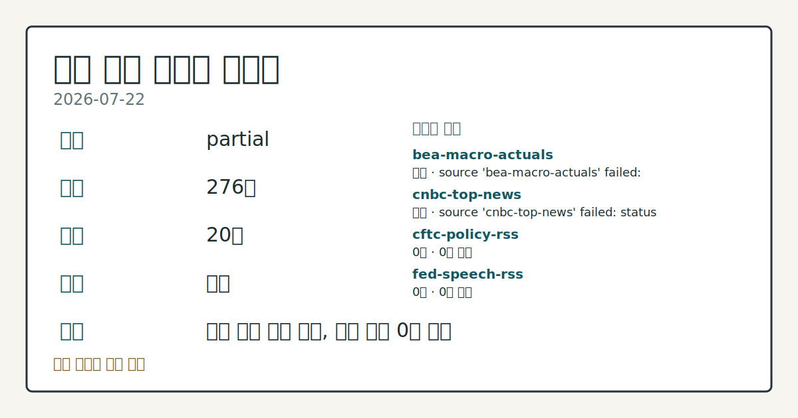
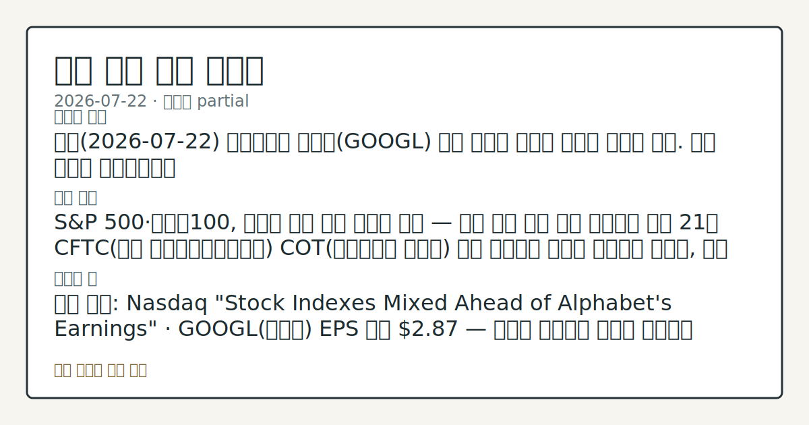
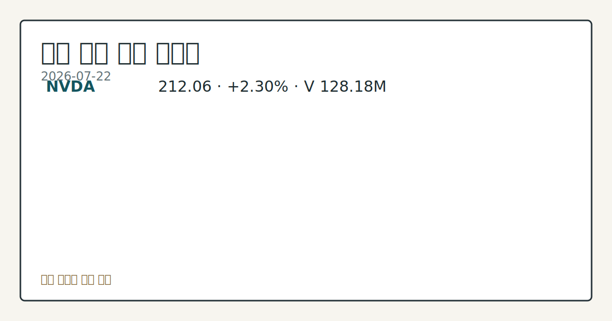
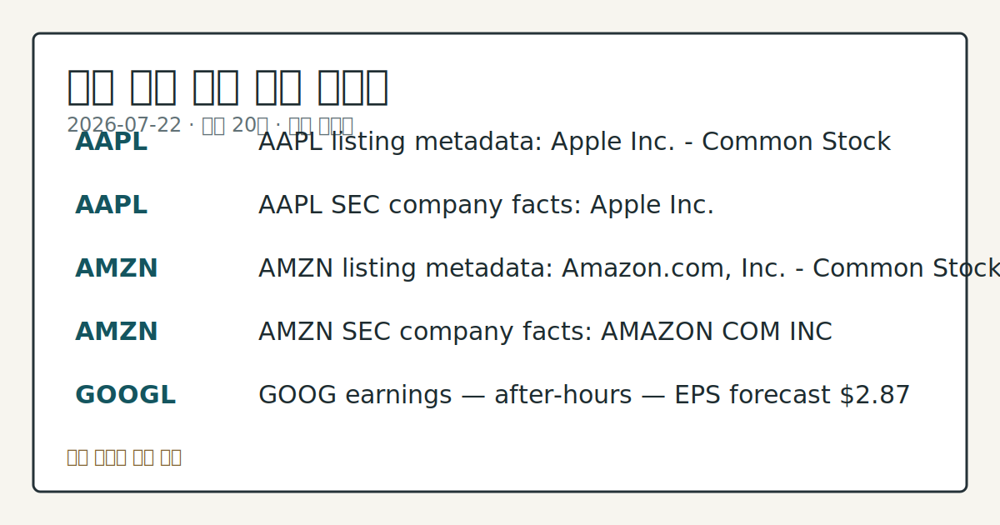

# 2026-07-22 미국 증시 시황
> 정보 제공용 자동 시황이며 매매 권유가 아닙니다.
# 2026-07-22 미국 증시 시황
**기준 시각**: 2026-07-22 NY · 수집창 2026-07-22T04:00Z ~ 2026-07-23T04:00Z (종료 미포함)
| 종목 | 종가 | 변동 | 비고 |
|------|------|------|------|
| ^GSPC | 7,498.96 | -0.14% | -1.46% from 52w high · +9.34% YTD |
| ^IXIC | 25,690.90 | -0.57% | -5.18% from 52w high · +10.57% YTD |
| ^DJI | 52,218.58 | -0.01% | -1.58% from 52w high · +7.93% YTD |
| AAPL | 325.89 | -0.56% | -2.35% from 52w high · +20.25% YTD |
| MSFT | 390.34 | -1.86% | +10.63% from 52w low · -17.47% YTD |
**세그먼트**: [국내 증시](../../../domestic-equity/2026/07/2026-07-22.md) | [미국 증시](2026-07-22.md) | [크립토](../../../crypto/2026/07/2026-07-22.md)
<!-- investo:block visual:us-equity.visual.curated-context-image -->

*이미지: 큐레이션 시황 이미지 · 출처: 외부 라이선스 이미지 · 생성: investo 0.1.0 · 2026-07-22 UTC*
<!-- /investo:block visual:us-equity.visual.curated-context-image -->
> **내 관심 자산 영향**: 20건 확인 (기본 바스켓) — AAPL: 직접 관련 · [nasdaq-symbol-directory] AAPL listing metadata: Apple Inc. - Common Stock; AAPL: 직접 관련 · [sec-company-facts] AAPL SEC company facts: Apple Inc.; AMZN: 직접 관련 · [nasdaq-symbol-directory] AMZN listing metadata: Amazon.com, Inc. - Common Stock; AMZN: 직접 관련 · [sec-company-facts] AMZN SEC company facts: AMAZON COM INC; GOOGL: 직접 관련 · [nasdaq-earnings-calendar] GOOG earnings — after-hours — EPS forecast **$2.87** 외
> **용어 가이드**: 이번 시황에서 처음 등장한 용어 — E-mini S&P 500(미니 S&P 500 선물), 시가총액(시장가치)
> **오늘의 결론**: 오늘(2026-07-22) 뉴욕증시는 알파벳(GOOGL) 실적 발표를 앞두고 혼조를 보이고 있다. 수집 근거가 제한적입니다
> **핵심 동인**: S&P 500·나스닥100, 알파벳 실적 발표 앞두고 혼조 — 이틀 연속 하락 이후 숨고르기 지난 21일 CFTC(미국 상품선물거래위원회) 본문 참고.
> **주의할 점**: 확인 소스: Nasdaq "Stock Indexes Mixed Ahead of Alphabet's Earnings" · GOOGL(알파벳) EPS 본문 참고.
## 한눈에 보기
미국 3대 지수가 알파벳(GOOGL) 실적 발표를 앞두고 방향성 없이 엇갈렸다 — S&P 500 **-0.09%**, 다우존스 **+0.10%** 본문 참고.
**GOOGL**(알파벳)이 장 마감 후 EPS(주당순이익) 전망치 **$2.87**로 실적을 발표할 예정이다.
WTI 원유가 6주 최고치로 **+2.95%** 급등하며 국채 금리 상승과 맞물려 지수 상단을 압박 — 본문 §② 참조.
## ⓪ 오늘의 매크로
**미 국채 수익률** — UST curve 2026-07-22: 10Y 4.67%, 2Y10Y +0.36pp
## ⓪-B 채널 기준선
| 기준선 | 값 |
|------|------|
| S&P 500 | 7,498.96 (-0.14%) |
| 나스닥 종합 | 25,690.90 (-0.57%) |
| 다우존스 | 52,218.58 (-0.01%) |
| CFTC 포지셔닝 | E-mini S&P 500 순포지션 -365002계약 (-18.80% OI), 2026-07-14 기준/2026-07-17 공개 · Nasdaq-100 mini 순포지션 -64163계약 (-22.52% OI), 2026-07-14 기준/2026-07-17 공개 · VIX futures 순포지션 10189계약 (2.62% OI), 2026-07-14 기준/2026-07-17 공개 · 주간 지연 |
> **크로스마켓 연결 고리**: 금리 이벤트가 할인율/달러 경로의 공통 변수로 남아 있습니다.
> **오늘의 큰 그림:** 금리와 달러 변수가 공통 변수지만, Nasdaq·Dow 섹터 변동성를 먼저 확인해야 합니다.
## ① 요약

<!-- investo:block visual:us-equity.visual.data-confidence -->

*이미지: 데이터 신뢰도 · 출처: investo 자체 생성 · 생성: investo 0.1.0 · 2026-07-22 UTC*
<!-- /investo:block visual:us-equity.visual.data-confidence -->

<!-- investo:block visual:us-equity.visual.market-snapshot -->

*이미지: 시장 스냅샷 · 출처: investo 자체 생성 · 생성: investo 0.1.0 · 2026-07-22 UTC*
<!-- /investo:block visual:us-equity.visual.market-snapshot -->

오늘 뉴욕증시는 [알파벳(GOOGL) 실적 발표를 앞두고 혼조](https://www.nasdaq.com/articles/stock-indexes-mixed-ahead-alphabets-earnings)를 보이고 있다. S&P 500(스탠더드앤드푸어스 500 지수)은 **-0.09%**, Dow Jones Industrial Average(다우존스 산업평균지수)는 **+0.10%**, 나스닥100은 **-0.29%**로 3대 지수 방향이 엇갈렸다. 알파벳은 이날 장 마감 후 EPS 전망치 **$2.87**로 실적을 발표할 예정이며, 최근 이틀간 지수를 눌러온 하락 압력이 이어질지를 가늠할 변수로 꼽힌다. 전일에는 [원유·국채 금리 동반 상승](https://www.nasdaq.com/articles/stock-indexes-retreat-crude-oil-and-bond-yields-climb)이 지수 상단을 제약했고, CLU26(WTI 원유 선물)은 6주 최고치로 **+2.95%** 급등했다. [혼재]

## ② 전일 핵심 이슈

### S&P 500·나스닥100, 알파벳 실적 발표 앞두고 혼조 — 이틀 연속 하락 이후 숨고르기

지난 21일 CFTC(미국 상품선물거래위원회) COT 관련 포지셔닝 흐름이 이어지는 가운데, 오늘 지수 자체는 방향성보다 [알파벳 실적 발표를 기다리는 관망 장세](https://www.nasdaq.com/articles/stock-indexes-mixed-ahead-alphabets-earnings)다. S&P 500은 **-0.09%**, 다우존스(DIA)는 **+0.10%**, 나스닥100(QQQ)은 **-0.29%**를 기록 중이며, ESU26(미니 S&P 500 선물, 9월물)은 **-0.07%** 하락했다. 이는 [수요일 마감 기준 하락](https://www.nasdaq.com/articles/stocks-settle-lower-crude-oil-prices-jump) — S&P 500 **-0.14%**, 다우존스 **-0.01%**, 나스닥100 **-0.54%** — 그리고 그 전날 [원유·국채 금리 상승에 따른 하락](https://www.nasdaq.com/articles/stock-indexes-retreat-crude-oil-and-bond-yields-climb) — S&P 500 **-0.13%**, 다우존스 **+0.15%**, 나스닥100 **-0.48%** — 에 이어지는 흐름으로, 지난주 CPI(소비자물가지수) 둔화에 따른 상승분을 일부 되돌리는 모습이다.

> **그래서 의미는?** 3대 지수가 알파벳 실적을 앞두고 관망하며 최근 이틀간의 하락 흐름을 소화하고 있다는 의미입니다.

### WTI 원유, 6주 최고치로 급등 — 국채 금리 동반 상승

[공급 리스크 우려](https://www.nasdaq.com/articles/escalating-global-supply-risks-underpin-crude-oil-prices)로 CLU26(WTI 원유 선물, 9월물)은 수요일 **+2.49(**+2.95%**)** 상승해 6주 최고치를 기록했고, RBU26(정제 휘발유 선물)도 **+0.0186(**+0.58%**)** 올랐다. 이는 앞서 지수 하락의 배경이 된 원유·금리 상승 흐름과 같은 맥락이다.

## ③ 섹터/수급 동향

### CFTC COT(선물포지션 보고서), 국채·주가지수 선물 순매도 우위 지속

지난 21일 언급된 포지셔닝 흐름을 잇는 [CFTC(미국 상품선물거래위원회) 최신 COT 보고서](https://www.cftc.gov/MarketReports/CommitmentsofTraders/index.htm)에 따르면, 10Y 국채(10년물 미국채) 선물에서 leveraged_money(레버리지 자금)는 순매도 **-2,079,653**계약(OI, 미결제약정 대비 **-39.4%**)을 기록했다. 주가지수 선물에서도 E-mini S&P 500이 순매도 **-365,002**계약, Nasdaq-100 mini가 순매도 **-64,163**계약으로 순매도 우위가 이어졌다. 원자재·통화·변동성 쪽은 방향이 갈려, Gold(금)의 managed_money는 순매수 **+120,779**계약, WTI 원유 managed_money는 순매수 **+61,974**계약인 반면, U.S. Dollar Index leveraged_money는 순매도 **-4,866**계약, VIX(변동성지수) 선물 leveraged_money는 순매수 **+10,189**계약이었다. 이는 주간 단위 보고서로 일중 수급 흐름과는 다르다.

> **그래서 의미는?** 대형 기관 자금이 국채·주가지수 선물에서는 순매도, 금·원유·VIX에서는 순매수 우위를 보인다는 의미입니다.

## ④ 지표·이벤트

### 6월 CPI·PPI 둔화, 실업률 하락 — 정책금리는 동결 유지

[FRED(세인트루이스 연방준비은행 경제데이터)](https://fred.stlouisfed.org/series/DFF)에 따르면 DFF(연방기금 실효금리)는 **3.63%**로 전일(2026-07-20) **3.63%**에서 변동이 없었다. [CPIAUCSL(소비자물가지수)](https://fred.stlouisfed.org/series/CPIAUCSL)는 2026년 6월 **332.568**로 전월(5월) **333.979**에서 하락했고, [PPIFID(생산자물가지수, 최종수요)](https://fred.stlouisfed.org/series/PPIFID)도 같은 달 **157.045**로 전월 **157.346**에서 낮아졌다. [UNRATE(실업률)](https://fred.stlouisfed.org/series/UNRATE)은 6월 **4.2%**로 전월 **4.3%**에서 하락했다. [BLS(미국 노동통계청)](https://www.bls.gov/data/) 집계에서도 같은 흐름이 확인된다 — Core CPI(근원 소비자물가지수)는 **336.065**(전월 336.121), PPI 최종수요는 **156.566**(전월 157.001), 비농업 부문 고용은 **158,984**천 명(전월 158,927천 명), 신규 채용공고는 **7,594**건(전월 7,585건), 평균 시간당 임금은 **$37.64**(전월 **$37.51**), 경제활동참가율은 **61.5%**(전월 **61.8%**)로 나타났다. 한편 [FOMC(연방공개시장위원회) 일정](https://www.federalreserve.gov/live-broadcast.htm)상 7월 29일 기자회견과 8월 19일 의사록 공개가 예정돼 있다.

> **그래서 의미는?** 물가지표들이 전월보다 낮아지고 실업률도 하락해 인플레이션 둔화 신호가 이어지고 있다는 의미입니다.

## ⑤ 주요 종목
<!-- investo:block chart:us-equity.chart.market -->

<!-- u50 lightweight-charts-embed: placeholders consumed by site_docs/assets/investo-chart-init.js -->

<noscript><em>인터랙티브 차트는 JavaScript가 활성화된 환경에서 표시됩니다. 위 정적 카드가 동일한 정보를 담고 있습니다.</em></noscript>

<!-- /investo:block chart:us-equity.chart.market -->

<!-- investo:block visual:us-equity.visual.price-snapshot -->

*이미지: 가격 스냅샷 · 출처: investo 자체 생성 · 생성: investo 0.1.0 · 2026-07-22 UTC*
<!-- /investo:block visual:us-equity.visual.price-snapshot -->

### 실적 발표 확인 (2026년 6월 분기)

- Rollins(ROL): EPS 서프라이즈 **-5.88%**, 매출 서프라이즈 **-1.73%** — [기사](https://www.nasdaq.com/articles/rollins-rol-q2-earnings-and-revenues-lag-estimates)
- Tesla(TSLA): EPS 서프라이즈 **-34.00%**, 매출 서프라이즈 **+9.41%** — [기사](https://www.nasdaq.com/articles/tesla-tsla-misses-q2-earnings-estimates)
- IBM: EPS 서프라이즈 **0.00%**, 매출 서프라이즈 **-0.03%** — [기사](https://www.nasdaq.com/articles/ibm-ibm-matches-q2-earnings-estimates)
- Kinder Morgan(KMI): EPS 서프라이즈 **+19.36%**, 매출 서프라이즈 **+4.33%** — [기사](https://www.nasdaq.com/articles/kinder-morgan-kmi-tops-q2-earnings-and-revenue-estimates)
- Las Vegas Sands(LVS): EPS 서프라이즈 **-23.38%**, 매출 서프라이즈 **-6.41%** — [기사](https://www.nasdaq.com/articles/las-vegas-sands-lvs-misses-q2-earnings-and-revenue-estimates)

> **그래서 의미는?** AAPL(애플)·AMZN(아마존)·GOOGL·TSLA(테슬라) 등 대형주 실적·펀더멘털 확인이 이번 주 관전 포인트입니다.

### 실적 발표 예정 (체크리스트)

- Alphabet(GOOGL/GOOG): 장 마감 후, EPS 전망 **$2.87**
- Crown Castle(CCI): 장 마감 후, EPS 전망 **$0.95**, 시가총액 **$33,257,641,105**, 전년 동기 EPS **$1.02** — [일정](https://www.nasdaq.com/market-activity/stocks/cci/earnings)
- CME Group(CME): 장 개장 전, EPS 전망 **$2.91**, 시가총액 **$86,016,861,791**, 전년 동기 EPS **$2.96** — [일정](https://www.nasdaq.com/market-activity/stocks/cme/earnings)
- CSX: 장 마감 후, EPS 전망 **$0.50**, 시가총액 **$92,702,547,526**, 전년 동기 EPS **$0.44** — [일정](https://www.nasdaq.com/market-activity/stocks/csx/earnings)
- Equinor(EQNR): 장 개장 전, EPS 전망 **$1.38**, 시가총액 **$93,985,188,018**, 전년 동기 EPS **$0.64** — [일정](https://www.nasdaq.com/market-activity/stocks/eqnr/earnings)

### 펀더멘털 확인 항목

- AAPL: [SEC(미국 증권거래위원회) 공시](https://data.sec.gov/submissions/CIK0000320193.json) 기준 매출 **$215,639,000,000**, 순이익 **$61,110,000,000**, 희석 EPS **$4.05**, 자산총계 **$359,241,000,000**, 부채총계 **$285,508,000,000**, 영업활동 현금흐름 **$53,887,000,000**
- AMZN, GOOGL, TSLA: [Nasdaq(나스닥) 상장 목록](https://www.nasdaqtrader.com/dynamic/SymDir/nasdaqlisted.txt) 기준 보통주 상장 유지 확인

## ⑥ 오늘의 관전 포인트

<!-- investo:block visual:us-equity.visual.watchlist-relevance -->

*이미지: 관심 자산 관련성 · 출처: investo 자체 생성 · 생성: investo 0.1.0 · 2026-07-22 UTC*
<!-- /investo:block visual:us-equity.visual.watchlist-relevance -->

> **관전 포인트**: 오늘은 공개 근거가 충분한 관전 신호만 본문에 남겼습니다.

> **데이터 상태**: 부분

수집/품질 진단

> **데이터 상태**: 부분 — 수집 276건 / 소스 20개 / 누락: 없음 · 부분 — 일부 카테고리 미수집, 본문 일부 결론 보강 필요
> **소스 카운트**: 수집 대상 26 / 성공 20 / 수집 상세는 진단 섹션에서 확인할 수 있습니다. / 수집 상세는 진단 섹션에서 확인할 수 있습니다. / 수집 상세는 진단 섹션에서 확인할 수 있습니다.
> **소스 등급 분포**: S=10 / A=10
> **상세 사유**: 일부 소스 수집 실패, 일부 소스 0건 반환
> **소스별 상태**: bea-macro-actuals 실패 (설정 미완료(미수집)), cnbc-top-news 실패 (접근 제한), cftc-policy-rss 0건, fed-speech-rss 0건, fomc-rss 0건, stooq-price 0건, 정상 20개

## ⑦ 면책조항
본 시황은 일반 정보 제공을 목적으로 자동 생성된 자료이며,
특정 종목·자산에 대한 매매 권유나 투자 자문이 아닙니다.
투자 결정과 그 결과에 대한 책임은 전적으로 본인에게 있으며,
본 시황의 내용에 따라 발생한 손실에 대해 작성자는 일체의 책임을 지지 않습니다.