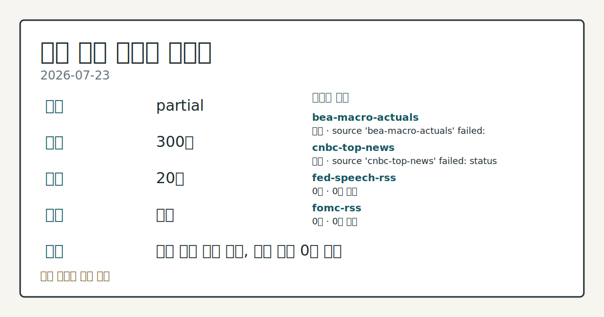
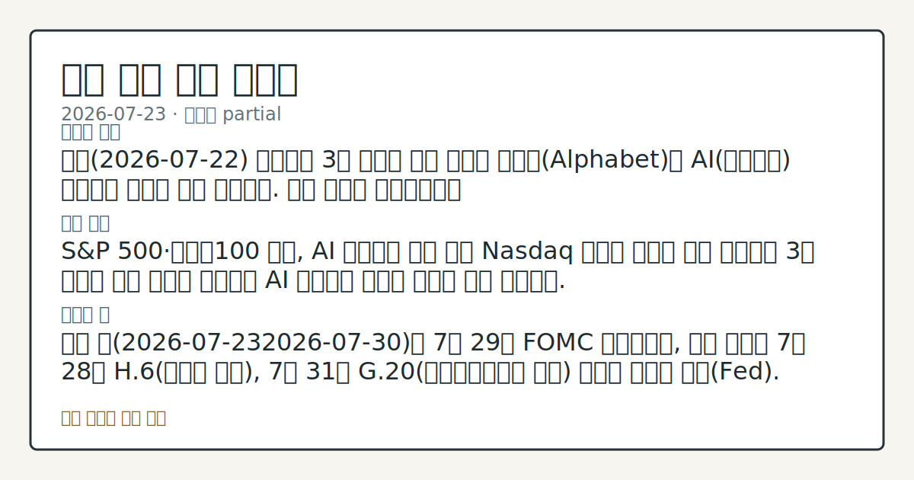
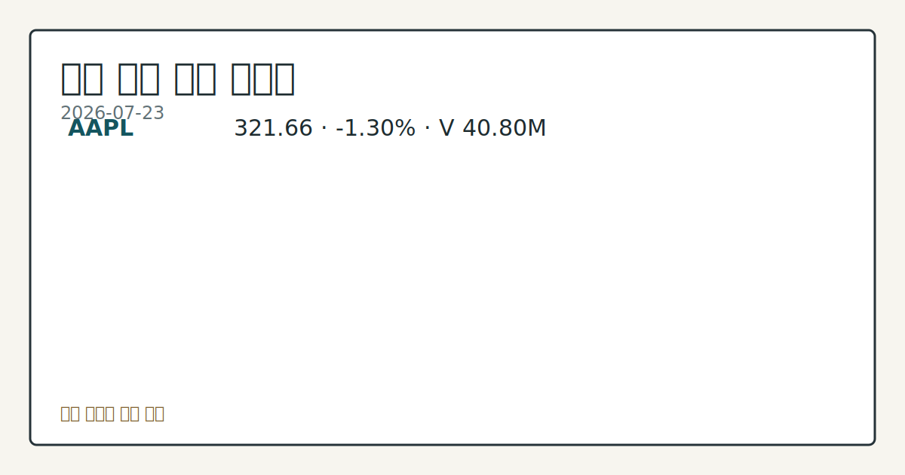
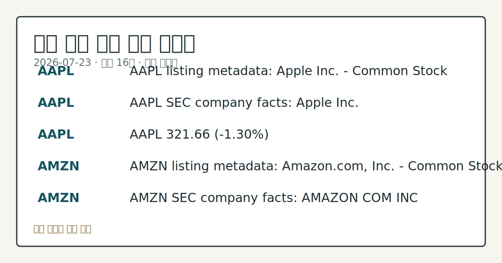

# 2026-07-23 미국 증시 시황
> 정보 제공용 자동 시황이며 매매 권유가 아닙니다.
# 2026-07-23 미국 증시 시황
**기준 시각**: 2026-07-23 NY · 수집창 2026-07-23T04:00Z ~ 2026-07-24T04:00Z (종료 미포함)
| 종목 | 종가 | 변동 | 비고 |
|------|------|------|------|
| ^GSPC | 7,408.30 | -1.21% | -2.65% from 52w high · +8.02% YTD |
| ^IXIC | 25,137.69 | -2.15% | -7.22% from 52w high · +8.19% YTD |
| ^DJI | 51,711.65 | -0.97% | -2.53% from 52w high · +6.88% YTD |
| AAPL | 321.66 | -1.30% | -3.62% from 52w high · +18.69% YTD |
| MSFT | 381.58 | -2.24% | +8.15% from 52w low · -19.32% YTD |
**세그먼트**: [국내 증시](../../../domestic-equity/2026/07/2026-07-23.md) | [미국 증시](2026-07-23.md) | [크립토](../../../crypto/2026/07/2026-07-23.md)
<!-- investo:block visual:us-equity.visual.curated-context-image -->

*이미지: 큐레이션 시황 이미지 · 출처: 외부 라이선스 이미지 · 생성: investo 0.1.0 · 2026-07-23 UTC*
<!-- /investo:block visual:us-equity.visual.curated-context-image -->
> **내 관심 자산 영향**: 16건 확인 (기본 바스켓) — AAPL: 직접 관련 · [nasdaq-symbol-directory] AAPL listing metadata: Apple Inc. - Common Stock; AAPL: 직접 관련 · [sec-company-facts] AAPL SEC company facts: Apple Inc.; AAPL: 직접 관련 · [yfinance-price] AAPL 321.66 (**-1.30%**); AMZN: 직접 관련 · [nasdaq-symbol-directory] AMZN listing metadata: Amazon.com, Inc. - Common Stock; AMZN: 직접 관련 · [sec-company-facts] AMZN SEC company facts: AMAZON COM INC 외
> **용어 가이드**: 이번 시황에서 처음 등장한 용어 — EIA(에너지정보청)
> **오늘의 결론**: 전일(2026-07-22) 뉴욕증시 3대 지수는 유가 급등과 알파벳(Alphabet)발 AI(인공지능) 자본지출 우려에 동반 하락했다. 수집 근거가 제한적입니다
> **핵심 동인**: S&P 500·나스닥100 급락, AI 자본지출 우려 확산 Nasdaq 기사에 따르면 전일 뉴욕증시 3대 지수는 유가 급등과 알파벳발 AI 자본지출 본문 참고.
> **주의할 점**: 이번 주(2026-07-232026-07-30)는 7월 29일 FOMC 기자회견이, 이번 달에는 7월 28일 H.6(통화량 지표), 7월 31일 G 본문 참고.
## 한눈에 보기
S&P 500 **-1.49%**, 다우존스산업평균 **-1.11%**, 나스닥100 **-2.26%** 하락 마감 — 유가 급등과 AI 자본지출 우려가 겹쳤다.
달러지수(DXY)가 **+0.37%** 상승하며 10년물 국채금리가 1.5년래 최고치를 기록했다.
10년물 국채금리(DGS10)가 **4.67%**로 전일 대비 상승 — 위협 임계 여부, 본문 §② 참조.
## ⓪ 오늘의 매크로
**국제 유가** — CFTC WTI crude oil managed_money net +61974 contracts
**미 국채 수익률** — UST curve 2026-07-23: 10Y 4.71%, 2Y10Y +0.34pp
## ⓪-B 채널 기준선
| 기준선 | 값 |
|------|------|
| S&P 500 | 7,408.30 (-1.21%) |
| 나스닥 종합 | 25,137.69 (-2.15%) |
| 다우존스 | 51,711.65 (-0.97%) |
| CFTC 포지셔닝 | E-mini S&P 500 순포지션 -365002계약 (-18.80% OI), 2026-07-14 기준/2026-07-17 공개 · Nasdaq-100 mini 순포지션 -64163계약 (-22.52% OI), 2026-07-14 기준/2026-07-17 공개 · VIX futures 순포지션 10189계약 (2.62% OI), 2026-07-14 기준/2026-07-17 공개 · 주간 지연 |
> **크로스마켓 연결 고리**: 유가/지정학 이슈가 여러 자산군의 변동성 연결 고리로 관찰됩니다. / 금리 이벤트가 할인율/달러 경로의 공통 변수로 남아 있습니다.
> **오늘의 큰 그림:** 유가와 지정학 변수가 공통 변수지만, 섹터·실적 변동성를 먼저 확인해야 합니다.
## ① 요약

<!-- investo:block visual:us-equity.visual.data-confidence -->

*이미지: 데이터 신뢰도 · 출처: investo 자체 생성 · 생성: investo 0.1.0 · 2026-07-23 UTC*
<!-- /investo:block visual:us-equity.visual.data-confidence -->

<!-- investo:block visual:us-equity.visual.market-snapshot -->

*이미지: 시장 스냅샷 · 출처: investo 자체 생성 · 생성: investo 0.1.0 · 2026-07-23 UTC*
<!-- /investo:block visual:us-equity.visual.market-snapshot -->

전일 뉴욕증시 3대 지수는 유가 급등과 알파벳발 AI 자본지출 우려에 동반 하락했다. S&P 500 **-1.49%**, 다우존스산업평균 **-1.11%**, 나스닥100 **-2.26%** 하락 마감했으며, 달러지수는 **+0.37%** 상승, 10년물 국채금리는 **4.67%**로 전일(**4.63%**) 대비 올라 1.5년래 최고 수준에 근접했다. 이번 주 예정된 FOMC(연방공개시장위원회) 기자회견(7월 29일)을 앞두고 대형주 실적 발표도 다수 예정돼 있다. [하락 관찰]

## ② 전일 핵심 이슈

### S&P 500·나스닥100 급락, AI 자본지출 우려 확산

[Nasdaq 기사](https://www.nasdaq.com/articles/stocks-fall-sharply-crude-oil-prices-soar-and-alphabet-sparks-ai-spending-concerns-0)에 따르면 전일 뉴욕증시 3대 지수는 유가 급등과 알파벳발 AI 자본지출 우려가 겹치며 동반 하락했다. S&P 500은 **-1.49%**, 다우존스산업평균은 **-1.11%**, 나스닥100은 **-2.26%** 하락 마감했으며, 9월물 미니 S&P 500 선물(ESU26, 9월물 미니 S&P 500 선물)도 **-1.50%** 내렸다. 어제(2026-07-22) 알파벳 실적 발표를 앞두고 혼조를 보였던 흐름이 오늘은 뚜렷한 하락 압력으로 이어졌다.

> **그래서 의미는?** AI 투자 확대에 대한 시장의 피로감이 대형 기술주 전반의 하락으로 번졌습니다.

### 달러 강세·유가 급등에 10년물 금리 1.5년래 최고

[Nasdaq 기사](https://www.nasdaq.com/articles/dollar-rises-houthi-tanker-attack-and-higher-oil-prices)에 따르면 달러지수(DXY)는 **+0.37%** 상승했고, 후티 반군의 유조선 공격 우려와 유가 급등(**+5%** 초과) 속에 10년물 국채금리가 +5bp 오르며 1.5년래 최고치를 기록했다. FRED(세인트루이스 연방준비은행 경제데이터)의 DGS10 시리즈도 **4.67%**로 전일 대비 상승했다([FRED](https://fred.stlouisfed.org/series/DGS10)).

## ③ 섹터/수급 동향

### 원유 재고·정제가동률 (EIA 주간 보고)

EIA 주간 석유현황보고서(WPSR)에 따르면 2026-07-17 기준 SPR(전략비축유) 제외 상업 원유 수입은 5,806 MBBL/D, 상업 원유 재고는 411,675 MBBL, 정제가동률은 **96.1%**, 휘발유 재고는 211,294 MBBL, 증류유 재고는 109,570 MBBL, 원유 생산량은 13,798 MBBL/D로 집계됐다([EIA](https://www.eia.gov/petroleum/supply/weekly/)). 이는 실시간 세션 데이터가 아닌 주간 통계다.

> **그래서 의미는?** 정제가동률과 재고 흐름은 향후 유가·에너지주 수급을 가늠하는 선행 지표로 쓰입니다.

### CFTC(미국 상품선물거래위원회) COT(선물포지션 보고서) 포지셔닝

CFTC COT 보고서에 따르면 레버리지드머니(leveraged money)는 10년물 국채선물에서 순매도 -2,079,653계약(미결제약정의 **-39.4%**), E-mini S&P 500에서 순매도 -365,002계약(**-18.8%**), 나스닥100 미니에서 순매도 -64,163계약(**-22.5%**), 달러인덱스 선물에서 순매도 -4,866계약(**-9.1%**)을 각각 기록했다. 반면 VIX(변동성지수) 선물은 순매수 +10,189계약(**+2.6%**)을 나타냈다. 매니지드머니(managed money)는 금에서 순매수 +120,779계약(**+31.5%**), WTI(서부텍사스산원유) 원유에서 순매수 +61,974계약(**+3.3%**)을 기록했다([CFTC](https://www.cftc.gov/MarketReports/CommitmentsofTraders/index.htm)). 이는 주간 보고 기준으로 일중 흐름을 반영하지 않는다.

## ④ 지표·이벤트

### 6월 CPI(소비자물가지수)·PPI(생산자물가지수) 둔화, 실업률 하락

FRED에 따르면 CPIAUCSL(소비자물가지수)은 332.568로 전월(333.979) 대비 하락했고([FRED](https://fred.stlouisfed.org/series/CPIAUCSL)), PPIFID(생산자물가지수 최종수요)는 157.045로 전월(157.346) 대비 낮아졌다([FRED](https://fred.stlouisfed.org/series/PPIFID)). UNRATE(실업률)는 **4.2%**로 전월(**4.3%**) 대비 하락했으며([FRED](https://fred.stlouisfed.org/series/UNRATE)), DFF(연방기금금리)는 **3.63%**로 전일과 동일하게 유지됐다([FRED](https://fred.stlouisfed.org/series/DFF)). BLS(노동통계청) 발표 기준으로도 소비자물가지수 실제치 332.568(2026-06), 근원 소비자물가지수 336.065(2026-06, 전월 336.121), 생산자물가지수 최종수요 156.566(2026-06, 전월 157.001), 실업률 **4.2%**(전월 **4.3%**), 비농업 신규고용 158,984천 명(전월 158,927천 명), 구인건수 7,594(전월 7,585), 경제활동참가율 **61.5%**(전월 **61.8%**), 시간당 평균임금 **$37.64**(전월 **$37.51**)가 각각 발표됐다([BLS](https://www.bls.gov/data/)).

> **그래서 의미는?** 물가 지표 둔화와 실업률 하락이 겹치며 연준의 통화정책 경로에 대한 기대가 조정될 수 있습니다.

### VVIX(변동성지수의 변동성)와 FOMC(연방공개시장위원회) 일정

Cboe(시카고옵션거래소) 공식 종가 기준 VVIX는 102.17을 기록했다([Cboe](https://cdn.cboe.com/api/global/us_indices/daily_prices/VVIX_History.csv)). FOMC는 2026-07-29 오후 2:30(현지시간) 기자회견을 예정하고 있다([Fed](https://www.federalreserve.gov/live-broadcast.htm)). 검증된 현재 팩트에 따르면 현 연준 의장은 케빈 워시(Kevin Warsh)다.

## ⑤ 주요 종목
<!-- investo:block chart:us-equity.chart.market -->

<!-- u50 lightweight-charts-embed: placeholders consumed by site_docs/assets/investo-chart-init.js -->

<noscript><em>인터랙티브 차트는 JavaScript가 활성화된 환경에서 표시됩니다. 위 정적 카드가 동일한 정보를 담고 있습니다.</em></noscript>

<!-- /investo:block chart:us-equity.chart.market -->

<!-- investo:block visual:us-equity.visual.price-snapshot -->

*이미지: 가격 스냅샷 · 출처: investo 자체 생성 · 생성: investo 0.1.0 · 2026-07-23 UTC*
<!-- /investo:block visual:us-equity.visual.price-snapshot -->

### 확인 항목: AAPL·AMZN

AAPL(애플)은 나스닥 상장 종목으로 확인됐으며([Nasdaq](https://www.nasdaqtrader.com/dynamic/SymDir/nasdaqlisted.txt)), 최근 가격은 **$321.66**(**-1.30%**)이다. AMZN(아마존)도 나스닥 상장 및 SEC(미국증권거래위원회) 기업 정보 등록이 확인됐다([Nasdaq](https://www.nasdaqtrader.com/dynamic/SymDir/nasdaqlisted.txt)).

> **그래서 의미는?** AAPL·AMZN은 오늘 워치리스트에서 실제 데이터가 매칭된 종목입니다.

### 실적 발표 관전 분류

이번 주 실적 발표 예정 종목은 다음과 같다(EPS 전망치는 컨센서스 기준):

- AMP (애머프라이즈 파이낸셜) — 장 시작 전 — EPS 전망 **$10.72** (전년 EPS **$9.11**)
- ARGX (아젠엑스) — 장 시작 전 — EPS 전망 **$6.27** (전년 EPS **$3.74**)
- BX (블랙스톤) — 장 시작 전 — EPS 전망 **$1.33** (전년 EPS **$1.21**)
- CMCSA (컴캐스트) — 장 시작 전 — EPS 전망 **$0.97** (전년 EPS **$1.25**)
- DLR (디지털리얼티) — 장 마감 후 — EPS 전망 **$1.98** (전년 EPS **$1.87**)
- EW (에드워즈라이프사이언스) — 장 마감 후 — EPS 전망 **$0.73** (전년 EPS **$0.67**)
- FCX (프리포트맥모란) — 장 시작 전 — EPS 전망 **$0.62** (전년 EPS **$0.54**)
- FIX (컴포트시스템즈USA) — 장 마감 후 — EPS 전망 **$10.38** (전년 EPS **$6.53**)
- HON (허니웰) — 장 시작 전 — EPS 전망 **$1.80** (전년 EPS **$5.50**)
- INFY (인포시스) — 장 시작 전 — EPS 전망 **$0.21** (전년 EPS **$0.19**)
- INTC (인텔) — 장 마감 후 — EPS 전망 **$0.10** (전년 EPS **-$0.26**)
- LMT (록히드마틴) — 장 시작 전 — EPS 전망 **$7.22** (전년 EPS **$7.29**)

## ⑥ 오늘의 관전 포인트

<!-- investo:block visual:us-equity.visual.watchlist-relevance -->

*이미지: 관심 자산 관련성 · 출처: investo 자체 생성 · 생성: investo 0.1.0 · 2026-07-23 UTC*
<!-- /investo:block visual:us-equity.visual.watchlist-relevance -->

#### 관찰 신호: 2026-07-29 FOMC 기자회견에서 케빈 워시 연…

- 출처: FOMC 캘린더
- 현재: 성장주 변동성을 점검.
- 확인 조건: 상방 2026-07-29 FOMC 기자회견에서 케빈 워시 연준 의장의 발언 톤이 매파적으로 나오면 금리 상방 압력 관찰; 하방 완화적 언급이 나오면 하방 안정 요인으로 해석
- 신뢰도: 보통
- 관심 영향: 이번 주 국채금리

#### 관찰 신호: DGS10이 **4.67%**를 상회해 추

- 출처: FRED
- 현재: FRED · DGS10이 **4.67%**를 상회해 추가 상승하면 성장주 밸류에이션 부담 확대 관찰, **4.63%**를 하회하면 되돌림 신호로 해석. 관심 영향: 대형 기술주 수급 흐름을 비교.
- 확인 조건: 상방 DGS10이 **4.67%**를 상회해 추가 상승하면 성장주 밸류에이션 부담 확대 관찰; 하방 **4.63%**를 하회하면 되돌림 신호로 해석
- 신뢰도: 높음
- 관심 영향: 대형 기술주 수급 흐름을 비교.

#### 관찰 신호: 정제가동률

- 출처: EIA 주간 보고서
- 현재: EIA 주간 보고서 · 정제가동률이 **96.1%**를 상회하면 정제마진 개선 관찰, 이를 하회하면 가동률 둔화로 해석. 관심 영향: 에너지 섹터 수급 변화를 비교.
- 확인 조건: 상방 정제가동률이 **96.1%**를 상회하면 정제마진 개선 관찰; 하방 이를 하회하면 가동률 둔화로 해석
- 신뢰도: 높음
- 관심 영향: 에너지 섹터 수급 변화를 비교.

#### 관찰 신호: INTC

- 출처: Nasdaq 실적 캘린더
- 현재: Nasdaq 실적 캘린더 · INTC가 EPS 전망 **$0.10**을 상회하는 실적을 내면 반도체 심리 개선 관찰, 이를 하회하면 업종 전반 조정 압력으로 해석. 관심 영향: 나스닥100 관련주 흐름을 확인.
- 확인 조건: 상방 INTC가 EPS 전망 **$0.10**을 상회하는 실적을 내면 반도체 심리 개선 관찰; 하방 이를 하회하면 업종 전반 조정 압력으로 해석
- 신뢰도: 높음
- 관심 영향: 나스닥100 관련주 흐름을 확인.

> **데이터 상태**: 부분

수집/품질 진단

> **데이터 상태**: 부분 — 수집 300건 / 소스 20개 / 누락: 없음 · 부분 — 일부 카테고리 미수집, 본문 일부 결론 보강 필요
> **소스 카운트**: 수집 대상 26 / 성공 20 / 수집 상세는 진단 섹션에서 확인할 수 있습니다. / 수집 상세는 진단 섹션에서 확인할 수 있습니다. / 수집 상세는 진단 섹션에서 확인할 수 있습니다.
> **소스 등급 분포**: S=11 / A=9
> **상세 사유**: 일부 소스 수집 실패, 일부 소스 0건 반환
> **소스별 상태**: bea-macro-actuals 실패 (설정 미완료(미수집)), cnbc-top-news 실패 (접근 제한), fed-speech-rss 0건, fomc-rss 0건, stooq-price 0건, yahoo-finance-news 0건, 정상 20개

## ⑦ 면책조항
본 시황은 일반 정보 제공을 목적으로 자동 생성된 자료이며,
특정 종목·자산에 대한 매매 권유나 투자 자문이 아닙니다.
투자 결정과 그 결과에 대한 책임은 전적으로 본인에게 있으며,
본 시황의 내용에 따라 발생한 손실에 대해 작성자는 일체의 책임을 지지 않습니다.