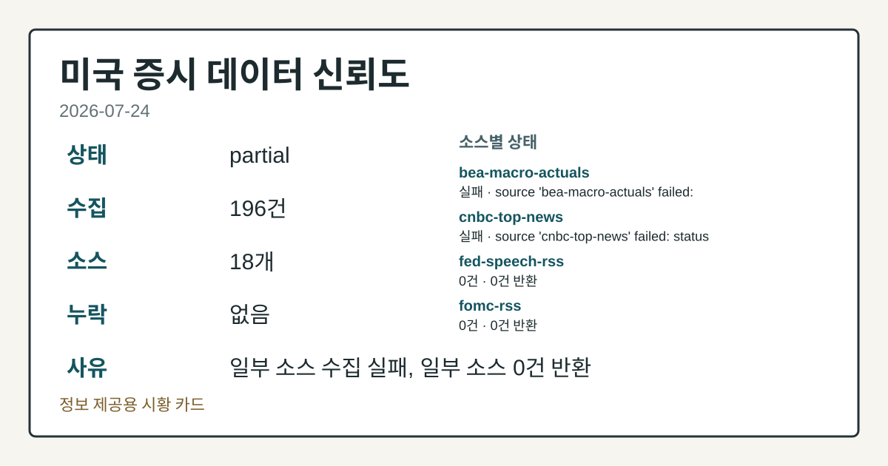
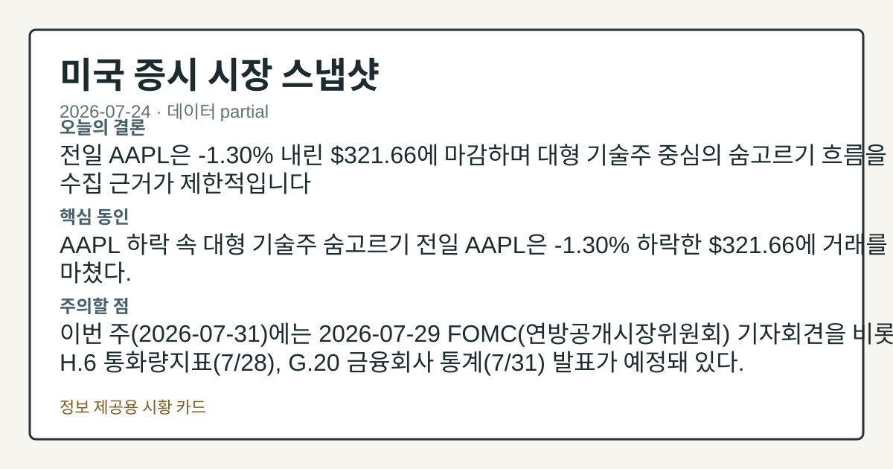
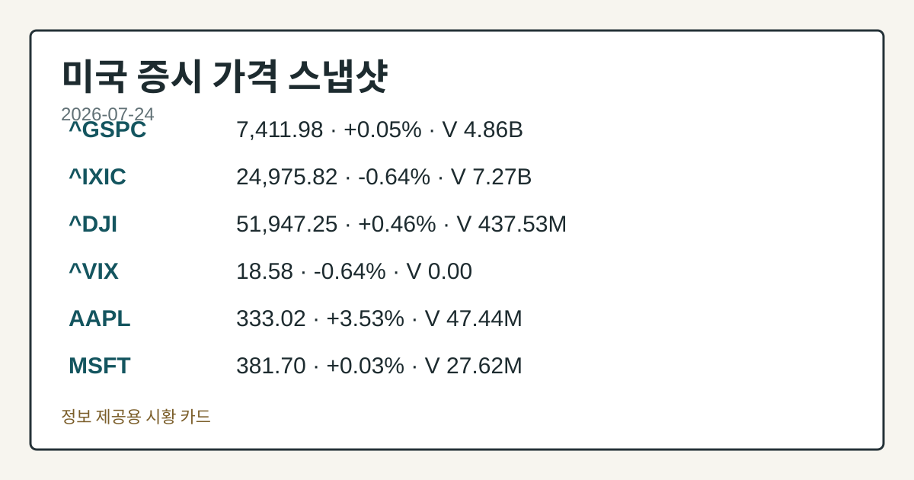
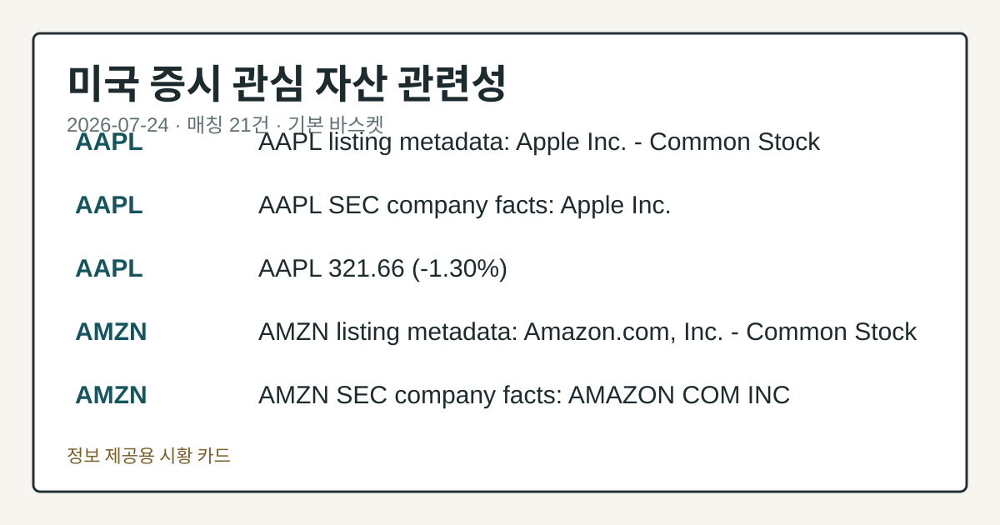

# 2026-07-24 미국 증시 시황
> 정보 제공용 자동 시황이며 매매 권유가 아닙니다.
# 2026-07-24 미국 증시 시황
**기준 시각**: 2026-07-24 NY · 수집창 2026-07-24T04:00Z ~ 2026-07-25T04:00Z (종료 미포함)
| 종목 | 종가 | 변동 | 비고 |
|------|------|------|------|
| ^GSPC | 7,411.98 | +0.05% | -2.60% from 52w high · +8.07% YTD |
| ^IXIC | 24,975.82 | -0.64% | -7.82% from 52w high · +7.49% YTD |
| ^DJI | 51,947.25 | +0.46% | -2.09% from 52w high · +7.37% YTD |
| AAPL | 333.02 | +3.53% | -0.22% from 52w high · +22.88% YTD |
| MSFT | 381.70 | +0.03% | +8.18% from 52w low · -19.29% YTD |
**세그먼트**: [국내 증시](../../../domestic-equity/2026/07/2026-07-24.md) | [미국 증시](2026-07-24.md) | [크립토](../../../crypto/2026/07/2026-07-24.md)
<!-- investo:block visual:us-equity.visual.curated-context-image -->

*이미지: 큐레이션 시황 이미지 · 출처: 외부 라이선스 이미지 · 생성: investo 0.1.0 · 2026-07-26 UTC*
<!-- /investo:block visual:us-equity.visual.curated-context-image -->
> **내 관심 자산 영향**: 21건 확인 (기본 바스켓) — AAPL: 직접 관련 · [nasdaq-symbol-directory] AAPL listing metadata: Apple Inc. - Common Stock; AAPL: 직접 관련 · [sec-company-facts] AAPL SEC company facts: Apple Inc.; AAPL: 직접 관련 · [yfinance-price] AAPL 333.02 (**+3.53%**); AMZN: 직접 관련 · [nasdaq-symbol-directory] AMZN listing metadata: Amazon.com, Inc. - Common Stock; AMZN: 직접 관련 · [sec-company-facts] AMZN SEC company facts: AMAZON COM INC 외
> **오늘의 결론**: 오늘(2026-07-24) 미국 증시(us-equity) 세그먼트에는 개별 지수 종가 데이터 없이, CFTC(미국 상품선물거래위원회) 포지셔닝과 본문 참고.
> **핵심 동인**: 이번 문서는 수집 근거가 제한적입니다.
> **주의할 점**: 이번 주(2026-07-2407-31)에는 FOMC(연방공개시장위원회) 기자회견(2026-07-29)과 H.6 통화량지표 발표(2026-07-28) 본문 참고.
## 한눈에 보기
AAPL이 **+3.53%** 상승해 **$333.02**를 기록했다.
CFTC COT(선물포지션 보고서)에서 E-mini S&P 500 레버리지드머니가 -322,865계약 순매도(미결제약정의 **-16.6%**)로 집계됐다.
Cboe SKEW(테일리스크지수) 147.28 · VVIX(변동성의 변동성지수) 100.73 — 변동성 지표 흐름은 본문 §③ 참조.
## ⓪ 오늘의 매크로
**FOMC 일정** — 2026-07-29 — FOMC Meeting
**국제 유가** — CFTC WTI crude oil managed_money net +63979 contracts
**미 국채 수익률** — UST curve 2026-07-24: 10Y 4.69%, 2Y10Y +0.36pp
## ⓪-B 채널 기준선
| 기준선 | 값 |
|------|------|
| S&P 500 | 7,411.98 (+0.05%) |
| 나스닥 종합 | 24,975.82 (-0.64%) |
| 다우존스 | 51,947.25 (+0.46%) |
| CFTC 포지셔닝 | E-mini S&P 500 순포지션 -322865계약 (-16.65% OI), 2026-07-21 기준/2026-07-24 공개 · Nasdaq-100 mini 순포지션 -74690계약 (-26.03% OI), 2026-07-21 기준/2026-07-24 공개 · VIX futures 순포지션 3098계약 (0.78% OI), 2026-07-21 기준/2026-07-24 공개 · 주간 지연 |
> **크로스마켓 연결 고리**: 유가/지정학 이슈가 여러 자산군의 변동성 연결 고리로 관찰됩니다. / 금리 이벤트가 할인율/달러 경로의 공통 변수로 남아 있습니다.
> **오늘의 큰 그림:** 금리와 달러 변수가 공통 변수지만, Nasdaq·Dow 섹터 변동성를 먼저 확인해야 합니다.
## ① 요약

<!-- investo:block visual:us-equity.visual.data-confidence -->

*이미지: 데이터 신뢰도 · 출처: investo 자체 생성 · 생성: investo 0.1.0 · 2026-07-26 UTC*
<!-- /investo:block visual:us-equity.visual.data-confidence -->

<!-- investo:block visual:us-equity.visual.market-snapshot -->

*이미지: 시장 스냅샷 · 출처: investo 자체 생성 · 생성: investo 0.1.0 · 2026-07-26 UTC*
<!-- /investo:block visual:us-equity.visual.market-snapshot -->

오늘 미국 증시 세그먼트에는 개별 지수 종가 데이터 없이, CFTC 포지셔닝과 변동성 지수, 개별 종목 공시 데이터가 핵심 근거로 라우팅됐다. Cboe SKEW는 147.28, VVIX는 100.73으로 집계됐고, COT에서는 E-mini S&P 500과 나스닥100 미니 모두 레버리지드머니가 순매도 우위를 보였다. 개별 종목에서는 AAPL이 **+3.53%** 상승한 **$333.02**를 기록해 대비되는 흐름을 보였다. [혼재]

## ② 전일 핵심 이슈

이번 문서는 수집 근거가 제한적입니다. 최근 며칠간 알파벳(Alphabet) 실적 발표와 유가 급등을 둘러싼 변동성이 이어졌으나, 오늘 미국 증시(us-equity) 세그먼트로 라우팅된 입력에는 개별 지수·종목 관련 전일 이슈가 포함되지 않아 어제 대비 새로운 방향성 신호는 확인되지 않았다.

## ③ 섹터/수급 동향

### 변동성 지수

Cboe SKEW는 2026-07-24 종가 기준 147.28([source](https://cdn.cboe.com/api/global/us_indices/daily_prices/SKEW_History.csv))로 집계됐으며, VVIX는 같은 날 100.73([source](https://cdn.cboe.com/api/global/us_indices/daily_prices/VVIX_History.csv))을 기록했다. 두 지표 모두 공식 일간 종가이며 장중 스냅샷이 아니다.

> **그래서 의미는?** 꼬리위험·변동성 지표가 높아지면 급격한 가격 변동 가능성을 미리 점검하는 신호로 볼 수 있다.

### 선물 포지셔닝(COT)

CFTC가 발표한 COT(선물포지션 보고서)에 따르면, E-mini S&P 500 레버리지드머니는 롱 146,834계약·숏 469,699계약으로 순매도 -322,865계약(미결제약정의 **-16.6%**, [source](https://www.cftc.gov/MarketReports/CommitmentsofTraders/index.htm))을 기록했다. 나스닥100 미니 역시 레버리지드머니 순매도 -74,690계약(미결제약정의 **-26.0%**, [source](https://www.cftc.gov/MarketReports/CommitmentsofTraders/index.htm))으로 집계됐다. 반면 VIX 선물 레버리지드머니는 순매수 +3,098계약(미결제약정의 **+0.8%**, [source](https://www.cftc.gov/MarketReports/CommitmentsofTraders/index.htm))으로 소폭 매수 우위를 보였다.

## ④ 지표·이벤트

### 금리·물가 지표(FRED)

FRED(세인트루이스 연은 경제데이터)에 따르면 DFF(연방기금실효금리)는 2026-07-23 기준 3.63으로 전일 대비 보합([source](https://fred.stlouisfed.org/series/DFF))을 나타냈다. CPIAUCSL(소비자물가지수)은 2026-06-01 기준 332.568로 전월 333.979 대비 하락([source](https://fred.stlouisfed.org/series/CPIAUCSL))했고, PPIFID(생산자물가지수 최종수요)는 같은 기간 157.045로 전월 157.346 대비 하락([source](https://fred.stlouisfed.org/series/PPIFID))했다. UNRATE(실업률)는 2026-06-01 기준 **4.2%**로 전월 **4.3%** 대비 하락([source](https://fred.stlouisfed.org/series/UNRATE))했다.

> **그래서 의미는?** 물가지표 하락과 실업률 하락이 겹치면 통화정책 완화 기대와 고용 개선 신호가 동시에 나타난 것으로 볼 수 있다.

### 고용·물가 실적(BLS)

BLS(미국 노동통계국) 자료에 따르면 2026-06 기준 평균시간당임금은 **$37.64**(전월 **$37.51**), 소비자물가지수는 332.568(전월 333.979), 근원 소비자물가지수는 336.065(전월 336.121), 생산자물가지수 최종수요는 156.566(전월 157.001)으로 나타났다. 2026-05 기준 구인건수는 7594천 건(전월 7585), 2026-06 기준 경제활동참가율은 **61.5%**(전월 **61.8%**), 비농업부문 고용은 158984천 명(전월 158927), 실업률은 **4.2%**(전월 **4.3%**)로 집계됐다([source](https://www.bls.gov/data/)).

### 향후 일정(FOMC)

FOMC(연방공개시장위원회) 기자회견이 2026-07-29 오후 2:30(현지시간)에 예정돼 있으며([source](https://www.federalreserve.gov/live-broadcast.htm)), SLOOS(고위대출담당자 설문조사)는 2026-08-03 오후 2:00에 발표될 예정이다([source](https://www.federalreserve.gov/newsevents/calendar.htm)).

## ⑤ 주요 종목
<!-- investo:block chart:us-equity.chart.market -->

<!-- u50 lightweight-charts-embed: placeholders consumed by site_docs/assets/investo-chart-init.js -->

<noscript><em>인터랙티브 차트는 JavaScript가 활성화된 환경에서 표시됩니다. 위 정적 카드가 동일한 정보를 담고 있습니다.</em></noscript>

<!-- /investo:block chart:us-equity.chart.market -->

<!-- investo:block visual:us-equity.visual.price-snapshot -->

*이미지: 가격 스냅샷 · 출처: investo 자체 생성 · 생성: investo 0.1.0 · 2026-07-26 UTC*
<!-- /investo:block visual:us-equity.visual.price-snapshot -->

오늘 세그먼트에는 개별 지수 종가 대신 대형 기술주와 ETF(상장지수펀드)의 상장 정보 및 SEC(미국 증권거래위원회) 공시 데이터가 확인됐다. 워치리스트 매칭 종목인 AAPL은 야후파이낸스 기준 **+3.53%** 상승한 **$333.02**로 확인됐다.

> **그래서 의미는?** AAPL(애플)의 개별 종목 상승이 눈에 띄지만, 다른 대형 기술주의 당일 가격 데이터는 이번 세그먼트 근거에 포함되지 않았다.

### 관전 분류: 대형 기술주·ETF 상장 정보

NASDAQ 상장 디렉터리 기준으로 AAPL(애플), AMZN(아마존), GOOGL(알파벳), META(메타), MSFT(마이크로소프트), NVDA(엔비디아), TSLA(테슬라)가 보통주로, QQQ와 SPY(State Street SPDR S&P 500 ETF Trust)가 ETF로 상장 상태를 유지 중임이 확인됐다([source](https://www.nasdaqtrader.com/dynamic/SymDir/nasdaqlisted.txt)).

### 확인 항목: SEC 공시 데이터

SEC 공시 기준 최근 실적 지표는 다음과 같다: AAPL 희석EPS(주당순이익) **$4.05**(2025-03-29 기준, 최근 공시 Form 4 2026-06-17), AMZN 희석EPS **$1.59**(2025-03-31 기준, 최근 공시 8-K(수시공시) 2026-07-09), GOOGL 희석EPS **$5.12**(2025-06-30 기준, 최근 공시 Form 4 2026-07-23), META 희석EPS **$6.43**(2025-03-31 기준, 최근 공시 Form 4 2026-07-22), MSFT 희석EPS **$9.99**(2025-03-31 기준, 최근 공시 PX14A6G(위임장 관련 공시) 2026-07-22)로 각각 확인됐다([source](https://data.sec.gov/submissions/CIK0000320193.json)).

## ⑥ 오늘의 관전 포인트

<!-- investo:block visual:us-equity.visual.watchlist-relevance -->

*이미지: 관심 자산 관련성 · 출처: investo 자체 생성 · 생성: investo 0.1.0 · 2026-07-26 UTC*
<!-- /investo:block visual:us-equity.visual.watchlist-relevance -->

> **관전 포인트**: 오늘은 공개 근거가 충분한 관전 신호만 본문에 남겼습니다.

> **데이터 상태**: 부분

수집/품질 진단

> **데이터 상태**: 부분 — 수집 196건 / 소스 18개 / 누락: 없음 · 부분 — 일부 카테고리 미수집, 본문 일부 결론 보강 필요
> **소스 카운트**: 수집 대상 25 / 성공 18 / 수집 상세는 진단 섹션에서 확인할 수 있습니다. / 수집 상세는 진단 섹션에서 확인할 수 있습니다. / 수집 상세는 진단 섹션에서 확인할 수 있습니다.
> **소스 등급 분포**: S=10 / A=8
> **상세 사유**: 일부 소스 수집 실패, 일부 소스 0건 반환
> **소스별 상태**: bea-macro-actuals 실패 (설정 미완료(미수집)), cnbc-top-news 실패 (접근 제한), fed-speech-rss 0건, fomc-rss 0건, nasdaq-stocks-news 0건, sec-newsroom-rss 0건, yahoo-finance-news 0건, 정상 18개

## ⑦ 면책조항
본 시황은 일반 정보 제공을 목적으로 자동 생성된 자료이며,
특정 종목·자산에 대한 매매 권유나 투자 자문이 아닙니다.
투자 결정과 그 결과에 대한 책임은 전적으로 본인에게 있으며,
본 시황의 내용에 따라 발생한 손실에 대해 작성자는 일체의 책임을 지지 않습니다.