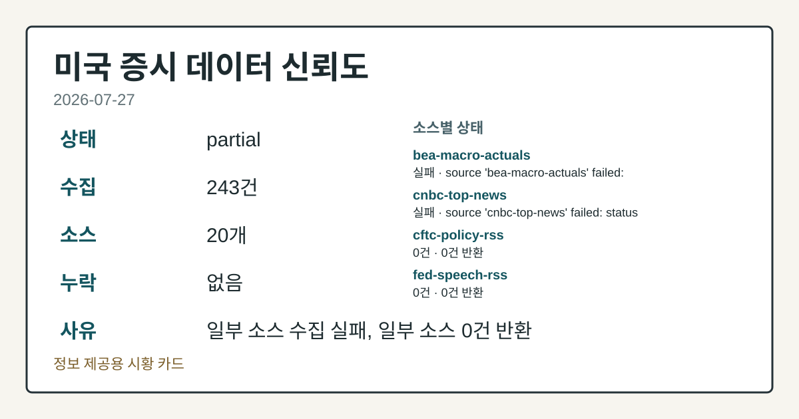
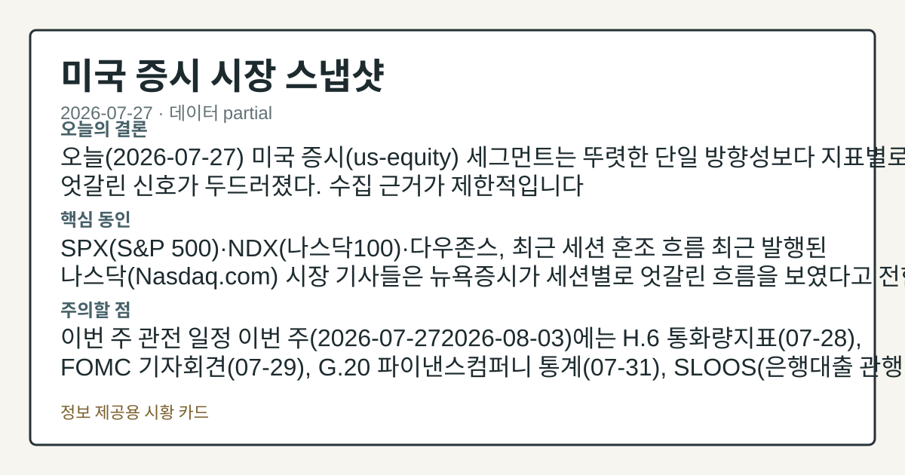
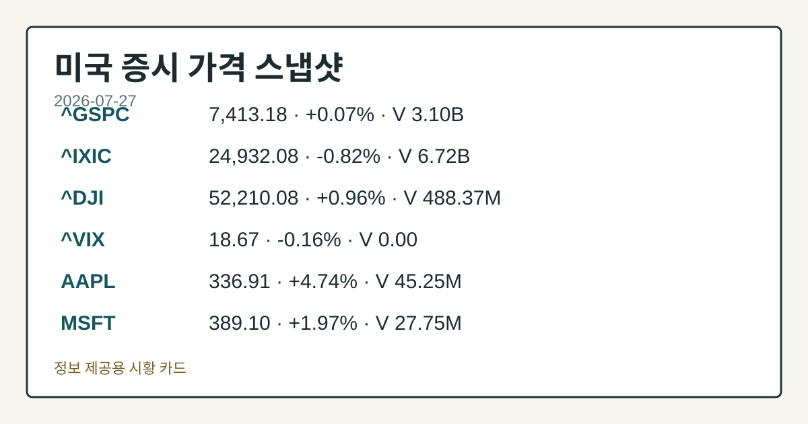
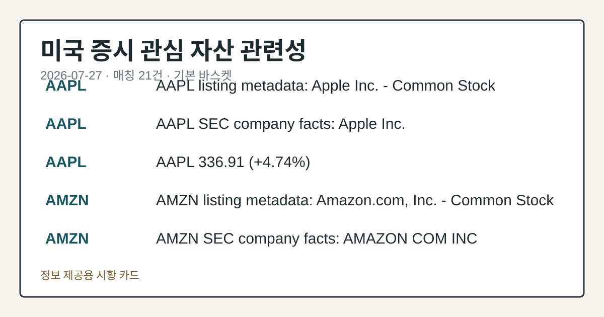

# 2026-07-27 미국 증시 시황
> 정보 제공용 자동 시황이며 매매 권유가 아닙니다.
# 2026-07-27 미국 증시 시황
**기준 시각**: 2026-07-27 NY · 수집창 2026-07-27T04:00Z ~ 2026-07-28T04:00Z (종료 미포함)
| 종목 | 종가 | 변동 | 비고 |
|------|------|------|------|
| ^GSPC | 7,413.18 | +0.07% | -2.58% from 52w high · +8.09% YTD |
| ^IXIC | 24,932.08 | -0.82% | -7.98% from 52w high · +7.30% YTD |
| ^DJI | 52,210.08 | +0.96% | -1.59% from 52w high · +7.91% YTD |
| AAPL | 336.91 | +4.74% | ATH 경신 · +24.32% YTD |
| MSFT | 389.10 | +1.97% | +10.28% from 52w low · -17.73% YTD |
**세그먼트**: [국내 증시](../../../domestic-equity/2026/07/2026-07-27.md) | [미국 증시](2026-07-27.md) | [크립토](../../../crypto/2026/07/2026-07-27.md)
<!-- investo:block visual:us-equity.visual.curated-context-image -->

*이미지: 큐레이션 시황 이미지 · 출처: 외부 라이선스 이미지 · 생성: investo 0.1.0 · 2026-07-27 UTC*
<!-- /investo:block visual:us-equity.visual.curated-context-image -->
> **내 관심 자산 영향**: 21건 확인 (기본 바스켓) — AAPL: 직접 관련 · [nasdaq-symbol-directory] AAPL listing metadata: Apple Inc. - Common Stock; AAPL: 직접 관련 · [sec-company-facts] AAPL SEC company facts: Apple Inc.; AAPL: 직접 관련 · [yfinance-price] AAPL 336.91 (**+4.74%**); AMZN: 직접 관련 · [nasdaq-symbol-directory] AMZN listing metadata: Amazon.com, Inc. - Common Stock; AMZN: 직접 관련 · [sec-company-facts] AMZN SEC company facts: AMAZON COM INC 외
> **오늘의 결론**: 오늘(2026-07-27) 미국 증시(us-equity) 세그먼트는 뚜렷한 단일 방향성보다 지표별로 엇갈린 신호가 두드러졌다. 수집 근거가 제한적입니다
> **핵심 동인**: SPX(S&P 500)·NDX(나스닥100)·다우존스, 최근 세션 혼조 흐름 최근 발행된 나스닥(Nasdaq.com) 시장 기사들은 뉴욕증시가 본문 참고.
> **주의할 점**: 이번 주 관전 일정 이번 주(2026-07-272026-08-03)에는 H.6 통화량지표(07-28), FOMC 기자회견(07-29), G.20 본문 참고.
## 한눈에 보기
미국 3대 지수는 최근 세션에서 엇갈린 흐름을 보이며 S&P 500 **+0.65%** 상승에서 나스닥100 **-0.46%** 하락까지 폭넓게 갈렸다.
**AAPL**이 **$336.91**로 **+4.74%** 상승하며 이번 세그먼트 워치리스트 매칭 종목 중 가장 뚜렷한 단일 종목 움직임을 보였다.
**4.2%** UNRATE(실업률)가 전월 **4.3%**에서 하락하며 고용 지표 둔화 신호를 보였다 — 본문 §④ 참조.
## ⓪ 오늘의 매크로
**미 국채 수익률** — UST curve 2026-07-27: 10Y 4.65%, 2Y10Y +0.34pp
## ⓪-B 채널 기준선
| 기준선 | 값 |
|------|------|
| S&P 500 | 7,413.18 (+0.07%) |
| 나스닥 종합 | 24,932.08 (-0.82%) |
| 다우존스 | 52,210.08 (+0.96%) |
| CFTC 포지셔닝 | E-mini S&P 500 순포지션 -322865계약 (-16.65% OI), 2026-07-21 기준/2026-07-24 공개 · Nasdaq-100 mini 순포지션 -74690계약 (-26.03% OI), 2026-07-21 기준/2026-07-24 공개 · VIX futures 순포지션 3098계약 (0.78% OI), 2026-07-21 기준/2026-07-24 공개 · 주간 지연 |
> **크로스마켓 연결 고리**: 금리 이벤트가 할인율/달러 경로의 공통 변수로 남아 있습니다.
> **오늘의 큰 그림:** 금리와 달러 변수가 공통 변수지만, Nasdaq·Dow 섹터 변동성를 먼저 확인해야 합니다.
## ① 요약

<!-- investo:block visual:us-equity.visual.data-confidence -->

*이미지: 데이터 신뢰도 · 출처: investo 자체 생성 · 생성: investo 0.1.0 · 2026-07-27 UTC*
<!-- /investo:block visual:us-equity.visual.data-confidence -->

<!-- investo:block visual:us-equity.visual.market-snapshot -->

*이미지: 시장 스냅샷 · 출처: investo 자체 생성 · 생성: investo 0.1.0 · 2026-07-27 UTC*
<!-- /investo:block visual:us-equity.visual.market-snapshot -->

오늘 미국 증시 세그먼트는 뚜렷한 단일 방향성보다 지표별로 엇갈린 신호가 두드러졌다. CFTC(미국 상품선물거래위원회)의 COT(선물포지션 보고서)에 따르면 E-mini S&P 500 레버리지드머니 순포지션은 **-16.6%**(미결제약정 대비) 순매도 우위를 보였고, 10Y 국채 선물 역시 **-39.2%** 순매도로 집계됐다. 반면 CPIAUCSL(소비자물가지수)은 전월 대비 하락(332.568, 전월 333.979)했고 PPIFID(생산자물가지수 최종수요) 역시 하락(157.045)해 물가 둔화 신호가 확인됐다. 개별 종목에서는 **AAPL**이 **$336.91**로 **+4.74%** 상승하며 관심을 끌었다. [혼재]

## ② 전일 핵심 이슈

### SPX·NDX·다우존스, 최근 세션 혼조 흐름

최근 발행된 나스닥(Nasdaq.com) 시장 기사들은 뉴욕증시가 세션별로 엇갈린 흐름을 보였다고 전한다. [Stocks Settle Mixed as AI Angst Offsets Easing Geopolitical Tensions](https://www.nasdaq.com/articles/stocks-settle-mixed-ai-angst-offsets-easing-geopolitical-tensions) 기사는 월요일 종가 기준 S&P 500 **+0.02%**, 다우존스 **+0.51%**, 나스닥100 **-0.32%**로 마감했다고 전했다. 이후 [Stocks Rally as Middle East Tensions Ease](https://www.nasdaq.com/articles/stocks-rally-middle-east-tensions-ease) 기사는 중동 지정학적 긴장 완화를 배경으로 S&P 500 **+0.65%**, 다우존스 **+1.08%**, 나스닥100 **+0.56%**의 상승세를 보도했고, [Stocks Fall from Early Highs as Chipmakers Retreat](https://www.nasdaq.com/articles/stocks-fall-early-highs-chipmakers-retreat) 기사는 반도체주 되돌림으로 장중 고점 대비 상승폭이 축소되며 S&P 500 **+0.11%**, 다우존스 **+0.54%**, 나스닥100 **-0.46%**를 기록했다고 전했다. 세 기사 모두 ESU26(미니 S&P 500 선물) 흐름을 함께 언급했다. 지난 주 급락 이후 이번 세션들에서는 반등과 되돌림이 반복되며 뚜렷한 추세보다 혼조 장세가 이어지는 모습이다.

> **그래서 의미는?** 지정학 리스크 완화와 반도체주 변동성이 번갈아 지수를 흔들며 방향성이 하루 단위로 뒤바뀌고 있습니다.

## ③ 섹터/수급 동향

### 국채·주가지수 선물 포지셔닝 혼조

CFTC COT 자료에 따르면 10Y 국채 선물의 레버리지드머니(leveraged money, 헤지펀드 등 투기적 자금) 순포지션은 미결제약정 대비 **-39.2%**로 순매도 우위를 이어갔고, E-mini S&P 500 역시 순매도 **-16.6%**를 기록했다. 나스닥100 미니 선물도 순매도 **-26.0%**로 집계됐다. 반면 금(Gold) 선물의 매니지드머니(managed money, 자산운용사 등 기관 자금) 순포지션은 **+32.6%**로 순매수 우위를 유지했고, WTI(서부텍사스산원유) 선물도 매니지드머니 순매수 **+3.4%**를 기록했다. 달러인덱스 선물은 레버리지드머니 순매도 **-3.6%**로 소폭에 그쳤고, VIX 선물은 레버리지드머니 순매수 **+0.8%**로 나타났다.

> **그래서 의미는?** 채권·주가지수 선물에서는 투기적 자금의 순매도가 우세한 반면 금·원유에는 순매수가 몰려, 안전자산 선호 심리가 일부 감지됩니다.

### 변동성 지표

Cboe VVIX(변동성지수의 변동성지수)는 2026-07-27 기준 **100.91**을 기록했고, Cboe SKEW(테일리스크지수)는 2026-07-24 기준 **147.28**로 집계됐다. 두 지표 모두 [공식 일일 종가](https://cdn.cboe.com/api/global/us_indices/daily_prices/VVIX_History.csv) 기준이며 장중 스냅샷이 아니다.

## ④ 지표·이벤트

### 물가·고용 지표

연준의 정책금리를 반영하는 DFF(연방기금금리)는 [FRED](https://fred.stlouisfed.org/series/DFF) 기준 3.63으로 전일 대비 보합을 나타냈다. CPIAUCSL은 [FRED](https://fred.stlouisfed.org/series/CPIAUCSL) 기준 332.568로 전월 333.979 대비 하락했고, PPIFID도 [FRED](https://fred.stlouisfed.org/series/PPIFID) 기준 157.045로 전월 157.346 대비 낮아졌다. UNRATE는 [FRED](https://fred.stlouisfed.org/series/UNRATE) 기준 **4.2%**로 전월 **4.3%**에서 하락했다.

BLS(미국 노동통계국) 발표 기준으로도 같은 흐름이 확인된다 — [BLS 데이터](https://www.bls.gov/data/) 기준 소비자물가지수 실제치 332.568(2026-06, 전월 333.979), 근원 소비자물가지수 336.065(전월 336.121), 생산자물가지수 최종수요 156.566(전월 157.001), 평균 시간당 임금 37.64달러(전월 37.51), 실업률 **4.2%**(전월 **4.3%**), 신규 고용 158,984천 명(전월 158,927천 명), 구인건수 7,594(전월 7,585), 노동참가율 **61.5%**(전월 **61.8%**).

> **그래서 의미는?** 물가지표가 일제히 전월보다 낮아져 인플레이션 둔화 신호가 뚜렷합니다.

### FOMC(연방공개시장위원회) 일정

[FOMC 기자회견](https://www.federalreserve.gov/live-broadcast.htm)이 2026-07-29 오후 2:30(현지시간)에 예정돼 있다. 검증된 현재 팩트에 따르면 현 연준 의장은 케빈 워시(Kevin Warsh)다. 이어 [FOMC 의사록](https://www.federalreserve.gov/newsevents/calendar.htm)은 2026-08-19에 공개될 예정이다.

## ⑤ 주요 종목
<!-- investo:block chart:us-equity.chart.market -->

<!-- u50 lightweight-charts-embed: placeholders consumed by site_docs/assets/investo-chart-init.js -->

<noscript><em>인터랙티브 차트는 JavaScript가 활성화된 환경에서 표시됩니다. 위 정적 카드가 동일한 정보를 담고 있습니다.</em></noscript>

<!-- /investo:block chart:us-equity.chart.market -->

<!-- investo:block visual:us-equity.visual.price-snapshot -->

*이미지: 가격 스냅샷 · 출처: investo 자체 생성 · 생성: investo 0.1.0 · 2026-07-27 UTC*
<!-- /investo:block visual:us-equity.visual.price-snapshot -->

### 관전 분류 — AAPL·AMZN·MSFT

이번 세그먼트에서 워치리스트와 매칭된 종목은 **AAPL**(애플)과 **AMZN**(아마존)이다. [나스닥 상장 종목 디렉터리](https://www.nasdaqtrader.com/dynamic/SymDir/nasdaqlisted.txt)에는 AAPL·AMZN 모두 NASDAQ 보통주로 등재돼 있다. [SEC(미국 증권거래위원회) 공시 자료](https://data.sec.gov/submissions/CIK0000320193.json)에 따르면 AAPL은 최근 Form 4 공시(2026-06-17)를 제출했으며, 순이익 **$61,110,000,000**, 희석 EPS(주당순이익) **$4.05**를 기록했다. [MSFT SEC 공시](https://data.sec.gov/submissions/CIK0000789019.json)는 최근 PX14A6G 공시(2026-07-22)를 반영하며 순이익 **$74,599,000,000**, 희석 EPS **$9.99**를 나타낸다. 가격 데이터 기준 AAPL은 **$336.91**로 **+4.74%** 상승했다.

> **그래서 의미는?** 워치리스트 매칭 종목인 AAPL(애플)의 강한 상승이 눈에 띄며, AMZN(아마존)·MSFT(마이크로소프트)는 공시 데이터로 확인이 필요합니다.

### 실적 발표 확인 항목

[OPKO Health(OPK)](https://www.nasdaq.com/articles/opko-health-opk-reports-q2-loss-tops-revenue-estimates)는 2026년 2분기 EPS·매출 서프라이즈 각각 **+87.50%**, **+24.68%**를 기록했다고 보도됐다. [Simpson Manufacturing(SSD)](https://www.nasdaq.com/articles/simpson-manufacturing-ssd-beats-q2-earnings-and-revenue-estimates)은 EPS·매출 서프라이즈 **+13.60%**, **+1.85%**를, [TFI International(TFII)](https://www.nasdaq.com/articles/tfi-international-inc-tfii-q2-earnings-and-revenues-beat-estimates)은 **+16.35%**, **+4.47%**를, [Universal Health Services(UHS)](https://www.nasdaq.com/articles/universal-health-services-uhs-q2-earnings-and-revenues-top-estimates)는 **+5.65%**, **+2.62%**를 각각 기록했다고 전해졌다.

### 체크리스트 — 예정 실적

- [AMKR](https://www.nasdaq.com/market-activity/stocks/amkr/earnings) — 장 마감 후 발표 예정, EPS 전망 **$0.47**, 시가총액 **$16,101,798,769**
- [APLD](https://www.nasdaq.com/market-activity/stocks/apld/earnings) — 장 마감 후 발표 예정, EPS 전망 (**$0.18**), 시가총액 **$7,770,073,765**
- [AZN](https://www.nasdaq.com/market-activity/stocks/azn/earnings) — 장 시작 전 발표 예정, EPS 전망 **$2.50**, 시가총액 **$261,726,968,543**
- [BRO](https://www.nasdaq.com/market-activity/stocks/bro/earnings) — 장 마감 후 발표 예정, EPS 전망 **$1.08**, 시가총액 **$22,933,210,922**
- [BRX](https://www.nasdaq.com/market-activity/stocks/brx/earnings) — 장 마감 후 발표 예정, EPS 전망 **$0.58**, 시가총액 **$9,953,779,855**
- [CDNS](https://www.nasdaq.com/market-activity/stocks/cdns/earnings) — 장 마감 후 발표 예정, EPS 전망 **$1.62**, 시가총액 **$89,982,211,840**

## ⑥ 오늘의 관전 포인트

<!-- investo:block visual:us-equity.visual.watchlist-relevance -->

*이미지: 관심 자산 관련성 · 출처: investo 자체 생성 · 생성: investo 0.1.0 · 2026-07-27 UTC*
<!-- /investo:block visual:us-equity.visual.watchlist-relevance -->

#### 관찰 신호: CDNS(Cadence Design Systems) E…

- 출처: 나스닥 실적 캘린더
- 현재: CDNS(Cadence Design Systems) EPS 전망 **$1.62**
- 확인 조건: 상방 실제 EPS가 전망치를 상회하면 반도체 설계 소프트웨어 수요 모멘텀으로 관찰; 하방 하회하면 관련 밸류체인 수요 둔화 신호로 확인한다
- 신뢰도: 높음
- 관심 영향: 반도체 섹터 실적 시즌 흐름을 점검한다.

#### 관찰 신호: 정제 가동률 **96.1%**. 가동률

- 출처: EIA(에너지정보청) 주간 석유 통계
- 현재: 정제 가동률 **96.1%**
- 확인 조건: 상방 가동률이 이 수준을 상회하면 정제마진 개선 신호로 관찰; 하방 하회하면 공급 차질 가능성으로 확인한다
- 신뢰도: 높음
- 관심 영향: 에너지 섹터 수급 흐름을 점검한다.

> **데이터 상태**: 부분

수집/품질 진단

> **데이터 상태**: 부분 — 수집 243건 / 소스 20개 / 누락: 없음 · 부분 — 일부 카테고리 미수집, 본문 일부 결론 보강 필요
> **소스 카운트**: 수집 대상 25 / 성공 20 / 수집 상세는 진단 섹션에서 확인할 수 있습니다. / 수집 상세는 진단 섹션에서 확인할 수 있습니다. / 수집 상세는 진단 섹션에서 확인할 수 있습니다.
> **소스 등급 분포**: S=10 / A=10
> **상세 사유**: 일부 소스 수집 실패, 일부 소스 0건 반환
> **소스별 상태**: bea-macro-actuals 실패 (설정 미완료(미수집)), cnbc-top-news 실패 (접근 제한), cftc-policy-rss 0건, fed-speech-rss 0건, fomc-rss 0건, 정상 20개

## ⑦ 면책조항
본 시황은 일반 정보 제공을 목적으로 자동 생성된 자료이며,
특정 종목·자산에 대한 매매 권유나 투자 자문이 아닙니다.
투자 결정과 그 결과에 대한 책임은 전적으로 본인에게 있으며,
본 시황의 내용에 따라 발생한 손실에 대해 작성자는 일체의 책임을 지지 않습니다.