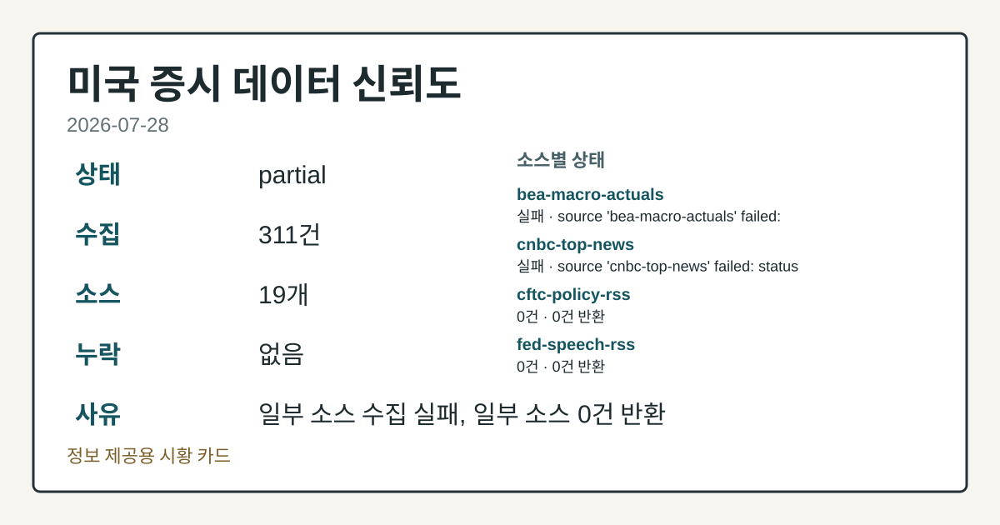
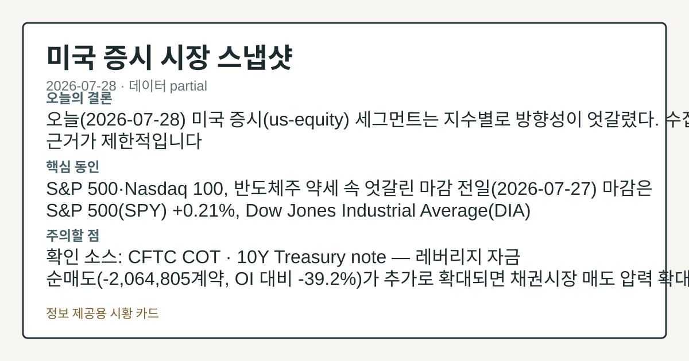
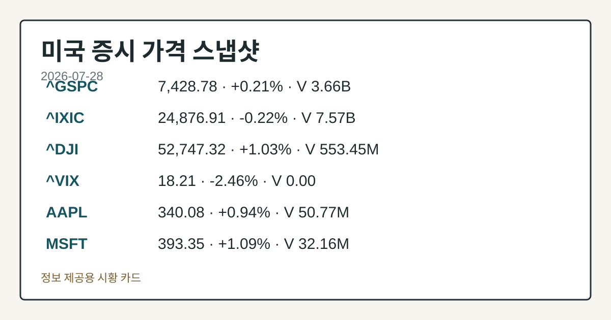
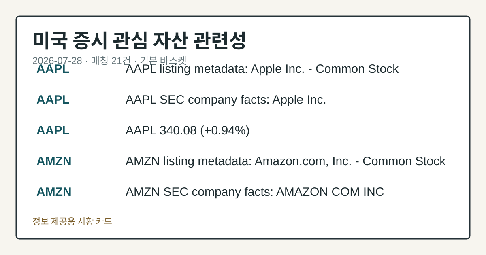

# 2026-07-28 미국 증시 시황
> 정보 제공용 자동 시황이며 매매 권유가 아닙니다.
# 2026-07-28 미국 증시 시황
**기준 시각**: 2026-07-28 NY · 수집창 2026-07-28T04:00Z ~ 2026-07-29T04:00Z (종료 미포함)
| 종목 | 종가 | 변동 | 비고 |
|------|------|------|------|
| ^GSPC | 7,428.78 | +0.21% | -2.38% from 52w high · +8.32% YTD |
| ^IXIC | 24,876.91 | -0.22% | -8.18% from 52w high · +7.06% YTD |
| ^DJI | 52,747.32 | +1.03% | -0.58% from 52w high · +9.02% YTD |
| AAPL | 340.08 | +0.94% | ATH 경신 · +25.49% YTD |
| MSFT | 393.35 | +1.09% | +11.48% from 52w low · -16.83% YTD |
**세그먼트**: [국내 증시](../../../domestic-equity/2026/07/2026-07-28.md) | [미국 증시](2026-07-28.md) | [크립토](../../../crypto/2026/07/2026-07-28.md)
<!-- investo:block visual:us-equity.visual.curated-context-image -->

*이미지: 큐레이션 시황 이미지 · 출처: 외부 라이선스 이미지 · 생성: investo 0.1.0 · 2026-07-28 UTC*
<!-- /investo:block visual:us-equity.visual.curated-context-image -->
> **내 관심 자산 영향**: 21건 확인 (기본 바스켓) — AAPL: 직접 관련 · [nasdaq-symbol-directory] AAPL listing metadata: Apple Inc. - Common Stock; AAPL: 직접 관련 · [sec-company-facts] AAPL SEC company facts: Apple Inc.; AAPL: 직접 관련 · [yfinance-price] AAPL 340.08 (**+0.94%**); AMZN: 직접 관련 · [nasdaq-symbol-directory] AMZN listing metadata: Amazon.com, Inc. - Common Stock; AMZN: 직접 관련 · [sec-company-facts] AMZN SEC company facts: AMAZON COM INC 외
> **용어 가이드**: 이번 시황에서 처음 등장한 용어 — E-mini S&P 500(미니 S&P 500 선물), 시가총액(시장가치)
> **오늘의 결론**: 오늘(2026-07-28) 미국 증시(us-equity) 세그먼트는 지수별로 방향성이 엇갈렸다. 수집 근거가 제한적입니다
> **핵심 동인**: S&P 500·Nasdaq 100, 반도체주 약세 속 엇갈린 마감 전일(2026-07-27) 마감은 S&P 500(SPY) **+0.21%** 본문 참고.
> **주의할 점**: 확인 소스: CFTC COT · 10Y Treasury note — 레버리지 자금 순매도(-2,064,805계약, OI 대비 **-39.2%**)가 본문 참고.
## 한눈에 보기
미국 3대 지수는 반도체주 약세 속 엇갈린 흐름을 보였다 — 전일(2026-07-27) 마감 기준 S&P 500(SPY) **+0.21%** 본문 참고.
**AAPL**(애플) 주가는 **$340.08**로 **+0.94%** 상승하며 관심 종목 중 가장 뚜렷한 단일 신호를 냈다.
CPI(소비자물가지수)가 전월 대비 하락한 **332.568**로 발표돼 — 본문 §④ 참조.
## ⓪ 오늘의 매크로
**FOMC 일정** — 2026-07-29 — FOMC Meeting
**미 국채 수익률** — UST curve 2026-07-28: 10Y 4.61%, 2Y10Y +0.35pp
## ⓪-B 채널 기준선
| 기준선 | 값 |
|------|------|
| S&P 500 | 7,428.78 (+0.21%) |
| 나스닥 종합 | 24,876.91 (-0.22%) |
| 다우존스 | 52,747.32 (+1.03%) |
| CFTC 포지셔닝 | E-mini S&P 500 순포지션 -322865계약 (-16.65% OI), 2026-07-21 기준/2026-07-24 공개 · Nasdaq-100 mini 순포지션 -74690계약 (-26.03% OI), 2026-07-21 기준/2026-07-24 공개 · VIX futures 순포지션 3098계약 (0.78% OI), 2026-07-21 기준/2026-07-24 공개 · 주간 지연 |
> **크로스마켓 연결 고리**: 금리 이벤트가 할인율/달러 경로의 공통 변수로 남아 있습니다.
> **오늘의 큰 그림:** 금리와 달러 변수가 공통 변수지만, Nasdaq·Dow 섹터 변동성를 먼저 확인해야 합니다.
## ① 요약

<!-- investo:block visual:us-equity.visual.data-confidence -->

*이미지: 데이터 신뢰도 · 출처: investo 자체 생성 · 생성: investo 0.1.0 · 2026-07-28 UTC*
<!-- /investo:block visual:us-equity.visual.data-confidence -->

<!-- investo:block visual:us-equity.visual.market-snapshot -->

*이미지: 시장 스냅샷 · 출처: investo 자체 생성 · 생성: investo 0.1.0 · 2026-07-28 UTC*
<!-- /investo:block visual:us-equity.visual.market-snapshot -->

오늘 미국 증시 세그먼트는 지수별로 방향성이 엇갈렸다. 전일 마감 기준 S&P 500은 **+0.21%**, Dow Jones Industrial Average는 **+1.03%**로 상승한 반면, Nasdaq 100은 반도체주 약세 여파로 **-0.98%** 하락했다. 장중 흐름을 보면 반도체주 약세가 더 짙어지며 Nasdaq 100 낙폭이 한때 **-1.50%**까지 확대되는 등 단일 방향성이 형성되지 않았다. 어보트 래보러토리스(Abbott Laboratories), Taiwan Semiconductor(TSMC, 대만반도체), 존슨앤드존슨(Johnson & Johnson)은 실적 서프라이즈와 함께 가이던스를 상향했고, CFTC(상품선물거래위원회) COT(선물포지션보고서)에서는 E-mini S&P 500과 Nasdaq-100 mini 레버리지 자금이 각각 순매도(**-16.6%** of 미결제약정(OI), **-26.0%** of OI) 포지션을 유지해 신호가 엇갈렸다. 어제 흐름과 비교해도 뚜렷한 단일 방향성 부재가 이어지는 모습이다. [혼재]

## ② 전일 핵심 이슈

### S&P 500·Nasdaq 100, 반도체주 약세 속 엇갈린 마감

전일 마감은 S&P 500 **+0.21%**, Dow Jones Industrial Average **+1.03%**로 상승했지만 Nasdaq 100은 **-0.98%** 하락했다([Stocks Settle Mostly Higher on Positive Earnings Results](https://www.nasdaq.com/articles/stocks-settle-mostly-higher-positive-earnings-results)). 이후 장중 흐름에서는 S&P 500이 **+0.05%**, Dow Jones가 **+0.738%**로 소폭 상승을 이어간 반면 Nasdaq 100은 **-1.12%**로 하락 폭을 키웠다([Stocks Mixed on Earnings Results and Weakness in Chipmakers](https://www.nasdaq.com/articles/stocks-mixed-earnings-results-and-weakness-chipmakers)). 반도체주 약세가 더 깊어지면서 같은 세션 후반에는 S&P 500이 **-0.22%**로 전환되고 Nasdaq 100 낙폭이 **-1.50%**까지 확대된 스냅샷도 확인된다([Stocks Mixed as Weakness in Chipmakers Deepens](https://www.nasdaq.com/articles/stocks-mixed-weakness-chipmakers-deepens)). ESU26(미니 S&P 500 선물)도 이 흐름 속에서 **+0.24%**에서 **+0.05%**, **-0.29%**로 등락을 오갔다.

> **그래서 의미는?** 지수 방향이 하루 안에서도 여러 번 바뀌어, 단일한 상승·하락 결론을 내리기 어려운 흐름입니다.

### 실적 시즌 속 개별 기업 서프라이즈

Abbott Laboratories, Taiwan Semiconductor, Johnson & Johnson은 2분기 실적에서 기록적 결과와 함께 가이던스를 상향했다([These 3 Companies Reported Record Results and Raised Guidance](https://www.nasdaq.com/articles/these-3-companies-reported-record-results-and-raised-guidance)). 어제(2026-07-27) 흐름에서도 뚜렷한 단일 방향성 부재가 보고됐던 만큼, 오늘 역시 그 흐름이 연장되는 모습이다.

## ③ 섹터/수급 동향

### CFTC COT, 채권·지수선물 레버리지 자금 순매도 유지

CFTC COT 기준 10Y Treasury note는 레버리지 자금(leveraged money) 순매도 **-2,064,805**계약(미결제약정(OI) 대비 **-39.2%**)을 기록했다([CFTC COT](https://www.cftc.gov/MarketReports/CommitmentsofTraders/index.htm)). E-mini S&P 500도 순매도 **-322,865**계약(OI 대비 **-16.6%**), Nasdaq-100 mini는 순매도 **-74,690**계약으로 지수선물 전반에서 순매도 포지션이 유지됐다. U.S. Dollar Index는 순매도 **-1,938**계약으로 상대적으로 완만했고, VIX(변동성지수) 선물은 순매수 **+3,098**계약으로 소폭 헤지 성격의 포지션이 확인된다.

> **그래서 의미는?** 대형 투자자들의 채권·지수선물 포지션이 순매도 쪽에 쏠려 있어, 방어적 수급 심리가 감지됩니다.

## ④ 지표·이벤트

### 물가·고용 지표, 전월 대비 둔화 신호

FRED(세인트루이스 연은 경제데이터) 기준 DFF(연방기금금리)는 **3.63**으로 전일 대비 변동이 없었다([FRED DFF](https://fred.stlouisfed.org/series/DFF)). CPIAUCSL(소비자물가지수, CPI)은 **332.568**로 전월(333.979) 대비 하락했고([FRED CPIAUCSL](https://fred.stlouisfed.org/series/CPIAUCSL)), PPIFID(생산자물가지수, PPI)는 **157.045**로 전월 대비 하락했다([FRED PPIFID](https://fred.stlouisfed.org/series/PPIFID)). UNRATE(실업률)는 **4.2%**로 전월 대비 소폭 낮아졌다([FRED UNRATE](https://fred.stlouisfed.org/series/UNRATE)). BLS(미국 노동통계국) 발표에서도 같은 방향이 확인된다 — Consumer Price Index 실제치 **332.568**(전월 333.979), Core Consumer Price Index **336.065**(전월 336.121), Producer Price Index Final Demand **156.566**(전월 157.001), Unemployment Rate **4.2%**(전월 **4.3%**), Average hourly earnings **37.64**달러(전월 37.51), Total nonfarm payroll employment **158984**천 명(전월 158927), Job Openings **7594**(전월 7585), Labor Force Participation Rate **61.5%**(전월 **61.8%**)([BLS](https://www.bls.gov/data/)). 변동성 지표인 Cboe VVIX(변동성의 변동성지수)는 2026-07-28 기준 **98.51**로 마감했다([Cboe VVIX](https://cdn.cboe.com/api/global/us_indices/daily_prices/VVIX_History.csv)). 오늘 일정으로는 FOMC(연방공개시장위원회) 캘린더상 H.6(연준 통화량 통계 발표)이 오후 1시에 예정돼 있다([FOMC Calendar](https://www.federalreserve.gov/newsevents/calendar.htm)).

> **그래서 의미는?** 물가·생산자물가 지표가 전월보다 낮아져, 물가 둔화 흐름이 이어지는지 확인이 필요한 구간입니다.

## ⑤ 주요 종목
<!-- investo:block chart:us-equity.chart.market -->

<!-- u50 lightweight-charts-embed: placeholders consumed by site_docs/assets/investo-chart-init.js -->

<noscript><em>인터랙티브 차트는 JavaScript가 활성화된 환경에서 표시됩니다. 위 정적 카드가 동일한 정보를 담고 있습니다.</em></noscript>

<!-- /investo:block chart:us-equity.chart.market -->

<!-- investo:block visual:us-equity.visual.price-snapshot -->

*이미지: 가격 스냅샷 · 출처: investo 자체 생성 · 생성: investo 0.1.0 · 2026-07-28 UTC*
<!-- /investo:block visual:us-equity.visual.price-snapshot -->

### 관전 분류 — AAPL·AMZN

**AAPL**(애플)은 nasdaq-symbol-directory 상장 정보(Common Stock, NASDAQ)와 SEC(미국 증권거래위원회) 기업 팩트가 함께 확인됐고([SEC AAPL](https://data.sec.gov/submissions/CIK0000320193.json)), 최근 주가는 **$340.08**로 **+0.94%** 상승했다. SEC 자료 기준 순이익 **$61,110,000,000**, 희석 EPS(주당순이익) **4.05**, 자산 **$359,241,000,000**, 부채 **$285,508,000,000**가 보고됐다. **AMZN**(아마존)은 nasdaq-symbol-directory 상장 정보와 SEC 기업 팩트가 확인됐다([SEC AMZN](https://data.sec.gov/submissions/CIK0000320193.json)). **MSFT**(마이크로소프트) 역시 SEC 기업 팩트에서 순이익 **$74,599,000,000**, 희석 EPS **9.99**, 자산 **$619,003,000,000**, 부채 **$275,524,000,000**가 확인됐다([SEC MSFT](https://data.sec.gov/submissions/CIK0000789019.json)).

> **그래서 의미는?** AAPL(애플)·AMZN(아마존)·MSFT(마이크로소프트) 모두 상장·재무 데이터가 최신으로 확인되는 관심 종목입니다.

### 실적 발표 확인

Zurn Water(ZWS)는 2분기 EPS·매출 서프라이즈 각각 **+6.38%**, **+1.78%**를 기록했다([Nasdaq](https://www.nasdaq.com/articles/zurn-water-zws-beats-q2-earnings-and-revenue-estimates)). Seacoast Banking(SBCF)은 **+1.67%**, **+1.30%**([Nasdaq](https://www.nasdaq.com/articles/seacoast-banking-sbcf-q2-earnings-and-revenues-beat-estimates)), Seagate(STX)는 **+11.96%**, **+3.85%**([Nasdaq](https://www.nasdaq.com/articles/seagate-stx-surpasses-q4-earnings-and-revenue-estimates)), Skyworks Solutions(SWKS)는 **+4.85%**, **+1.38%**([Nasdaq](https://www.nasdaq.com/articles/skyworks-solutions-swks-q3-earnings-and-revenues-beat-estimates)), Visa(V, 비자)는 **+2.79%**, **+2.28%**([Nasdaq](https://www.nasdaq.com/articles/visa-v-surpasses-q3-earnings-and-revenue-estimates)), Mondelez(MDLZ, 몬델리즈)는 **+8.96%**, **+1.39%** 서프라이즈를 기록했다([Nasdaq](https://www.nasdaq.com/articles/mondelez-mdlz-q2-earnings-and-revenues-top-estimates)).

### 이번 주 실적 확인 항목 — 개장 전 발표 예정

American Tower(AMT, REIT(부동산투자신탁))는 EPS 전망 **$2.65**, 시가총액 **$77,683,010,325**, 전년 동기 EPS **$2.60**로 개장 전 발표 예정이다([Nasdaq](https://www.nasdaq.com/market-activity/stocks/amt/earnings)). Boeing(BA)은 EPS 전망 (**$0.34**), 시가총액 **$166,725,943,007**, 전년 동기 EPS (**$1.24**)로 개장 전 발표 예정이며([Nasdaq](https://www.nasdaq.com/market-activity/stocks/ba/earnings)), Barclays(BCS)는 EPS 전망 **$0.89**, 시가총액 **$97,543,696,236**, 전년 동기 EPS **$0.62**로 개장 전 발표 예정이다([Nasdaq](https://www.nasdaq.com/market-activity/stocks/bcs/earnings)).

## ⑥ 오늘의 관전 포인트

<!-- investo:block visual:us-equity.visual.watchlist-relevance -->

*이미지: 관심 자산 관련성 · 출처: investo 자체 생성 · 생성: investo 0.1.0 · 2026-07-28 UTC*
<!-- /investo:block visual:us-equity.visual.watchlist-relevance -->

#### 관찰 신호: 10Y Treasury note — 레버리지 자금 순매…

- 출처: CFTC COT
- 현재: CFTC COT · 10Y Treasury note — 레버리지 자금 순매도가 추가로 확대되면 채권시장 매도 압력 확대 관찰, 순매도 규모가 축소 전환되면 되돌림 관찰. 관심 영향: 채권시장 변동성 점검.
- 확인 조건: 상방 10Y Treasury note — 레버리지 자금 순매도가 추가로 확대되면 채권시장 매도 압력 확대 관찰; 하방 순매도 규모가 축소 전환되면 되돌림 관찰
- 신뢰도: 보통
- 관심 영향: 채권시장 변동성 점검.

> **데이터 상태**: 부분

수집/품질 진단

> **데이터 상태**: 부분 — 수집 311건 / 소스 19개 / 누락: 없음 · 부분 — 일부 카테고리 미수집, 본문 일부 결론 보강 필요
> **소스 카운트**: 수집 대상 25 / 성공 19 / 수집 상세는 진단 섹션에서 확인할 수 있습니다. / 수집 상세는 진단 섹션에서 확인할 수 있습니다. / 수집 상세는 진단 섹션에서 확인할 수 있습니다.
> **소스 등급 분포**: S=9 / A=10
> **상세 사유**: 일부 소스 수집 실패, 일부 소스 0건 반환
> **소스별 상태**: bea-macro-actuals 실패 (설정 미완료(미수집)), cnbc-top-news 실패 (접근 제한), cftc-policy-rss 0건, fed-speech-rss 0건, fomc-rss 0건, sec-newsroom-rss 0건, 정상 19개

## ⑦ 면책조항
본 시황은 일반 정보 제공을 목적으로 자동 생성된 자료이며,
특정 종목·자산에 대한 매매 권유나 투자 자문이 아닙니다.
투자 결정과 그 결과에 대한 책임은 전적으로 본인에게 있으며,
본 시황의 내용에 따라 발생한 손실에 대해 작성자는 일체의 책임을 지지 않습니다.