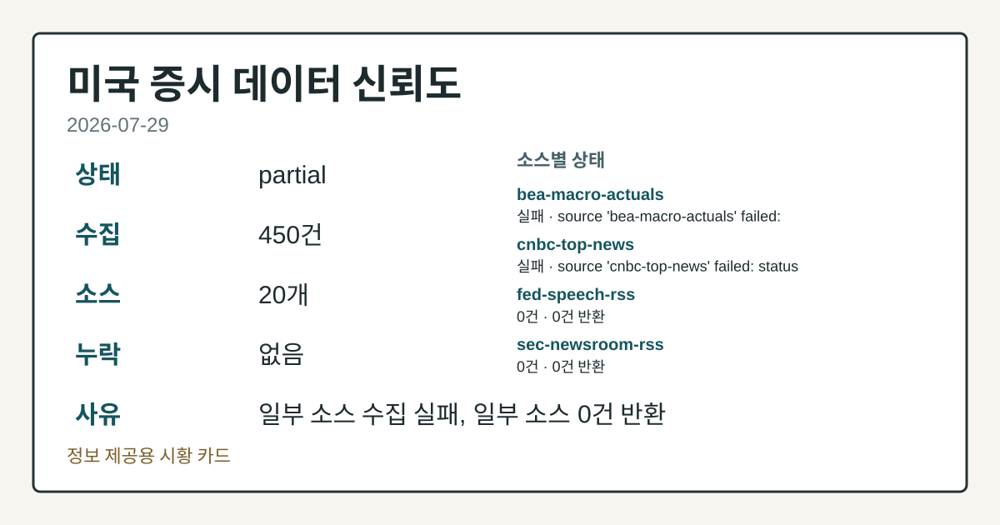
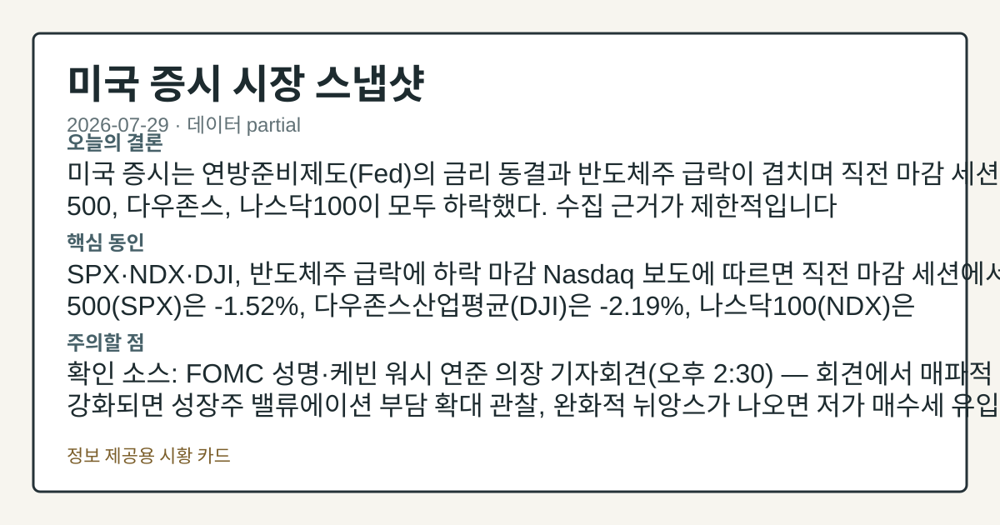
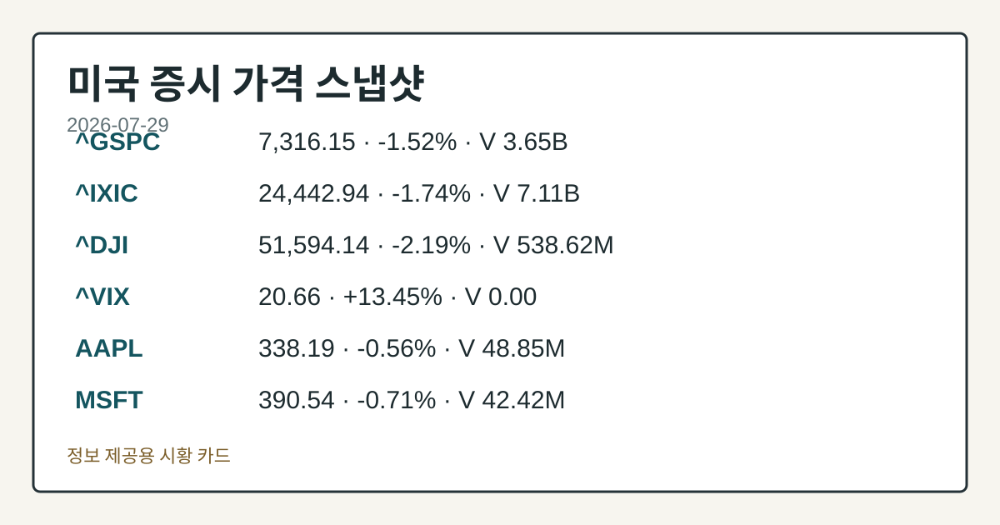
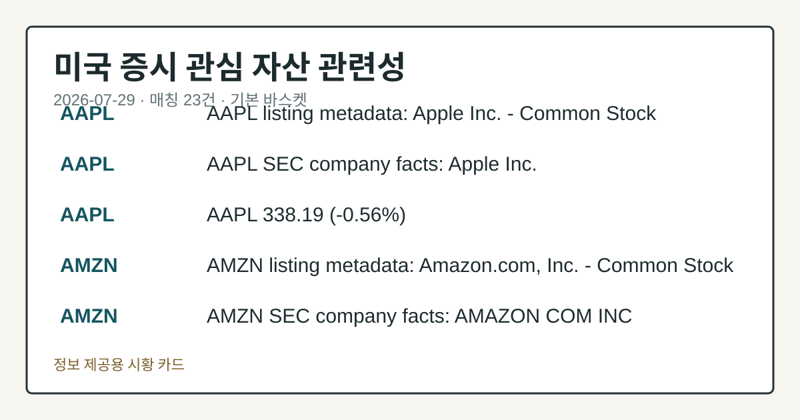

# 2026-07-29 미국 증시 시황
> 정보 제공용 자동 시황이며 매매 권유가 아닙니다.
# 2026-07-29 미국 증시 시황
**기준 시각**: 2026-07-29 NY · 수집창 2026-07-29T04:00Z ~ 2026-07-30T04:00Z (종료 미포함)
| 종목 | 종가 | 변동 | 비고 |
|------|------|------|------|
| ^GSPC | 7,316.15 | -1.52% | -3.86% from 52w high · +6.67% YTD |
| ^IXIC | 24,442.94 | -1.74% | -9.78% from 52w high · -6.13% MTD |
| ^DJI | 51,594.14 | -2.19% | -2.76% from 52w high · +6.64% YTD |
| AAPL | 338.19 | -0.56% | -0.56% from 52w high · +24.79% YTD |
| MSFT | 390.54 | -0.71% | +10.69% from 52w low · -17.42% YTD |
**세그먼트**: [국내 증시](../../../domestic-equity/2026/07/2026-07-29.md) | [미국 증시](2026-07-29.md) | [크립토](../../../crypto/2026/07/2026-07-29.md)
<!-- investo:block visual:us-equity.visual.curated-context-image -->

*이미지: 큐레이션 시황 이미지 · 출처: 외부 라이선스 이미지 · 생성: investo 0.1.0 · 2026-07-29 UTC*
<!-- /investo:block visual:us-equity.visual.curated-context-image -->
> **내 관심 자산 영향**: 23건 확인 (기본 바스켓) — AAPL: 직접 관련 · [nasdaq-symbol-directory] AAPL listing metadata: Apple Inc. - Common Stock; AAPL: 직접 관련 · [sec-company-facts] AAPL SEC company facts: Apple Inc.; AAPL: 직접 관련 · [yfinance-price] AAPL 338.19 (**-0.56%**); AMZN: 직접 관련 · [nasdaq-symbol-directory] AMZN listing metadata: Amazon.com, Inc. - Common Stock; AMZN: 직접 관련 · [sec-company-facts] AMZN SEC company facts: AMAZON COM INC 외
> **용어 가이드**: 이번 시황에서 처음 등장한 용어 — CLU26(원유선물), DXY(달러지수)
> **오늘의 결론**: 미국 증시는 연방준비제도(Fed)의 금리 동결과 반도체주 급락이 겹치며 직전 마감 세션에서 S&P 500, 다우존스, 나스닥100이 모두 하락했다 본문 참고.
> **핵심 동인**: SPX·NDX·DJI, 반도체주 급락에 하락 마감 Nasdaq 보도에 따르면 직전 마감 세션에서 S&P 500(SPX)은 **-1.52%** 본문 참고.
> **주의할 점**: 확인 소스: FOMC 성명·케빈 워시 연준 의장 기자회견(오후 2:30) — 회견에서 매파적 톤이 강화되면 성장주 밸류에이션 부담 확대 관찰 본문 참고.
## 한눈에 보기
뉴욕증시 3대 지수, 반도체주 급락과 매파적 FOMC 동결 여파로 직전 마감 세션 기준 **-1.52%**~**-2.19%** 하락.
WTI 원유(CLU26)가 미-이란 갈등 여파로 전일 **+6.56%** 급등, 배럴당 +5.20달러 상승.
CFTC COT(트레이더 포지션 보고서) 기준 E-mini S&P 500 레버리지 자금 순매도가 미결제약정의 **-16.6%**까지 확대 — 본문 §③ 참조.
## ⓪ 오늘의 매크로
**FOMC 일정** — 2026-07-29 — FOMC Meeting
**미 국채 수익률** — UST curve 2026-07-29: 10Y 4.67%, 2Y10Y +0.45pp
## ⓪-B 채널 기준선
| 기준선 | 값 |
|------|------|
| S&P 500 | 7,316.15 (-1.52%) |
| 나스닥 종합 | 24,442.94 (-1.74%) |
| 다우존스 | 51,594.14 (-2.19%) |
| CFTC 포지셔닝 | E-mini S&P 500 순포지션 -322865계약 (-16.65% OI), 2026-07-21 기준/2026-07-24 공개 · Nasdaq-100 mini 순포지션 -74690계약 (-26.03% OI), 2026-07-21 기준/2026-07-24 공개 · VIX futures 순포지션 3098계약 (0.78% OI), 2026-07-21 기준/2026-07-24 공개 · 주간 지연 |
> **크로스마켓 연결 고리**: 금리 이벤트가 할인율/달러 경로의 공통 변수로 남아 있습니다.
> **오늘의 큰 그림:** 금리와 달러 변수가 공통 변수지만, Nasdaq·Dow 섹터 변동성를 먼저 확인해야 합니다.
## ① 요약

<!-- investo:block visual:us-equity.visual.data-confidence -->

*이미지: 데이터 신뢰도 · 출처: investo 자체 생성 · 생성: investo 0.1.0 · 2026-07-29 UTC*
<!-- /investo:block visual:us-equity.visual.data-confidence -->

<!-- investo:block visual:us-equity.visual.market-snapshot -->

*이미지: 시장 스냅샷 · 출처: investo 자체 생성 · 생성: investo 0.1.0 · 2026-07-29 UTC*
<!-- /investo:block visual:us-equity.visual.market-snapshot -->

미국 증시는 연방준비제도의 금리 동결과 반도체주 급락이 겹치며 직전 마감 세션에서 S&P 500, 다우존스, 나스닥100이 모두 하락했다. 여기에 미-이란 갈등에 따른 유가 급등과 달러 약세까지 맞물리며 투자심리가 위축된 모습이다. 오늘 예정된 FOMC 기자회견 결과에 따라 방향성이 다시 흔들릴 수 있는 구간이다. [하락 관찰]

## ② 전일 핵심 이슈

### SPX·NDX·DJI, 반도체주 급락에 하락 마감

[Nasdaq 보도](https://www.nasdaq.com/articles/stocks-plunge-rout-chipmakers-and-hawkish-fed-hold)에 따르면 직전 마감 세션에서 S&P 500은 **-1.52%**, 다우존스산업평균은 **-2.19%**, 나스닥100은 **-2.06%** 하락 마감했다고 전했다. 이후 나온 [업데이트 기사](https://www.nasdaq.com/articles/stocks-tumble-chipmakers-plunge-oil-spikes)에서는 하락폭이 S&P 500 **-0.71%**, 다우존스 **-1.53%**, 나스닥100 **-0.98%** 수준으로 다소 완화된 것으로 보도됐다. 두 기사 모두 반도체주 급락과 유가 급등을 하락 배경으로 지목했다.

> **그래서 의미는?** 반도체 중심 매도세와 매파적 금리 동결이 겹쳐 성장주 투자심리가 위축되는 흐름입니다.

### 연방준비제도(Fed), FOMC(연방공개시장위원회) 성명 발표·기자회견 예정

[연준 보도자료](https://www.federalreserve.gov/newsevents/pressreleases/monetary20260729a.htm)에 따르면 FOMC가 성명을 발표했으며, [FOMC 일정](https://www.federalreserve.gov/live-broadcast.htm)에 따라 케빈 워시(Kevin Warsh) 연준 의장이 오늘 오후 2:30 기자회견을 진행할 예정이다. [관련 기사](https://www.nasdaq.com/articles/dollar-falls-fomc-keeps-interest-rates-unchanged)는 FOMC가 금리를 동결한 이후 달러지수(DXY)가 1주일 최저 수준으로 밀리며 **-0.48%** 하락 마감했다고 전했다.

어제까지 이어지던 지수별 혼조 흐름에서 벗어나 오늘은 하락 쏠림이 뚜렷해졌으며, 달러 약세와 유가 상승이 동시에 나타나는 자금 흐름 전환이 확인된다.

## ③ 섹터/수급 동향

### 레버리지 자금, S&P·나스닥 선물 순매도 확대

[CFTC COT](https://www.cftc.gov/MarketReports/CommitmentsofTraders/index.htm)에 따르면 E-mini S&P 500 레버리지 자금은 순매도 -322,865계약을 기록했고, 나스닥100 미니 선물은 순매도 -74,690계약(OI 대비 **-26.0%**)으로 나타났다. 반면 VIX 선물 레버리지 자금은 순매수 +3,098계약(OI 대비 **+0.8%**)으로 소폭 늘었다. 해당 수치는 주간 CFTC(미국상품선물거래위원회) 리포트 기준으로 일중 흐름은 아니다.

> **그래서 의미는?** 대형 지수 선물에서 순매도가 늘어난 점은 기관 자금이 방어적으로 움직이고 있음을 보여줍니다.

### 유가 급등, 미-이란 갈등 여파

[Nasdaq 보도](https://www.nasdaq.com/articles/crude-oil-prices-surge-us-iran-conflict-looks-drag)에 따르면 9월물 WTI(서부텍사스산원유) 선물(CLU26)이 전일 +5.20달러(**+6.56%**) 급등했고, 9월물 RBOB(무연 휘발유 선물) 가솔린(RBU26)도 +0.0815달러(**+2.59%**) 상승했다. 중동 지역 무력 충돌 재점화가 상승 배경으로 지목됐다.

## ④ 지표·이벤트

| 지표 | 최신치 | 직전치 | 기준 시점 | 출처 |
|---|---|---|---|---|
| DFF(연방기금실효금리) | 3.63 | 3.63 | 2026-07-28 | [FRED](https://fred.stlouisfed.org/series/DFF) |
| CPIAUCSL(소비자물가지수) | 332.568 | 333.979 | 2026-06-01 | [FRED](https://fred.stlouisfed.org/series/CPIAUCSL) |
| PPIFID(생산자물가지수) | 157.045 | 157.346 | 2026-06-01 | [FRED](https://fred.stlouisfed.org/series/PPIFID) |
| UNRATE(실업률) | 4.2 | 4.3 | 2026-06-01 | [FRED](https://fred.stlouisfed.org/series/UNRATE) |
| VVIX(변동성지수의 변동성) | 109.47 | - | 2026-07-29 | [Cboe](https://cdn.cboe.com/api/global/us_indices/daily_prices/VVIX_History.csv) |

FRED(세인트루이스 연방준비은행 경제데이터) 기준으로 기준금리(DFF)는 **3.63**으로 전일과 동일했고, 소비자물가지수(CPIAUCSL)는 332.568로 전월 333.979 대비 하락했다. 생산자물가지수(PPIFID)도 157.045로 전월 157.346보다 낮아졌고, 실업률(UNRATE)은 **4.2%**로 전월 **4.3%**에서 소폭 내려갔다. [BLS(미국 노동통계국)](https://www.bls.gov/data/) 발표 기준으로도 같은 방향의 수치가 확인됐다 — 근원 소비자물가지수 336.065(전월 336.121), 생산자물가지수 최종수요 156.566(전월 157.001), 총 비농업 고용 158,984천 명(전월 158,927천 명), 시간당 평균 임금 **$37.64**(전월 **$37.51**), 구인 건수 7,594(전월 7,585), 경제활동참가율 **61.5%**(전월 **61.8%**). [연준 일정](https://www.federalreserve.gov/newsevents/calendar.htm)에 따르면 SLOOS(선임대출담당자 설문조사, 은행대출관행 조사)는 2026-08-03 오후 2시로 예정돼 있다.

> **그래서 의미는?** 물가 지표가 완만히 둔화됐지만 금리는 동결돼 통화정책 경로에 대한 해석이 엇갈립니다.

## ⑤ 주요 종목
<!-- investo:block chart:us-equity.chart.market -->

<!-- u50 lightweight-charts-embed: placeholders consumed by site_docs/assets/investo-chart-init.js -->

<noscript><em>인터랙티브 차트는 JavaScript가 활성화된 환경에서 표시됩니다. 위 정적 카드가 동일한 정보를 담고 있습니다.</em></noscript>

<!-- /investo:block chart:us-equity.chart.market -->

<!-- investo:block visual:us-equity.visual.price-snapshot -->

*이미지: 가격 스냅샷 · 출처: investo 자체 생성 · 생성: investo 0.1.0 · 2026-07-29 UTC*
<!-- /investo:block visual:us-equity.visual.price-snapshot -->

### 확인 항목

[나스닥 상장 정보](https://www.nasdaqtrader.com/dynamic/SymDir/nasdaqlisted.txt)와 SEC 공시 기준으로 AAPL(애플), AMZN(아마존), NVDA(엔비디아)의 상장·공시 메타데이터가 확인됐다. AAPL은 **338.19**달러, **-0.56%**로 집계됐다.

> **그래서 의미는?** 애플·아마존·엔비디아 등 대형주 확인과 다수 실적 발표가 겹쳐 개별 종목 변동성 확인이 필요합니다.

### 실적 발표

[Waystar(WAY)](https://www.nasdaq.com/articles/waystar-holding-way-beats-q2-earnings-and-revenue-estimates)는 2026년 6월 분기 실적·매출 서프라이즈가 각각 **+7.50%**, **+1.12%**로 집계됐다. [Qualcomm(QCOM)](https://www.nasdaq.com/articles/qualcomm-qcom-q3-earnings-miss-estimates)은 실적 서프라이즈 **-0.45%**, 매출 서프라이즈 **+2.44%**를 기록했다. [Starbucks(SBUX)](https://www.nasdaq.com/articles/starbucks-sbux-q3-earnings-surpass-estimates)는 실적 서프라이즈 **+28.79%**, 매출 서프라이즈 **-1.22%**로 나타났다.

### 실적 발표 예정 (체크리스트)

[Nasdaq 실적 캘린더](https://www.nasdaq.com/market-activity/stocks/adp/earnings) 기준 EPS(주당순이익) 전망치는 ADP **$2.59**, [AEM](https://www.nasdaq.com/market-activity/stocks/aem/earnings) **$2.89**, [AON](https://www.nasdaq.com/market-activity/stocks/aon/earnings) **$3.77**, [APH](https://www.nasdaq.com/market-activity/stocks/aph/earnings) **$1.19**, [ARM](https://www.nasdaq.com/market-activity/stocks/arm/earnings) **$0.18**, [BSX](https://www.nasdaq.com/market-activity/stocks/bsx/earnings) **$0.83**, [CP](https://www.nasdaq.com/market-activity/stocks/cp/earnings) **$0.89**, [CVNA](https://www.nasdaq.com/market-activity/stocks/cvna/earnings) **$0.42**로 각각 집계됐다.

## ⑥ 오늘의 관전 포인트

<!-- investo:block visual:us-equity.visual.watchlist-relevance -->

*이미지: 관심 자산 관련성 · 출처: investo 자체 생성 · 생성: investo 0.1.0 · 2026-07-29 UTC*
<!-- /investo:block visual:us-equity.visual.watchlist-relevance -->

#### 관찰 신호: Nasdaq 실적 캘린더 · ADP EPS…

- 출처: Nasdaq 실적 캘린더
- 현재: Nasdaq 실적 캘린더
- 확인 조건: 상방 ARM EPS 전망 **$0.18** 등 이번 주 실적 발표 다수 예정 — 예상치를 상회하는 결과가 이어지면 관련 섹터 상승 여력 관찰; 하방 하회하는 결과가 이어지면 실적 우려 확산 흐름 점검
- 신뢰도: 높음
- 관심 영향: 결제

> **데이터 상태**: 부분

수집/품질 진단

> **데이터 상태**: 부분 — 수집 450건 / 소스 20개 / 누락: 없음 · 부분 — 일부 카테고리 미수집, 본문 일부 결론 보강 필요
> **소스 카운트**: 수집 대상 25 / 성공 20 / 수집 상세는 진단 섹션에서 확인할 수 있습니다. / 수집 상세는 진단 섹션에서 확인할 수 있습니다. / 수집 상세는 진단 섹션에서 확인할 수 있습니다.
> **소스 등급 분포**: S=11 / A=9
> **상세 사유**: 일부 소스 수집 실패, 일부 소스 0건 반환
> **소스별 상태**: bea-macro-actuals 실패 (설정 미완료(미수집)), cnbc-top-news 실패 (접근 제한), fed-speech-rss 0건, sec-newsroom-rss 0건, treasury-auctions 0건, 정상 20개

## ⑦ 면책조항
본 시황은 일반 정보 제공을 목적으로 자동 생성된 자료이며,
특정 종목·자산에 대한 매매 권유나 투자 자문이 아닙니다.
투자 결정과 그 결과에 대한 책임은 전적으로 본인에게 있으며,
본 시황의 내용에 따라 발생한 손실에 대해 작성자는 일체의 책임을 지지 않습니다.