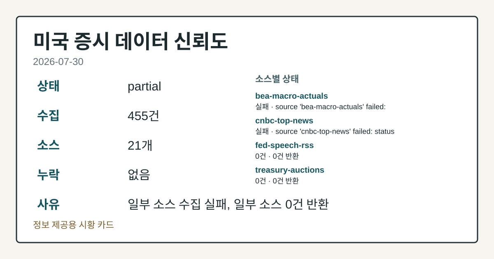
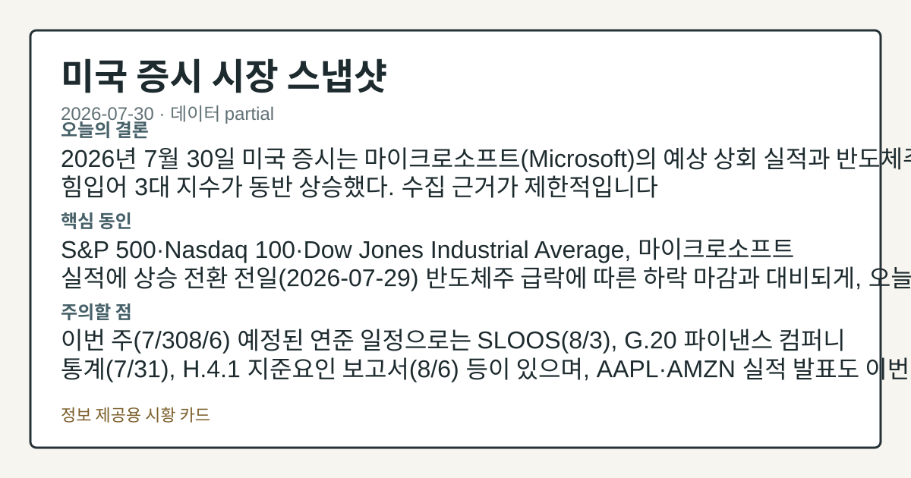
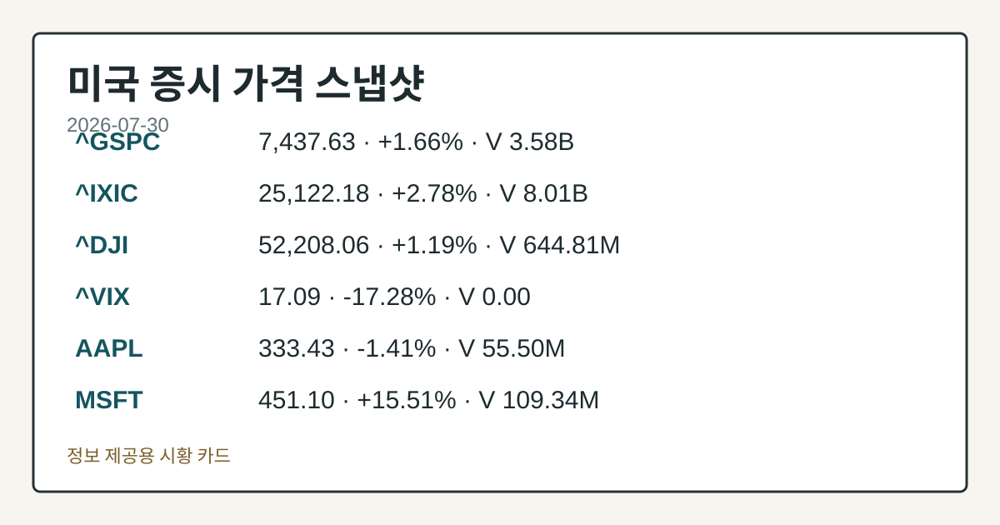
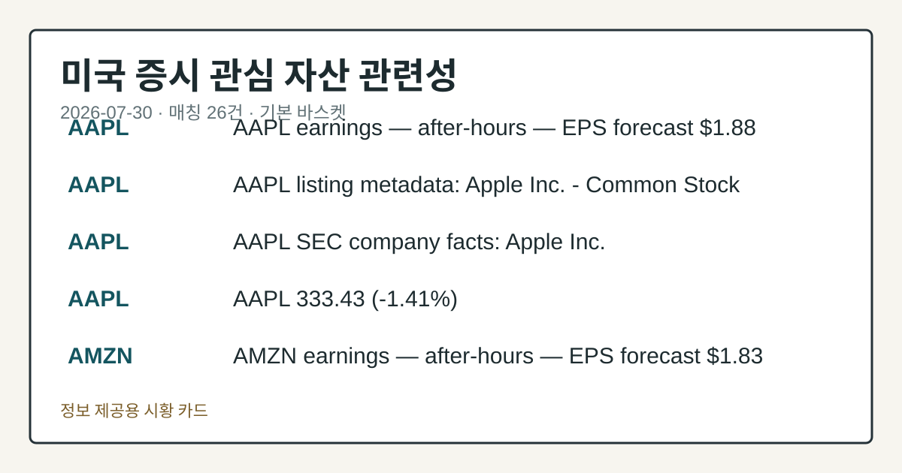

# 2026-07-30 미국 증시 시황
> 정보 제공용 자동 시황이며 매매 권유가 아닙니다.
# 2026-07-30 미국 증시 시황
**기준 시각**: 2026-07-30 NY · 수집창 2026-07-30T04:00Z ~ 2026-07-31T04:00Z (종료 미포함)
| 종목 | 종가 | 변동 | 비고 |
|------|------|------|------|
| ^GSPC | 7,437.63 | +1.66% | -2.26% from 52w high · +8.44% YTD |
| ^IXIC | 25,122.18 | +2.78% | -7.28% from 52w high · +8.12% YTD |
| ^DJI | 52,208.06 | +1.19% | -1.60% from 52w high · +7.91% YTD |
| AAPL | 333.43 | -1.41% | -1.96% from 52w high · +23.03% YTD |
| MSFT | 451.10 | +15.51% | -16.78% from 52w high · +17.39% MTD |
**세그먼트**: [국내 증시](../../../domestic-equity/2026/07/2026-07-30.md) | [미국 증시](2026-07-30.md) | [크립토](../../../crypto/2026/07/2026-07-30.md)
<!-- investo:block visual:us-equity.visual.curated-context-image -->

*이미지: 큐레이션 시황 이미지 · 출처: 외부 라이선스 이미지 · 생성: investo 0.1.0 · 2026-07-30 UTC*
<!-- /investo:block visual:us-equity.visual.curated-context-image -->
> **내 관심 자산 영향**: 26건 확인 (기본 바스켓) — AAPL: 직접 관련 · [nasdaq-earnings-calendar] AAPL earnings — after-hours — EPS forecast **$1.88**; AAPL: 직접 관련 · [nasdaq-symbol-directory] AAPL listing metadata: Apple Inc. - Common Stock; AAPL: 직접 관련 · [sec-company-facts] AAPL SEC company facts: Apple Inc.; AAPL: 직접 관련 · [yfinance-price] AAPL 333.43 (**-1.41%**); AMZN: 직접 관련 · [nasdaq-earnings-calendar] AMZN earnings — after-hours — EPS forecast **$1.83** 외
> **오늘의 결론**: 2026년 7월 30일 미국 증시는 마이크로소프트(Microsoft)의 예상 상회 실적과 반도체주 강세에 힘입어 3대 지수가 동반 상승했다. 수집 본문 참고.
> **핵심 동인**: S&P 500·Nasdaq 100·Dow Jones Industrial Average, 마이크로소프트 실적에 상승 전환 전일(2026-07-29) 본문 참고.
> **주의할 점**: 이번 주(7/308/6) 예정된 연준 일정으로는 SLOOS(8/3), G.20 파이낸스 컴퍼니 통계(7/31), H.4.1 지준요인 보고서(8/6) 본문 참고.
## 한눈에 보기
미국 3대 지수 동반 상승, Nasdaq 100 최대 **+2.69%**로 상승폭 주도.
**AAPL**이 오늘 장 마감 후 실적 발표 예정, EPS 전망치는 **$1.88**.
**4.2%** 실업률 등 물가·고용 지표 둔화 확인 — 본문 §④ 참조.
## ⓪ 오늘의 매크로
**FOMC 일정** — 2026-08-19 — FOMC Minutes
**미 국채 수익률** — UST curve 2026-07-30: 10Y 4.68%, 2Y10Y +0.45pp
## ⓪-B 채널 기준선
| 기준선 | 값 |
|------|------|
| S&P 500 | 7,437.63 (+1.66%) |
| 나스닥 종합 | 25,122.18 (+2.78%) |
| 다우존스 | 52,208.06 (+1.19%) |
| CFTC 포지셔닝 | E-mini S&P 500 순포지션 -322865계약 (-16.65% OI), 2026-07-21 기준/2026-07-24 공개 · Nasdaq-100 mini 순포지션 -74690계약 (-26.03% OI), 2026-07-21 기준/2026-07-24 공개 · VIX futures 순포지션 3098계약 (0.78% OI), 2026-07-21 기준/2026-07-24 공개 · 주간 지연 |
> **크로스마켓 연결 고리**: 금리 이벤트가 할인율/달러 경로의 공통 변수로 남아 있습니다.
> **오늘의 큰 그림:** 금리와 달러 변수가 공통 변수지만, Nasdaq·Dow 섹터 변동성를 먼저 확인해야 합니다.
## ① 요약

<!-- investo:block visual:us-equity.visual.data-confidence -->

*이미지: 데이터 신뢰도 · 출처: investo 자체 생성 · 생성: investo 0.1.0 · 2026-07-30 UTC*
<!-- /investo:block visual:us-equity.visual.data-confidence -->

<!-- investo:block visual:us-equity.visual.market-snapshot -->

*이미지: 시장 스냅샷 · 출처: investo 자체 생성 · 생성: investo 0.1.0 · 2026-07-30 UTC*
<!-- /investo:block visual:us-equity.visual.market-snapshot -->

2026년 7월 30일 미국 증시는 마이크로소프트의 예상 상회 실적과 반도체주 강세에 힘입어 3대 지수가 동반 상승했다. [Nasdaq 보도](https://www.nasdaq.com/articles/stocks-rebound-microsoft-earnings-ease-ai-spending-concerns)에 따르면 S&P 500은 장중 최대 **+1.12%**, Nasdaq 100은 최대 **+2.69%**까지 올랐다. 같은 날 BLS(노동통계국) 발표에서는 실업률이 **4.2%**로 전월(**4.3%**) 대비 낮아지고 CPIAUCSL(소비자물가지수) 역시 전월 대비 하락해 물가 둔화 신호가 겹쳤다. 다만 CFTC(상품선물거래위원회) 포지셔닝 자료에서는 10년물 국채와 주요 주가지수 선물에 대한 레버리지 자금의 순매도 비중이 두드러져 신호가 엇갈린다. [상승 관찰]

## ② 전일 핵심 이슈

### S&P 500·Nasdaq 100·Dow Jones Industrial Average, 마이크로소프트 실적에 상승 전환

전일(2026-07-29) 반도체주 급락에 따른 하락 마감과 대비되게, 오늘은 마이크로소프트의 예상 상회 실적과 반도체주 강세가 겹치며 매수세가 유입되는 반전 흐름이 나타났다. [Nasdaq 보도](https://www.nasdaq.com/articles/stocks-rally-stellar-microsoft-earnings-and-chip-stock-strength)에 따르면 세션 초반 S&P 500은 **+0.86%**, Dow Jones Industrial Average는 **+0.29%**, Nasdaq 100은 **+2.65%** 상승했고, 이후 [후속 보도](https://www.nasdaq.com/articles/stocks-rebound-microsoft-earnings-ease-ai-spending-concerns)에서는 S&P 500 **+1.12%**, Dow Jones Industrial Average **+0.64%**, Nasdaq 100 **+2.69%**로 상승폭이 확대된 것으로 나타났다. 직전 거래일(목요일) 마감 기준으로는 S&P 500이 **+1.66%**, Nasdaq 100이 **+3.36%** 오르며 이미 강한 상승 흐름이 이어지고 있었다.

> **그래서 의미는?** 반도체·대형 기술주 실적이 지수 상승을 주도하는 흐름으로 해석됩니다.

### AAPL·AMZN, 장 마감 후 실적 발표 예고

[Nasdaq 실적 캘린더](https://www.nasdaq.com/market-activity/stocks/aapl/earnings)에 따르면 AAPL은 오늘 장 마감 후 실적을 발표하며 EPS 전망치는 **$1.88**(전년 동기 **$1.57**)이다. 같은 시간대에 [AMZN](https://www.nasdaq.com/market-activity/stocks/amzn/earnings)도 실적을 발표하며 EPS 전망치는 **$1.83**(전년 동기 **$1.68**)이다. 현재 AAPL 주가는 **$333.43**으로 전일 대비 **-1.41%** 하락한 채 거래되고 있다.

## ③ 섹터/수급 동향

### 원유·에너지 수급 — EIA 주간 재고 지표

[EIA](https://www.eia.gov/petroleum/supply/weekly/)(에너지정보청)가 발표한 2026-07-24 기준 주간 재고 지표에 따르면 미국 상업용 원유 수입량(SPR 제외)은 5,683 MBBL/D(하루 천 배럴), 상업용 원유 재고는 404,508 MBBL(천 배럴)이다. 정제유 재고는 110,632 MBBL, 휘발유 재고는 211,301 MBBL이며, 정유 가동률은 **97.2%**, 원유 생산량은 13,796 MBBL/D로 집계됐다. 해당 수치는 주간 집계 기준으로 당일 세션 데이터는 아니다.

> **그래서 의미는?** 정유 가동률과 재고 수준은 에너지 섹터 수급 압력을 가늠하는 참고 지표입니다.

### 선물 포지셔닝 — CFTC COT 리포트

CFTC의 [COT](https://www.cftc.gov/MarketReports/CommitmentsofTraders/index.htm)(투자자별 포지션 보고서)에 따르면 레버리지 자금은 10년물 국채에서 순매도 -2,064,805계약(미결제약정 대비 **-39.2%**), E-mini S&P 500에서 순매도 -322,865계약(**-16.6%**), Nasdaq-100 미니에서 순매도 -74,690계약(**-26.0%**)을 기록했다. 반면 매니지드머니(운용사 자금)는 금(Gold)에서 순매수 +124,831계약(**+32.6%**), WTI(서부텍사스산원유)에서 순매수 +63,979계약(**+3.4%**)을 나타냈다.

## ④ 지표·이벤트

### 물가·고용 지표 — 완만한 둔화

FRED(세인트루이스 연은 경제데이터) 기준 [DFF](https://fred.stlouisfed.org/series/DFF)(연방기금 실효금리)는 **3.63%**로 전일 대비 변동이 없었다. [CPIAUCSL](https://fred.stlouisfed.org/series/CPIAUCSL)(소비자물가지수)는 332.568로 전월(333.979) 대비 하락했고, [PPIFID](https://fred.stlouisfed.org/series/PPIFID)(생산자물가지수 최종수요)도 157.045로 전월(157.346) 대비 내려갔다. [UNRATE](https://fred.stlouisfed.org/series/UNRATE)(실업률 지표)는 **4.2%**로 전월 대비 낮아졌다. [BLS](https://www.bls.gov/data/) 발표에서도 실업률 실적치가 동일하게 **4.2%**로 집계됐고, 평균 시간당 임금은 **$37.64**(전월 **$37.51**), 비농업 고용은 158,984천 명(전월 158,927천 명), 구인 건수는 7,594(전월 7,585), 노동참가율은 **61.5%**(전월 **61.8%**)로 나타났다.

> **그래서 의미는?** 물가·고용 지표가 함께 둔화되며 긴축 압력이 다소 완화된 것으로 해석됩니다.

### 변동성·연준 일정

Cboe VVIX(변동성지수의 변동성)는 2026-07-30 기준 94.66을 기록했다. 연방준비제도는 2026-08-03 [Senior Loan Officer Opinion Survey on Bank Lending Practices(SLOOS, 은행대출관행 설문조사)](https://www.federalreserve.gov/newsevents/calendar.htm) 결과를 발표할 예정이며, [현재 연방준비제도 의장은 케빈 워시(Kevin Warsh)](https://www.federalreserve.gov/aboutthefed/bios/board/default.htm)다.

## ⑤ 주요 종목
<!-- investo:block chart:us-equity.chart.market -->

<!-- u50 lightweight-charts-embed: placeholders consumed by site_docs/assets/investo-chart-init.js -->

<noscript><em>인터랙티브 차트는 JavaScript가 활성화된 환경에서 표시됩니다. 위 정적 카드가 동일한 정보를 담고 있습니다.</em></noscript>

<!-- /investo:block chart:us-equity.chart.market -->

<!-- investo:block visual:us-equity.visual.price-snapshot -->

*이미지: 가격 스냅샷 · 출처: investo 자체 생성 · 생성: investo 0.1.0 · 2026-07-30 UTC*
<!-- /investo:block visual:us-equity.visual.price-snapshot -->

### 실적 발표 — 장 마감 후

- [AAPL](https://www.nasdaq.com/market-activity/stocks/aapl/earnings): EPS 전망 **$1.88**(전년 동기 **$1.57**), 시가총액 **$4,967,116,925,640**
- [AMZN](https://www.nasdaq.com/market-activity/stocks/amzn/earnings): EPS 전망 **$1.83**(전년 동기 **$1.68**), 시가총액 **$2,438,098,853,669**

> **그래서 의미는?** AAPL(애플)·AMZN(아마존) 실적이 기술주 전반의 향후 방향성 확인 재료가 됩니다.

### 실적 발표 — 장 시작 전

- [AEP](https://www.nasdaq.com/market-activity/stocks/aep/earnings) **$1.49**, [BMY](https://www.nasdaq.com/market-activity/stocks/bmy/earnings) **$1.59**, [BUD](https://www.nasdaq.com/market-activity/stocks/bud/earnings) **$1.09**, [CI](https://www.nasdaq.com/market-activity/stocks/ci/earnings) **$7.58**, [EPD](https://www.nasdaq.com/market-activity/stocks/epd/earnings) **$0.75**, [ICE](https://www.nasdaq.com/market-activity/stocks/ice/earnings) **$1.84**, [ING](https://www.nasdaq.com/market-activity/stocks/ing/earnings) **$0.75**, [KKR](https://www.nasdaq.com/market-activity/stocks/kkr/earnings) **$1.27**, [LYG](https://www.nasdaq.com/market-activity/stocks/lyg/earnings) **$0.14**, EPS 전망치 순으로 실적 발표가 예정되어 있다.

### 확인 항목 — 발표 완료

- [CTVA](https://www.nasdaq.com/articles/corteva-inc-ctva-q2-earnings-beat-estimates)(코르테바): 2분기 EPS 서프라이즈 **+2.68%**, 매출 서프라이즈 **-3.66%**로 실적 발표를 마쳤다.

### 체크리스트 — 현재가

- AAPL 현재가는 **$333.43**으로 전일 대비 **-1.41%** 변동했다.

## ⑥ 오늘의 관전 포인트

<!-- investo:block visual:us-equity.visual.watchlist-relevance -->

*이미지: 관심 자산 관련성 · 출처: investo 자체 생성 · 생성: investo 0.1.0 · 2026-07-30 UTC*
<!-- /investo:block visual:us-equity.visual.watchlist-relevance -->

#### 관찰 신호: Nasdaq 실적 캘린더 · AAPL 장…

- 출처: Nasdaq 실적 캘린더
- 현재: Nasdaq 실적 캘린더
- 확인 조건: 상방 AAPL 장 마감 후 실적이 EPS 전망치 **$1.88**을 상회하면 대형 기술주 상승 압력 관찰; 하방 하회하면 Nasdaq 100 변동성 확대 가능성 점검
- 신뢰도: 높음
- 관심 영향: Nasdaq 100 방향성 점검.

#### 관찰 신호: Nasdaq 실적 캘린더 · AMZN 장…

- 출처: Nasdaq 실적 캘린더
- 현재: Nasdaq 실적 캘린더
- 확인 조건: 상방 AMZN 장 마감 후 실적이 EPS 전망치 **$1.83**을 상회하면 이커머스; 하방 하회하면 소비 둔화 신호로 대비되는 흐름 비교
- 신뢰도: 높음
- 관심 영향: 대형 기술주 실적 시즌 흐름 점검.

#### 관찰 신호: CFTC COT · 10년물 국채 레버리지…

- 출처: CFTC COT
- 현재: CFTC COT
- 확인 조건: 상방 10년물 국채 레버리지 자금 순매도 비중이 현재 **-39.2%**(미결제약정 대비)에서 추가 확대되면 금리 상승 베팅 강화 신호; 하방 축소되면 포지션 되돌림 신호로 대비되는 변화 관찰
- 신뢰도: 높음
- 관심 영향: 장기금리 민감 성장주 수급 점검.

> **데이터 상태**: 부분

수집/품질 진단

> **데이터 상태**: 부분 — 수집 455건 / 소스 21개 / 누락: 없음 · 부분 — 일부 카테고리 미수집, 본문 일부 결론 보강 필요
> **소스 카운트**: 수집 대상 25 / 성공 21 / 수집 상세는 진단 섹션에서 확인할 수 있습니다. / 수집 상세는 진단 섹션에서 확인할 수 있습니다. / 수집 상세는 진단 섹션에서 확인할 수 있습니다.
> **소스 등급 분포**: S=12 / A=9
> **상세 사유**: 일부 소스 수집 실패, 일부 소스 0건 반환
> **소스별 상태**: bea-macro-actuals 실패 (설정 미완료(미수집)), cnbc-top-news 실패 (접근 제한), fed-speech-rss 0건, treasury-auctions 0건, 정상 21개

## ⑦ 면책조항
본 시황은 일반 정보 제공을 목적으로 자동 생성된 자료이며,
특정 종목·자산에 대한 매매 권유나 투자 자문이 아닙니다.
투자 결정과 그 결과에 대한 책임은 전적으로 본인에게 있으며,
본 시황의 내용에 따라 발생한 손실에 대해 작성자는 일체의 책임을 지지 않습니다.