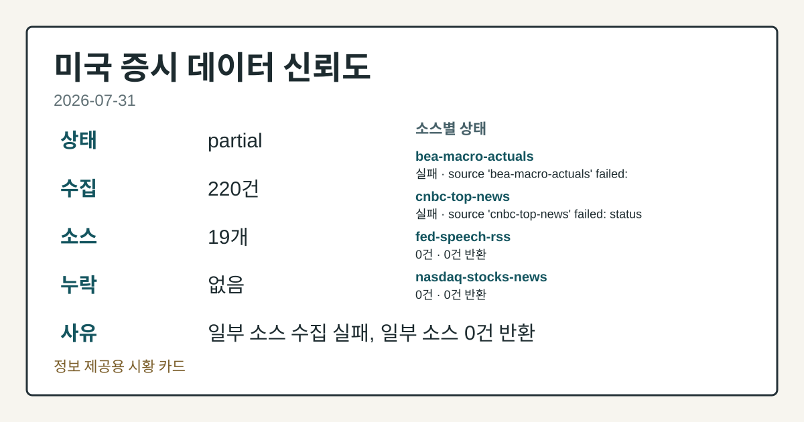
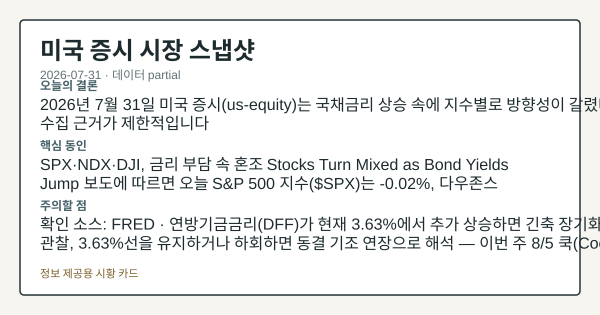
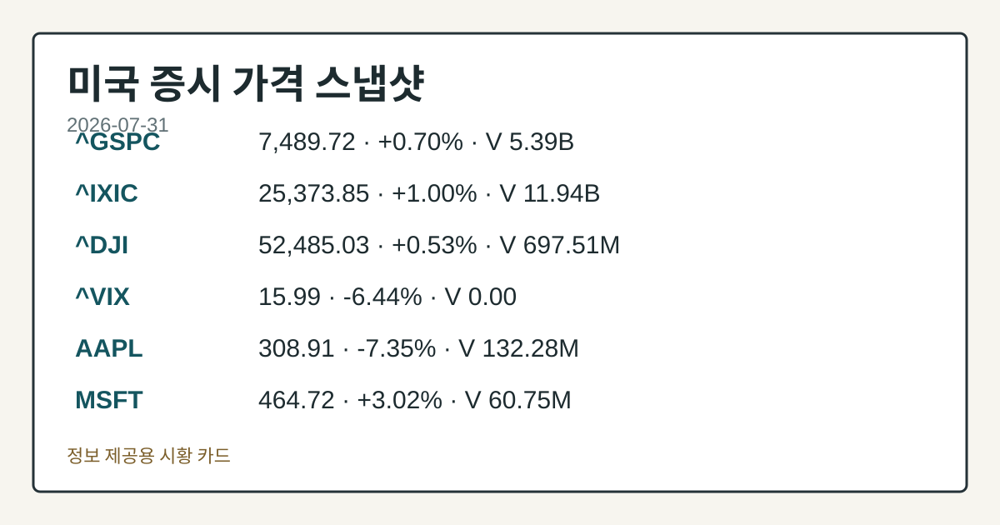
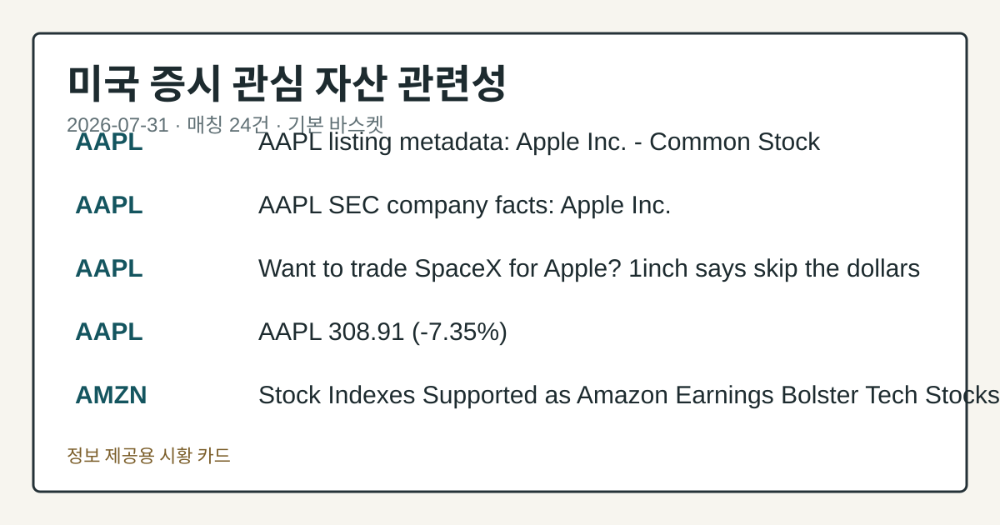

# 2026-07-31 미국 증시 시황
> 정보 제공용 자동 시황이며 매매 권유가 아닙니다.
# 2026-07-31 미국 증시 시황
**기준 시각**: 2026-07-31 NY · 수집창 2026-07-31T04:00Z ~ 2026-08-01T04:00Z (종료 미포함)
| 종목 | 종가 | 변동 | 비고 |
|------|------|------|------|
| ^GSPC | 7,489.72 | +0.70% | -1.58% from 52w high · +9.20% YTD |
| ^IXIC | 25,373.85 | +1.00% | -6.35% from 52w high · +9.20% YTD |
| ^DJI | 52,485.03 | +0.53% | -1.08% from 52w high · +8.48% YTD |
| AAPL | 308.91 | -7.35% | -9.17% from 52w high · +13.98% YTD |
| MSFT | 464.72 | +3.02% | -14.27% from 52w high · +20.93% MTD |
**세그먼트**: [국내 증시](../../../domestic-equity/2026/07/2026-07-31.md) | [미국 증시](2026-07-31.md) | [크립토](../../../crypto/2026/07/2026-07-31.md)
<!-- investo:block visual:us-equity.visual.curated-context-image -->

*이미지: 큐레이션 시황 이미지 · 출처: 외부 라이선스 이미지 · 생성: investo 0.1.0 · 2026-08-02 UTC*
<!-- /investo:block visual:us-equity.visual.curated-context-image -->
> **내 관심 자산 영향**: 21건 확인 (기본 바스켓) — AAPL: 직접 관련 · [nasdaq-symbol-directory] AAPL listing metadata: Apple Inc. - Common Stock; AAPL: 직접 관련 · [sec-company-facts] AAPL SEC company facts: Apple Inc.; AAPL: 직접 관련 · [yfinance-price] AAPL 308.91 (**-7.35%**); AMZN: 직접 관련 · [nasdaq-symbol-directory] AMZN listing metadata: Amazon.com, Inc. - Common Stock; AMZN: 직접 관련 · [sec-company-facts] AMZN SEC company facts: AMAZON COM INC 외
> **용어 가이드**: 이번 시황에서 처음 등장한 용어 — EIA(에너지정보청), ETF(상장지수펀드)
> **오늘의 결론**: 2026년 7월 31일 미국 증시(us-equity) 세그먼트는 AAPL이 전일 대비 **-7.35%** 하락해 **$308.91**을 기록한 점이 본문 참고.
> **핵심 동인**: AAPL, 실적 공시 속 큰 폭 하락 AAPL은 308.91달러로 전일 대비 **-7.35%** 하락했다.
> **주의할 점**: 이번 주(2026-07-312026-08-07)에는 8월 3일 SLOOS(은행대출태도조사)·G.5/H.10(외환환율 통계), 8월 5일 Lisa D 본문 참고.
## 한눈에 보기
AAPL(애플)이 전일 대비 **-7.35%** 하락한 **$308.91**에 거래되며 미국 대형 기술주 약세 신호를 보였다.
미국 6월 실업률(UNRATE)이 **4.2%**로 전월 **4.3%**에서 낮아졌고, CFTC(상품선물거래위원회) 포지셔닝은 E-mini S&P 본문 참고.
Cboe SKEW 지수가 141.23으로 높은 꼬리위험(tail-risk) 구간을 시사한다 — 본문 §④ 지표·이벤트 참조.
## ⓪ 오늘의 매크로
**국제 유가** — CFTC WTI crude oil managed_money net +92943 contracts
**미 국채 수익률** — UST curve 2026-07-31: 10Y 4.75%, 2Y10Y +0.47pp
## ⓪-B 채널 기준선
| 기준선 | 값 |
|------|------|
| S&P 500 | 7,489.72 (+0.70%) |
| 나스닥 종합 | 25,373.85 (+1.00%) |
| 다우존스 | 52,485.03 (+0.53%) |
| CFTC 포지셔닝 | E-mini S&P 500 순포지션 -297476계약 (-14.99% OI), 2026-07-28 기준/2026-07-31 공개 · Nasdaq-100 mini 순포지션 -58298계약 (-19.78% OI), 2026-07-28 기준/2026-07-31 공개 · VIX futures 순포지션 -12289계약 (-3.58% OI), 2026-07-28 기준/2026-07-31 공개 · 주간 지연 |
> **크로스마켓 연결 고리**: 유가/지정학 이슈가 여러 자산군의 변동성 연결 고리로 관찰됩니다. / 금리 이벤트가 할인율/달러 경로의 공통 변수로 남아 있습니다.
> **오늘의 큰 그림:** 유가와 지정학 변수가 공통 변수지만, 섹터·실적 변동성를 먼저 확인해야 합니다.
## ① 요약

<!-- investo:block visual:us-equity.visual.data-confidence -->

*이미지: 데이터 신뢰도 · 출처: investo 자체 생성 · 생성: investo 0.1.0 · 2026-08-02 UTC*
<!-- /investo:block visual:us-equity.visual.data-confidence -->

<!-- investo:block visual:us-equity.visual.market-snapshot -->

*이미지: 시장 스냅샷 · 출처: investo 자체 생성 · 생성: investo 0.1.0 · 2026-08-02 UTC*
<!-- /investo:block visual:us-equity.visual.market-snapshot -->

2026년 7월 31일 미국 증시 세그먼트는 AAPL이 전일 대비 **-7.35%** 하락해 **$308.91**을 기록한 점이 가장 뚜렷한 개별 종목 신호였다. 어제(2026-07-30) 마이크로소프트(Microsoft) 실적 호조가 지수 상승을 이끌었던 흐름과 달리, 오늘은 AAPL 하락과 CFTC(상품선물거래위원회) COT(트레이더별 포지션 보고서) 상 E-mini S&P 500·Nasdaq-100 mini 선물의 레버리지 자금 순매도(숏) 우위, 그리고 Cboe SKEW·VVIX 등 꼬리위험 지표의 높은 수준이 함께 관찰되어 전일 대비 방향 전환에 가까운 모습이다. [하락 관찰]

## ② 전일 핵심 이슈

### AAPL, 실적 공시 속 큰 폭 하락

AAPL은 308.91달러로 전일 대비 **-7.35%** 하락했다. 같은 날 SEC(증권거래위원회) 제출 자료에 따르면 AAPL은 2026-07-31 10-Q(분기보고서)를 제출했으며, 회사 재무자료 상 순이익은 **$84,544,000,000**(2025-06-28 기준), 희석 주당순이익은 5.62달러(2025-06-28 기준)로 나타난다. 다만 동일 자료 내 매출 항목 **$215,639,000,000**은 2016-09-24 기준 과거 수치로 표기되어 있어 최근 실적과 혼동해서는 안 된다.

> **그래서 의미는?** 대형 기술주 AAPL의 큰 폭 하락은 기술주 전반 심리에 영향을 줄 수 있어 확인이 필요합니다.

### AMZN, S-4 제출과 재무 지표

AMZN은 2026-07-31 S-4(증권신고서)를 제출했다. 회사 재무자료 상 순이익 **$70,623,000,000**, 희석 주당순이익 3.27달러(모두 2025-06-30 기준), 발행주식수 10,786,313,572주(2026-07-22 기준)가 공시되어 있다. 가격 변동 데이터는 이번 입력에 포함되어 있지 않다.

### 연준(Fed) 규제 관련 의견수렴 절차 진행

연방준비제도(Federal Reserve)는 은행 내부자([FOMC 발표](https://www.federalreserve.gov/newsevents/pressreleases/bcreg20260731b.htm)) 신용공여 규정 현대화 제안과 상호저축은행([FOMC 발표](https://www.federalreserve.gov/newsevents/pressreleases/bcreg20260731a.htm)) 관련 규정 개정 제안에 대해 각각 의견수렴을 시작했다고 밝혔다. 두 건 모두 규제 절차 초기 단계로, 미국 증시 세그먼트 관점에서는 은행주 규제 부담 변화 여부를 장기적으로 확인할 사안이다.

## ③ 섹터/수급 동향

### 기관 포지셔닝 (CFTC COT)

CFTC COT에 따르면, E-mini S&P 500 선물은 레버리지 자금(leveraged_money) 순매도 -297,476계약(롱 155,964 / 숏 453,440, OI(미결제약정) 대비 **-15.0%**)로 나타났다. Nasdaq-100 mini 선물도 레버리지 자금 순매도 -58,298계약(롱 61,233 / 숏 119,531, OI 대비 **-19.8%**)을 기록했다. 10Y 국채선물은 레버리지 자금 순매도 -2,155,739계약(OI 대비 **-40.6%**)으로 가장 큰 숏 편중을 보였다. 반면 금(Gold)은 운용자금(managed_money) 순매수 +119,795계약(OI 대비 **+31.1%**), WTI 원유는 순매수 +92,943계약(OI 대비 **+5.0%**)으로 반대 방향을 나타냈다. 달러인덱스(U.S. Dollar Index)는 순매도 -1,601계약(OI 대비 **-2.7%**), VIX 선물은 순매도 -12,289계약(OI 대비 **-3.6%**)이었다.

> **그래서 의미는?** 주요 주가지수 선물의 숏 우위 포지셔닝은 단기 수급이 신중한 쪽으로 기울었을 가능성을 시사합니다.

### 에너지 시장 (EIA 주간 보고서)

EIA 주간 보고서(2026-07-24 기준)에 따르면 미국 상업 원유 수입은 5,683 MBBL/D, 상업 원유 재고(전략비축유 제외)는 404,508 MBBL, 정제유 재고는 110,632 MBBL, 총 휘발유 재고는 211,301 MBBL로 각각 집계됐다. 정유 가동률은 **97.2%**, 미국 원유 생산량은 13,796 MBBL/D였다.

## ④ 지표·이벤트

### 금리 및 물가 (FRED)

[FRED](https://fred.stlouisfed.org/series/DFF) 기준 연방기금 실효금리(DFF)는 3.63으로 전일(2026-07-29) 대비 변동 없음(3.63)이었다. [CPIAUCSL](https://fred.stlouisfed.org/series/CPIAUCSL)(소비자물가지수)은 332.568(2026-06-01 기준)로 전월 333.979 대비 하락했다. [PPIFID](https://fred.stlouisfed.org/series/PPIFID)(생산자물가지수 최종수요)는 157.045(2026-06-01 기준)로 전월 157.346 대비 하락했다. [UNRATE](https://fred.stlouisfed.org/series/UNRATE)(실업률)는 **4.2%**(2026-06-01 기준)로 전월 **4.3%**에서 낮아졌다.

> **그래서 의미는?** 물가 지표 하락과 실업률 소폭 개선이 동시에 나타나 통화정책 경로에 대한 해석이 엇갈릴 수 있습니다.

### 노동시장 및 물가 (BLS)

[BLS](https://www.bls.gov/data/)(노동통계국) 자료 기준 6월 소비자물가지수(CPI) 실제치는 332.568(전월 333.979), 근원 CPI는 336.065(전월 336.121)였다. 생산자물가지수 최종수요는 156.566(전월 157.001)이었다. 실업률은 **4.2%**(전월 **4.3%**), 노동참가율은 **61.5%**, 시간당 평균임금은 37.64달러(전월 37.51달러)였다. 구인건수는 7,594천 건(전월 7,585천 건), 비농업 고용은 158,984천 명(전월 158,927천 명)으로 집계됐다.

### 변동성 지표 (Cboe)

[Cboe SKEW](https://cdn.cboe.com/api/global/us_indices/daily_prices/SKEW_History.csv) 지수(꼬리위험 지수)는 2026-07-31 종가 기준 141.23을 기록했다. [Cboe VVIX](https://cdn.cboe.com/api/global/us_indices/daily_prices/VVIX_History.csv)(변동성지수의 변동성)는 같은 날 91.64였다.

## ⑤ 주요 종목
<!-- investo:block chart:us-equity.chart.market -->

<!-- u50 lightweight-charts-embed: placeholders consumed by site_docs/assets/investo-chart-init.js -->

<noscript><em>인터랙티브 차트는 JavaScript가 활성화된 환경에서 표시됩니다. 위 정적 카드가 동일한 정보를 담고 있습니다.</em></noscript>

<!-- /investo:block chart:us-equity.chart.market -->

<!-- investo:block visual:us-equity.visual.price-snapshot -->

*이미지: 가격 스냅샷 · 출처: investo 자체 생성 · 생성: investo 0.1.0 · 2026-08-02 UTC*
<!-- /investo:block visual:us-equity.visual.price-snapshot -->

### 최근 SEC 제출 확인
- AAPL: 10-Q(분기보고서) 제출(2026-07-31); 순이익 **$84,544,000,000**·희석 EPS 5.62달러(2025-06-28 기준)
- AMZN: S-4(증권신고서) 제출; 순이익 **$70,623,000,000**·희석 EPS 3.27달러(2025-06-30 기준)
- GOOGL: Form 4 제출(2026-07-30); 매출 **$186,662,000,000**·순이익 **$62,736,000,000**·희석 EPS 5.12달러(2025-06-30 기준)
- META: Form 144 제출(2026-07-31); 순이익 **$16,644,000,000**·희석 EPS 6.43달러(2025-03-31 기준, 매출 항목은 2017-09-30 기준 과거 수치)
- MSFT: 10-K(연차보고서) 제출; 순이익 **$88,136,000,000**·희석 EPS 11.8달러(2024-06-30 기준, 매출 항목은 2009-12-31 기준 과거 수치)

### 가격 변동 확인
- AAPL: **$308.91**, 전일 대비 **-7.35%**

### 체크리스트 (상장 메타데이터만 확인, 가격·실적 데이터 없음)
- NVDA(NVIDIA Corporation), QQQ(Invesco QQQ Trust), SPY(State Street SPDR S&P 500 ETF Trust), TSLA(Tesla, Inc.) — 나스닥 상장 메타데이터만 확인됨

> **그래서 의미는?** AAPL·AMZN(아마존)·GOOGL(알파벳)·META(메타)·MSFT(마이크로소프트) 등 최근 제출 공시가 몰려 있어 개별 확인이 필요합니다.

## ⑥ 오늘의 관전 포인트

<!-- investo:block visual:us-equity.visual.watchlist-relevance -->

*이미지: 관심 자산 관련성 · 출처: investo 자체 생성 · 생성: investo 0.1.0 · 2026-08-02 UTC*
<!-- /investo:block visual:us-equity.visual.watchlist-relevance -->

> **관전 포인트**: 오늘은 공개 근거가 충분한 관전 신호만 본문에 남겼습니다.

> **데이터 상태**: 부분

수집/품질 진단

> **데이터 상태**: 부분 — 수집 220건 / 소스 19개 / 누락: 없음 · 부분 — 일부 카테고리 미수집, 본문 일부 결론 보강 필요
> **소스 카운트**: 수집 대상 25 / 성공 19 / 수집 상세는 진단 섹션에서 확인할 수 있습니다. / 수집 상세는 진단 섹션에서 확인할 수 있습니다. / 수집 상세는 진단 섹션에서 확인할 수 있습니다.
> **소스 등급 분포**: S=11 / A=8
> **상세 사유**: 일부 소스 수집 실패, 일부 소스 0건 반환
> **소스별 상태**: bea-macro-actuals 실패 (설정 미완료(미수집)), cnbc-top-news 실패 (접근 제한), fed-speech-rss 0건, nasdaq-stocks-news 0건, sec-newsroom-rss 0건, yahoo-finance-news 0건, 정상 19개

## ⑦ 면책조항
본 시황은 일반 정보 제공을 목적으로 자동 생성된 자료이며,
특정 종목·자산에 대한 매매 권유나 투자 자문이 아닙니다.
투자 결정과 그 결과에 대한 책임은 전적으로 본인에게 있으며,
본 시황의 내용에 따라 발생한 손실에 대해 작성자는 일체의 책임을 지지 않습니다.