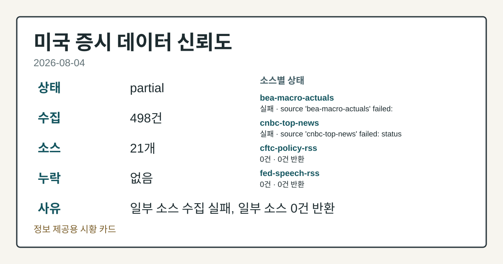
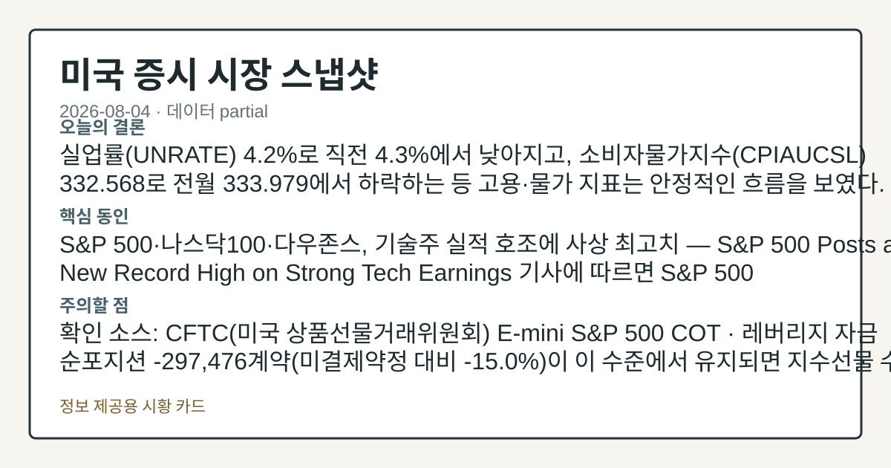
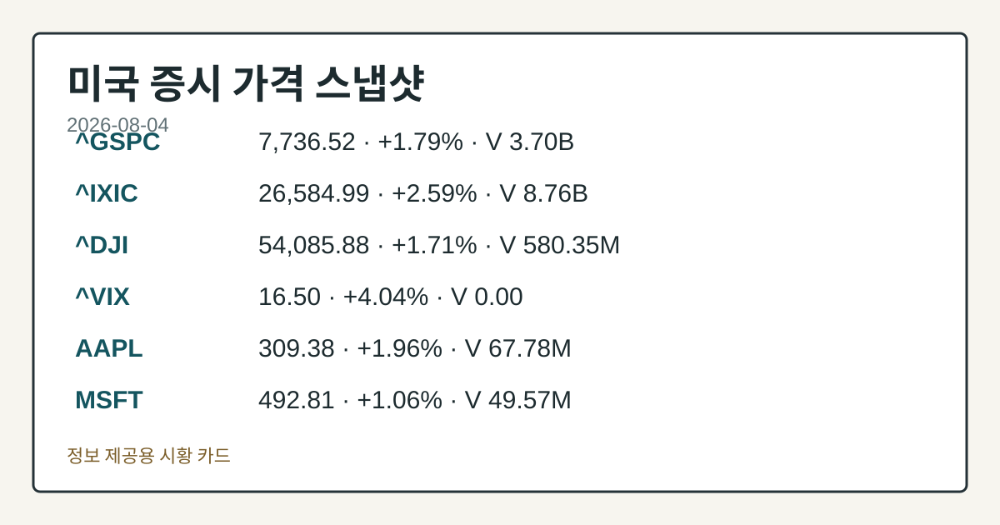
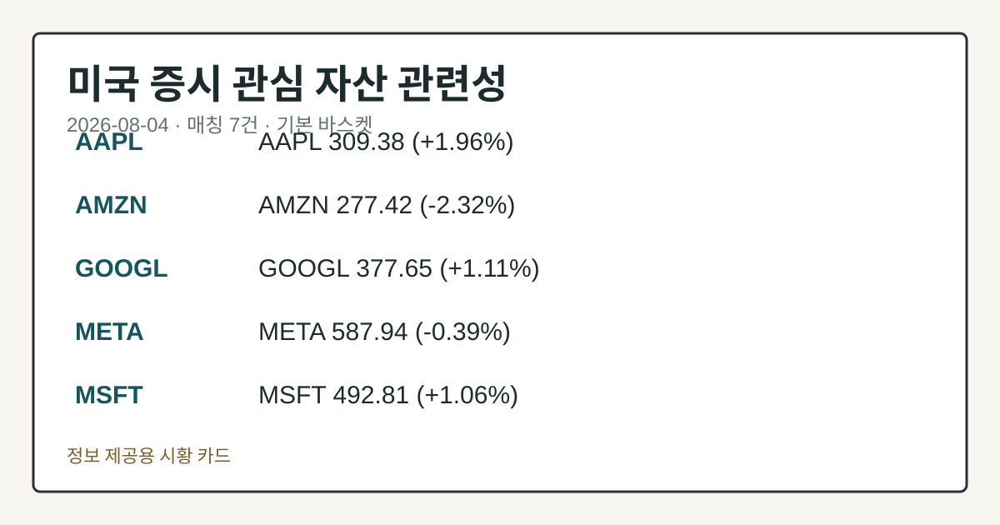

# 2026-08-04 미국 증시 시황
> 정보 제공용 자동 시황이며 매매 권유가 아닙니다.
# 2026-08-04 미국 증시 시황
**기준 시각**: 2026-08-04 NY · 수집창 2026-08-04T04:00Z ~ 2026-08-05T04:00Z (종료 미포함)
| 종목 | 종가 | 변동 | 비고 |
|------|------|------|------|
| ^GSPC | 7,736.52 | +1.79% | ATH 경신 · +12.80% YTD |
| ^IXIC | 26,584.99 | +2.59% | -1.88% from 52w high · +14.41% YTD |
| ^DJI | 54,085.88 | +1.71% | ATH 경신 · +11.79% YTD |
| AAPL | 309.38 | +1.96% | -9.03% from 52w high · +14.16% YTD |
| MSFT | 492.81 | +1.06% | -9.09% from 52w high |
**세그먼트**: 국내 증시(미발행) | [미국 증시](2026-08-04.md) | [크립토](../../../crypto/2026/08/2026-08-04.md)
<!-- investo:block visual:us-equity.visual.curated-context-image -->

*이미지: 큐레이션 시황 이미지 · 출처: 외부 라이선스 이미지 · 생성: investo 0.1.0 · 2026-08-04 UTC*
<!-- /investo:block visual:us-equity.visual.curated-context-image -->
> **내 관심 자산 영향**: 8건 확인 (기본 바스켓) — AAPL: 직접 관련 · [yfinance-price] AAPL 309.38 (**+1.96%**); AMZN: 직접 관련 · [yfinance-price] AMZN 277.42 (**-2.32%**); BTC: 직접 관련 · [yahoo-finance-news] If you invested **$1,000** in gold, Bitcoin and $TRUMP on Inauguration Day, here is what each is worth today; GOOGL: 직접 관련 · [yfinance-price] GOOGL 377.65 (**+1.11%**); META: 직접 관련 · [yfinance-price] META 587.94 (**-0.39%**) 외
> **용어 가이드**: 이번 시황에서 처음 등장한 용어 — E-mini S&P 500(미니 S&P 500 선물), VIX(변동성지수)
> **오늘의 결론**: 실업률(UNRATE) **4.2%**로 직전 **4.3%**에서 낮아지고, 소비자물가지수(CPIAUCSL) 332.568로 전월 333.979에서 본문 참고.
> **핵심 동인**: S&P 500·나스닥100·다우존스, 기술주 실적 호조에 사상 최고치 — S&P 500 Posts a New Record High on Strong 본문 참고.
> **주의할 점**: 본문 §②·§④ 참조
## 한눈에 보기
최근 발행 기사 기준 미국 3대 지수가 **+0.73%**~**+2.21%** 상승했고, S&P 500은 사상 최고치를 경신했다.
CFTC 포지셔닝은 E-mini S&P 500 레버리지 자금 순포지션이 -297,476계약으로 여전히 순매도에 머물러 있다.
**92.57** VVIX(VIX 변동성의 변동성 지수) 레벨과 8/5 연준 인사 연설 일정이 확인 변수 — 본문 §④·⑥ 참조.
## ⓪ 오늘의 매크로
**미 국채 수익률** — UST curve 2026-08-04: 10Y 4.63%, 2Y10Y +0.43pp
## ⓪-B 채널 기준선
| 기준선 | 값 |
|------|------|
| S&P 500 | 7,736.52 (+1.79%) |
| 나스닥 종합 | 26,584.99 (+2.59%) |
| 다우존스 | 54,085.88 (+1.71%) |
| CFTC 포지셔닝 | E-mini S&P 500 순포지션 -297476계약 (-14.99% OI), 2026-07-28 기준/2026-07-31 공개 · Nasdaq-100 mini 순포지션 -58298계약 (-19.78% OI), 2026-07-28 기준/2026-07-31 공개 · VIX futures 순포지션 -12289계약 (-3.58% OI), 2026-07-28 기준/2026-07-31 공개 · 주간 지연 |
> **크로스마켓 연결 고리**: 금리 이벤트가 할인율/달러 경로의 공통 변수로 남아 있습니다.
> **오늘의 큰 그림:** 금리와 달러 변수가 공통 변수지만, Nasdaq·Dow 섹터 변동성를 먼저 확인해야 합니다.
## ① 요약

<!-- investo:block visual:us-equity.visual.data-confidence -->

*이미지: 데이터 신뢰도 · 출처: investo 자체 생성 · 생성: investo 0.1.0 · 2026-08-04 UTC*
<!-- /investo:block visual:us-equity.visual.data-confidence -->

<!-- investo:block visual:us-equity.visual.market-snapshot -->

*이미지: 시장 스냅샷 · 출처: investo 자체 생성 · 생성: investo 0.1.0 · 2026-08-04 UTC*
<!-- /investo:block visual:us-equity.visual.market-snapshot -->

실업률 **4.2%**로 직전 **4.3%**에서 낮아지고, 소비자물가지수 332.568로 전월 333.979에서 하락하는 등 고용·물가 지표는 안정적인 흐름을 보였다. 그러나 CFTC(미국 상품선물거래위원회) 포지셔닝 데이터를 보면 E-mini S&P 500 레버리지 자금 순포지션은 -297,476계약으로 여전히 순매도 구간에 머물러 있다. 이런 가운데 [S&P 500 Posts a New Record High on Strong Tech Earnings](https://www.nasdaq.com/articles/sp-500-posts-new-record-high-strong-tech-earnings) 보도에 따르면 S&P 500은 **+0.73%** 상승하며 사상 최고치를 새로 썼고, 다우존스산업평균지수는 **+1.03%**, 나스닥100지수는 **+2.00%** 올랐다. 같은 배경에는 기술주 실적 호조와 미국-이란 간 호르무즈해협 재개방 기대가 자리한다. [상승 관찰]

## ② 전일 핵심 이슈

### S&P 500·나스닥100·다우존스, 기술주 실적 호조에 사상 최고치

[S&P 500 Posts a New Record High on Strong Tech Earnings](https://www.nasdaq.com/articles/sp-500-posts-new-record-high-strong-tech-earnings) 기사에 따르면 S&P 500 지수는 **+0.73%**, 다우존스산업평균지수는 **+1.03%**, 나스닥100지수는 **+2.00%** 상승하며 사상 최고치를 경신했다. 9월물 미니 S&P 500 선물 ESU26(9월물 미니 S&P500 선물)도 **+0.72%** 올랐다. 앞선 세션을 다룬 [Stocks Finish Sharply Higher on Strong Earnings and Push to Reopen Hormuz](https://www.nasdaq.com/articles/stocks-finish-sharply-higher-strong-earnings-and-push-reopen-hormuz) 기사는 화요일 마감 기준 S&P 500 **+1.79%**, 다우존스 **+1.71%**, 나스닥100 **+3.32%**로 더 큰 폭의 상승을 전했다. 최근 실적 발표 이후 조정을 겪었던 AAPL은 오늘 **+1.96%** 상승한 흐름을 보였다.

> **그래서 의미는?** 3대 지수가 실적 호조 속 동반 상승하며 사상 최고치권 흐름이 이어지고 있습니다.

### 호르무즈해협 재개방 기대, 유가·달러 동반 약세로 연결(지정학·오일 매크로)

[Stock Indices Rally on Strong Tech Earnings and US-Iran Peace Hopes](https://www.nasdaq.com/articles/stock-indices-rally-strong-tech-earnings-and-us-iran-peace-hopes) 기사는 미국-이란 간 호르무즈해협 재개방 협상 기대가 주가 상승과 함께 유가 하락을 이끌었다고 전했다. 이는 원유 공급 우려 완화 시그널로, 미국 증시 세그먼트 관점에서는 인플레이션 기대 경로를 낮춰 위험자산 선호를 뒷받침하는 배경으로 해석된다. 실업률 **4.2%**([FRED](https://fred.stlouisfed.org/series/UNRATE))와 소비자물가지수(CPIAUCSL) 332.568([FRED](https://fred.stlouisfed.org/series/CPIAUCSL))도 같은 안정 흐름을 뒷받침한다.

## ③ 섹터/수급 동향

CFTC의 주간 COT(투기적 포지션) 보고서에 따르면, E-mini S&P 500은 레버리지 자금 순포지션 -297,476계약, 나스닥100 미니는 -58,298계약(**-19.8%**), 10Y 국채는 -2,155,739계약(**-40.6%**)으로 모두 순매도 구간에 머물렀다. 반면 금(Gold)은 자산운용사(managed money) 순포지션이 +119,795계약(**+31.1%**)으로 순매수를 유지했고, WTI(서부텍사스산원유) 원유도 +92,943계약(**+5.0%**) 순매수였다. 달러인덱스(DXY) 레버리지 자금 순포지션은 -1,601계약(**-2.7%**)으로 중립에 가까웠고, VIX 선물은 -12,289계약(**-3.6%**)이었다. [Strength in Stocks and Lower Crude Prices Weigh on the Dollar](https://www.nasdaq.com/articles/strength-stocks-and-lower-crude-prices-weigh-dollar) 기사는 화요일 달러인덱스가 **-0.03%** 하락했다고 전했다.

> **그래서 의미는?** 지수선물은 여전히 순매도 우위지만 금·원유는 순매수로, 자금 포지션이 자산군별로 엇갈립니다.

### 유가 급락과 13F 공시

[Optimism of Reopening Strait of Hormuz Knocks Crude Prices Lower](https://www.nasdaq.com/articles/optimism-reopening-strait-hormuz-knocks-crude-prices-lower) 기사에 따르면 9월물 WTI 원유 선물 CLU26은 화요일 마감 -4.57달러(**-5.69%**), 9월물 RBOB(정제휘발유) 가솔린 선물 RBU26은 -0.1145달러(**-3.86%**) 하락했다. 한편 [13F 공시](https://www.nasdaq.com/articles/see-which-recent-13f-filers-hold-asml-vawter-financial-and-ravenstone-capital-management)(기관투자자 지분보유 공시) 집계에서는 최근 87개 13F 제출 기관 중 39곳이 ASML을 보유한 것으로 나타났다.

## ④ 지표·이벤트

FRED(세인트루이스 연은 경제데이터) 기준 연방기금금리(DFF)는 **3.63%**로 전일과 동일했다([FRED DFF](https://fred.stlouisfed.org/series/DFF)). 소비자물가지수는 332.568로 전월 333.979에서 하락했고([FRED CPIAUCSL](https://fred.stlouisfed.org/series/CPIAUCSL)), 생산자물가지수 최종수요(PPIFID)는 157.045로 전월 157.346에서 낮아졌다([FRED PPIFID](https://fred.stlouisfed.org/series/PPIFID)). 실업률은 **4.2%**로 전월 **4.3%**에서 개선됐다([FRED UNRATE](https://fred.stlouisfed.org/series/UNRATE)). BLS(미국 노동통계국) 집계로는 근원 소비자물가지수 336.065(전월 336.121), 생산자물가지수 최종수요 156.566(전월 157.001), 구인건수 7,359천 건(전월 7,537천 건), 경제활동참가율 **61.5%**(전월 **61.8%**), 비농업 고용 158,984천 명(전월 158,927천 명), 시간당 평균임금 **$37.64**(전월 **$37.51**)가 각각 발표됐다([BLS](https://www.bls.gov/data/)).

> **그래서 의미는?** 물가 지표는 전월 대비 낮아지고 실업률도 개선돼 고용·물가 모두 안정 신호입니다.

### 변동성·연준 일정

Cboe VVIX는 **92.57**을 기록했다([Cboe](https://cdn.cboe.com/api/global/us_indices/daily_prices/VVIX_History.csv)). FOMC(연방공개시장위원회) 일정으로는 8/5 리사 쿡(Lisa D. Cook) 이사가 앵커리지 경제개발공사 오찬에서 경제전망 연설을 진행할 예정이다([연준 캘린더](https://www.federalreserve.gov/newsevents/calendar.htm)). 검증된 팩트 기준 현재 연준 의장은 케빈 워시(Kevin Warsh)다([연준](https://www.federalreserve.gov/aboutthefed/bios/board/default.htm)).

## ⑤ 주요 종목
<!-- investo:block chart:us-equity.chart.market -->

<!-- u50 lightweight-charts-embed: placeholders consumed by site_docs/assets/investo-chart-init.js -->

<noscript><em>인터랙티브 차트는 JavaScript가 활성화된 환경에서 표시됩니다. 위 정적 카드가 동일한 정보를 담고 있습니다.</em></noscript>

<!-- /investo:block chart:us-equity.chart.market -->

<!-- investo:block visual:us-equity.visual.price-snapshot -->

*이미지: 가격 스냅샷 · 출처: investo 자체 생성 · 생성: investo 0.1.0 · 2026-08-04 UTC*
<!-- /investo:block visual:us-equity.visual.price-snapshot -->

### 실적 발표

이번 주 실적 발표 예정 명단에는 AMD(Advanced Micro Devices, 시간외, EPS 전망 **$1.35**), CAT(Caterpillar, 개장전, EPS 전망 **$6.25**), AMGN(Amgen, 시간외, EPS 전망 **$5.60**), ANET(Arista Networks, 시간외, EPS 전망 **$0.80**), BKNG(Booking Holdings, 시간외, EPS 전망 **$2.45**), GILD(Gilead Sciences, 시간외, EPS 전망 -**$7.07**) 등이 포함됐다([나스닥 실적 캘린더](https://www.nasdaq.com/market-activity/stocks/amd/earnings)).

> **그래서 의미는?** AMD·CAT 등 대형주 실적 발표가 몰려 있어 개별 종목 변동성 확인이 필요합니다.

### 확인 항목

워치리스트 매칭 기준 AAPL은 **$309.38**(**+1.96%**), AMZN은 **$277.42**(**-2.32%**), GOOGL은 **$377.65**(**+1.11%**), META는 **$587.94**(**-0.39%**)를 나타냈다. BTC는 이번 세그먼트 워치리스트에서 매칭된 [관련 뉴스](https://www.nasdaq.com/articles) 헤드라인만 확인됐으며, 가격 수치는 별도 크립토 세그먼트에서 다뤄진다.

## ⑥ 오늘의 관전 포인트

<!-- investo:block visual:us-equity.visual.watchlist-relevance -->

*이미지: 관심 자산 관련성 · 출처: investo 자체 생성 · 생성: investo 0.1.0 · 2026-08-04 UTC*
<!-- /investo:block visual:us-equity.visual.watchlist-relevance -->

#### 관찰 신호: 레버리지 자금 순포지션 -297,476계약

- 출처: CFTC E-mini S&P 500 COT
- 현재: CFTC E-mini S&P 500 COT · 레버리지 자금 순포지션 -297,476계약이 이 수준에서 유지되면 지수선물 수급의 하방 경사 지속을 관찰하고, 순매수로 전환되면 상방 압력 신호로 확인. 관심 영향: 사상 최고치 이후 선물 수급 동반 여부 점검.
- 확인 조건: 상방 순매수로 전환되면 상방 압력 신호로 확인; 하방 레버리지 자금 순포지션 -297,476계약이 이 수준에서 유지되면 지수선물 수급의 하방 경사 지속을 관찰하고
- 신뢰도: 보통
- 관심 영향: 사상 최고치 이후 선물 수급 동반 여부 점검.

> **데이터 상태**: 부분 · 이번 문서는 수집 근거가 제한적입니다. · 수집 상세는 진단 섹션에서 확인할 수 있습니다.

수집/품질 진단

> **데이터 상태**: 부분 — 수집 498건 / 소스 21개 / 누락: 없음 · 부분 — 일부 카테고리 미수집, 본문 일부 결론 보강 필요
> **소스 카운트**: 수집 대상 25 / 성공 21 / 0건 2 / 실패 2 / 본문 사용 19
> **소스 등급 분포**: S=11 / A=10
> **상세 사유**: 일부 소스 수집 실패, 일부 소스 0건 반환
> **소스별 상태**: bea-macro-actuals 실패 (설정 미완료(미수집)), cnbc-top-news 실패 (접근 제한), cftc-policy-rss 0건, fed-speech-rss 0건, 정상 21개

## ⑦ 면책조항
본 시황은 일반 정보 제공을 목적으로 자동 생성된 자료이며,
특정 종목·자산에 대한 매매 권유나 투자 자문이 아닙니다.
투자 결정과 그 결과에 대한 책임은 전적으로 본인에게 있으며,
본 시황의 내용에 따라 발생한 손실에 대해 작성자는 일체의 책임을 지지 않습니다.